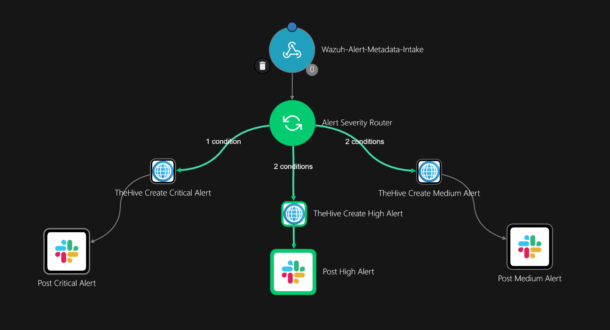
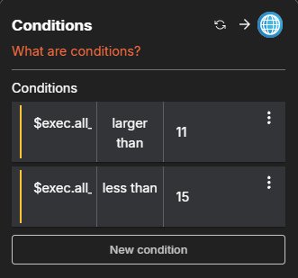
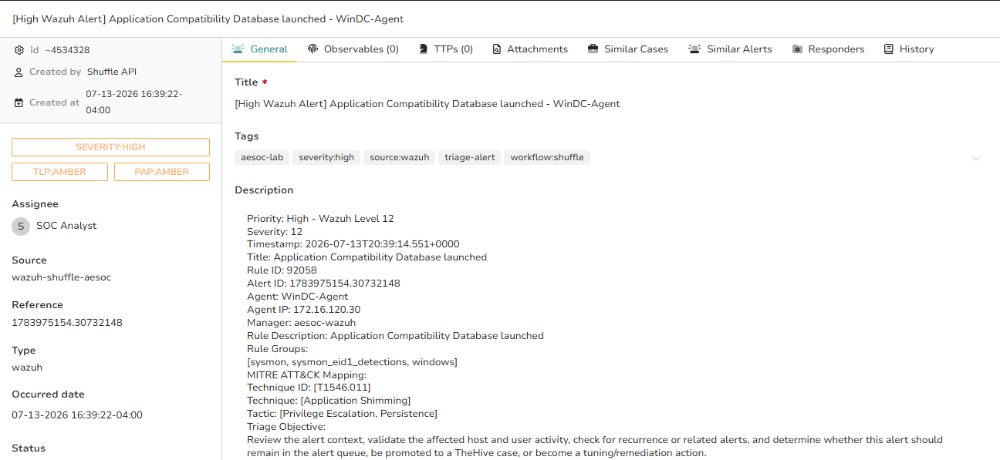
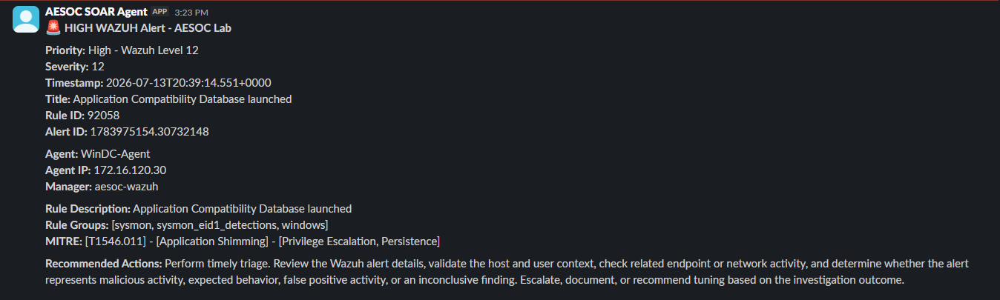

# 01 – Wazuh Alert Intake

## Overview

The Wazuh Alert Intake playbook automates the initial processing of security alerts generated by Wazuh.

Wazuh sends alert metadata to a Shuffle webhook. Shuffle evaluates the Wazuh rule level, routes the alert through the appropriate severity branch, creates an alert in TheHive, and sends a formatted notification to the AESOC Slack alert channel.

This gives the Tier 1 analyst a consistent starting point for alert triage while reducing manual alert entry.

---

## Workflow

```text
Wazuh Detection
       ↓
Shuffle Webhook
       ↓
Alert Severity Router
       ↓
 ┌───────────────┬───────────────┐
 ↓               ↓               ↓
Medium 7–11    High 12–14     Critical 15+
 ↓               ↓               ↓
TheHive Alert  TheHive Alert   TheHive Alert
Created        Created         Created
 ↓               ↓               ↓
Slack Medium   Slack High      Slack Critical
Notification   Notification    Notification
 ───────────────┬─────────────────
      Tier 1 Analyst Triage
```

### Implemented Shuffle Workflow

The Shuffle workflow receives Wazuh alert metadata and routes the alert through the medium, high, or critical severity path.

Each path creates a corresponding TheHive alert and sends a formatted Slack notification.

[](Workflow-Diagram.png)

[Open the workflow image at full size](Workflow-Diagram.png)

---

## Severity Routing

Shuffle evaluates the Wazuh `rule.level` field received in the webhook payload.

| Wazuh rule level | Classification | Automated result |
|---:|---|---|
| 7–11 | Medium | Create a medium-severity TheHive alert and send a medium Slack notification |
| 12–14 | High | Create a high-severity TheHive alert and send a high Slack notification |
| 15 or higher | Critical | Create a critical-severity TheHive alert and send a critical Slack notification |

The documented high-severity branch uses the following conditions:

```text
rule.level > 11
AND
rule.level < 15
```

### High-Severity Branch Configuration

The following conditions route Wazuh rule levels `12` through `14` into the high-severity branch.

[](Evidence/01-High-Branch-Conditions.png)

[Open the branch-conditions image at full size](Evidence/01-High-Branch-Conditions.png)

---

## Systems Involved

| System | Purpose |
|---|---|
| Wazuh | Detects endpoint activity and generates the original security alert |
| Shuffle SOAR | Receives the alert, evaluates severity, and executes the appropriate workflow branch |
| TheHive | Stores the alert and investigation context for analyst review |
| Slack | Notifies the SOC that a new alert requires attention |

---

## Automated Actions

For each accepted Wazuh alert, the playbook:

1. Receives alert metadata through a Shuffle webhook.
2. Reads the Wazuh rule level.
3. Selects the medium, high, or critical branch.
4. Creates a structured alert in TheHive.
5. Transfers available endpoint, rule, timestamp, and MITRE ATT&CK information.
6. Posts a formatted notification to `#aesoc-alerts`.
7. Hands the alert to Tier 1 for analyst triage.

The automation creates a TheHive **alert**, not an investigation case.

A Tier 1 analyst must review the alert and determine whether it should be dismissed, documented, or promoted to a case.

---

## Ownership and Handoff

| Stage | Owner | Responsibility |
|---|---|---|
| Alert detection | Wazuh | Generate the original security alert |
| Automated processing | Shuffle SOAR | Evaluate severity and execute the configured workflow |
| Initial alert triage | Tier 1 SOC Analyst | Validate the alert and determine whether escalation is required |
| Escalated investigation | Tier 2 SOC Analyst | Investigate confirmed or higher-risk activity |
| Official alert record | TheHive | Store alert metadata and analyst findings |
| Operational notification | Slack | Notify analysts that an alert was received |

Slack provides operational visibility but is not treated as the official investigation record.

---

## Validation Test

The high-severity path was validated using a Wazuh level `12` alert.

| Field | Test value |
|---|---|
| Alert title | Application Compatibility Database launched |
| Wazuh rule ID | `92058` |
| Wazuh rule level | `12` |
| Expected branch | High |
| Affected agent | `WinDC-Agent` |
| MITRE ATT&CK technique | `T1546.011 – Application Shimming` |
| Expected TheHive result | High-severity alert created |
| Expected Slack result | High-severity notification delivered |

### Validated Execution Path

```text
Wazuh Level 12 Alert
        ↓
Shuffle Webhook
        ↓
High-Severity Conditions Matched
        ↓
TheHive Alert Created
        ↓
Slack Notification Delivered
```

---

## TheHive Alert Creation

The test alert was successfully created in TheHive with the original Wazuh context, including:

- Alert title
- Wazuh rule ID and level
- Affected endpoint
- Agent IP address
- Event timestamp
- Wazuh rule groups
- MITRE ATT&CK technique
- MITRE ATT&CK tactics
- Initial triage guidance

[](Evidence/02-TheHive-Alert-Details.png)

[Open the TheHive alert image at full size](Evidence/02-TheHive-Alert-Details.png)

---

## Slack Notification

After TheHive created the alert, the AESOC SOAR Agent posted a formatted notification to the AESOC Slack alert channel.

The message provides the analyst with:

- Alert priority
- Wazuh rule level
- Alert title
- Wazuh rule ID
- Affected endpoint
- Agent IP address
- MITRE ATT&CK mapping
- Recommended triage actions

[](Evidence/03-Slack-High-Alert-Notification.png)

[Open the Slack notification image at full size](Evidence/03-Slack-High-Alert-Notification.png)

---

## Validation Result

The test confirmed that:

- Wazuh successfully delivered the alert to Shuffle.
- Shuffle recognized Wazuh rule level `12`.
- The high-severity conditions evaluated successfully.
- TheHive created the corresponding alert.
- Relevant Wazuh metadata was transferred into TheHive.
- Slack received the formatted high-alert notification.
- The workflow completed from alert ingestion through analyst notification.

**Validation status: Passed**

Additional validation details are available in the [`Evidence`](Evidence/) directory.

---

## Known Limitations

- Severity routing is based on the Wazuh rule level and is not a final analyst determination.
- Wazuh alert fields may vary depending on the event source and decoder.
- The workflow does not independently determine whether activity is malicious or benign.
- Analyst validation is required before an alert is promoted to a case.
- The automation depends on connectivity between Wazuh, Shuffle, TheHive, and Slack.
- The playbook was implemented and tested in a controlled home-lab environment.

---

## Status

**Implementation status:** Complete and lab validated  
**Validated execution path:** High severity, Wazuh levels 12–14  
**Environment:** AESOC Home Lab  
**SOAR platform:** Shuffle  
**Alert management:** TheHive  
**Notification platform:** Slack
