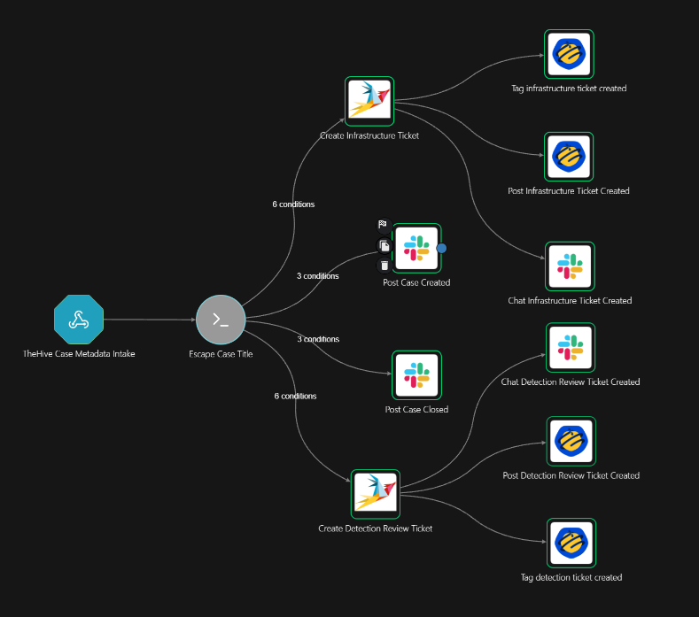
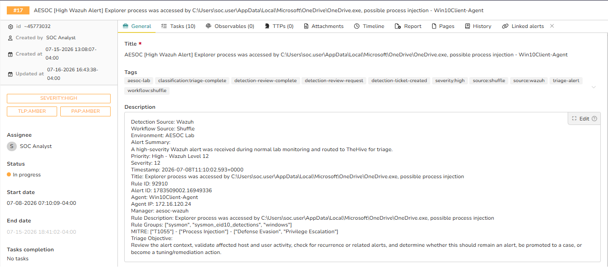
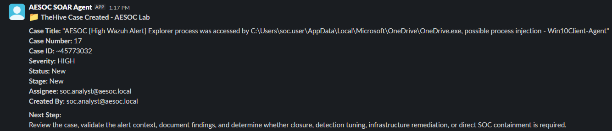
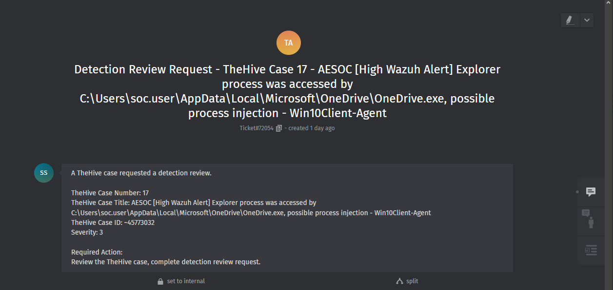
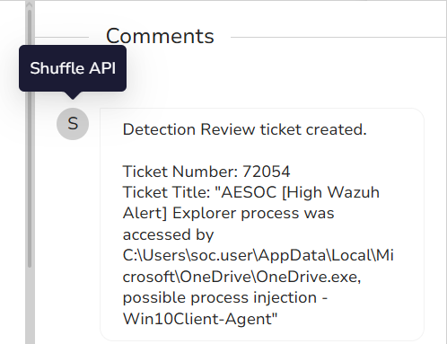
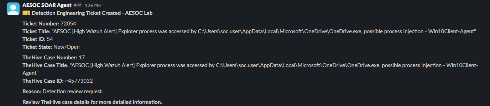
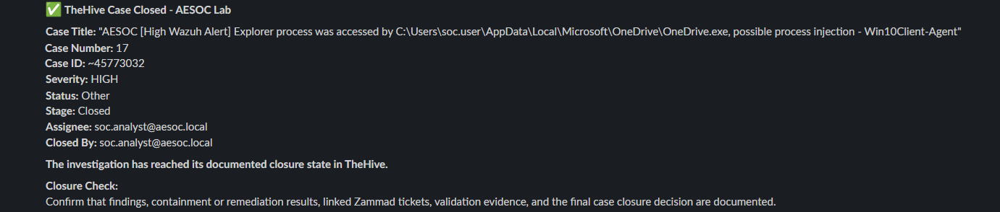

# 02 – Case Updates and Ticket Routing

## Overview

The Case Updates and Ticket Routing playbook automates TheHive case notifications and routes action requests to Zammad.

Shuffle receives TheHive case events and evaluates the case state and tags. It can notify the SOC when a case is created or closed and create either a Detection Engineering or Infrastructure Remediation ticket when work must be handed off outside the immediate investigation.

TheHive remains the primary investigation record, while Zammad tracks assigned detection or remediation work.

> **Validation scope:** This test focused on the automation workflow. The test assumes that Tier 2 completed the required investigation and requested a detection review. A full investigation report and detection-engineering review were not produced for this automation test.

---

## Workflow

```text
TheHive Case Event
        ↓
Shuffle Webhook
        ↓
Process Case Metadata
        ↓
Evaluate Event Type and Case Tags
        ↓
 ┌───────────────────────────┬─────────────────────────────┐
 ↓                           ↓                             ↓
Case Created             Case Closed               Action Required
 ↓                           ↓                             ↓
Slack Case               Slack Case               Determine Ticket Type
Notification            Notification              ┌────────┴─────────┐
                                                  ↓                  ↓
                                           Detection Review   Infrastructure
                                                  ↓             Remediation
                                                  └────────┬─────────┘
                                                           ↓
                                                  Zammad Ticket Created
                                                           ↓
                                                  TheHive Case Updated
                                                           ↓
                                                 Slack Ticket Notification
```

### Implemented Shuffle Workflow

The Shuffle workflow receives case events from TheHive and routes them according to the event type and action-request tags.

The workflow includes:

- TheHive case-created notifications
- TheHive case-closed notifications
- Detection Engineering ticket creation
- Infrastructure Remediation ticket creation
- TheHive ticket-reference updates
- Slack case and ticket notifications
- Ticket-created tags used to prevent duplicate routing

[](Workflow-Diagram.png)

[Open the workflow image at full size](Workflow-Diagram.png)

---

## Routing Logic

| Case event or condition | Automated result |
|---|---|
| TheHive case created | Post a case-created notification to Slack |
| TheHive case closed | Post a case-closed notification to Slack |
| Detection review requested | Create a Detection Engineering ticket in Zammad |
| Infrastructure remediation requested | Create an Infrastructure Remediation ticket in Zammad |
| Ticket-created tag already present | Prevent duplicate ticket creation |

The documented validation follows the Detection Engineering ticket path.

```text
Tier 2 Requests Detection Review
        ↓
Detection Review Tag Added
        ↓
Shuffle Matches Detection Ticket Conditions
        ↓
Zammad Detection Engineering Ticket Created
        ↓
Ticket Reference Added to TheHive
        ↓
Slack Ticket Notification Delivered
```

---

## Systems Involved

| System | Purpose |
|---|---|
| TheHive | Stores the investigation case, tags, comments, status, and ownership |
| Shuffle SOAR | Receives case events, evaluates routing conditions, and executes automated actions |
| Zammad | Tracks Detection Engineering and Infrastructure Remediation requests |
| Slack | Provides operational visibility into case and ticket events |

---

## Automated Actions

The playbook can perform the following actions:

1. Receive TheHive case metadata through a webhook.
2. Identify whether the event represents case creation, case closure, or an action request.
3. Read case tags to determine whether Detection Engineering or Infrastructure Remediation is required.
4. Create the appropriate Zammad ticket.
5. Include the linked TheHive case number, case ID, title, severity, and required action.
6. Add the ticket reference to the TheHive case.
7. Add a ticket-created tag to prevent duplicate ticket creation.
8. Post the appropriate notification to Slack.

The playbook does not conduct the investigation or complete the requested technical work. Those activities remain human responsibilities.

---

## Ownership and Handoff

| Stage | Owner | Responsibility |
|---|---|---|
| Deep investigation | Tier 2 SOC Analyst | Investigate the alert and determine whether additional action is required |
| Ticket-routing decision | Tier 2 SOC Analyst | Apply the appropriate case tag or action request |
| Automated handoff | Shuffle SOAR | Create the ticket and synchronize the ticket reference |
| Detection review | Detection Engineering | Review or modify the detection logic |
| Infrastructure remediation | IT/Remediation | Complete the requested system or infrastructure action |
| Investigation record | TheHive | Maintain the primary case record |
| Assigned action record | Zammad | Track the work requested from another team |
| Operational visibility | Slack | Notify the appropriate AESOC channels |

TheHive remains the authoritative investigation record. Zammad tracks assigned work, while Slack is used only for notifications.

---

## Validation Scenario

The Detection Engineering ticket path was tested using TheHive Case `17`.

The case represented a high-severity Wazuh alert involving possible process injection behavior associated with `OneDrive.exe` accessing `Explorer.exe`.

| Field | Test value |
|---|---|
| TheHive case number | `17` |
| TheHive case ID | `~45773032` |
| Severity | High |
| Requested action | Detection review |
| Zammad ticket number | `72054` |
| Zammad ticket ID | `54` |
| Expected routing destination | Detection Engineering |
| Expected TheHive result | Ticket reference and ticket-created tag added |
| Expected Slack result | Case and ticket notifications delivered |

This scenario was used specifically to validate the automation. It should not be interpreted as a complete documented investigation or detection-engineering review.

---

## TheHive Case and Routing Tags

The test case contained the investigation context and workflow tags used to represent the case state.

Relevant workflow tags included:

- `classification:triage-complete`
- `detection-review-request`
- `detection-ticket-created`
- `detection-review-complete`
- `severity:high`
- `source:wazuh`
- `source:shuffle`
- `workflow:shuffle`

[](Evidence/01-TheHive-Case-Details.png)

[Open the TheHive case image at full size](Evidence/01-TheHive-Case-Details.png)

---

## Case-Created Notification

When the TheHive case was created, Shuffle sent a formatted notification to the AESOC case channel.

The message included:

- Case title
- Case number
- Case ID
- Severity
- Status and stage
- Assigned analyst
- Recommended next step

[](Evidence/02-Slack-Case-Created-Notification.png)

[Open the case-created notification at full size](Evidence/02-Slack-Case-Created-Notification.png)

---

## Detection Engineering Ticket Creation

After the detection-review request was identified, Shuffle created a Detection Engineering ticket in Zammad.

The ticket linked the requested work back to the original TheHive case and included:

- TheHive case number
- TheHive case title
- TheHive case ID
- Severity
- Required action
- Detection review context

[](Evidence/03-Zammad-Detection-Review-Ticket.png)

[Open the Zammad ticket image at full size](Evidence/03-Zammad-Detection-Review-Ticket.png)

---

## TheHive Ticket Reference

After creating the Zammad ticket, Shuffle added a comment to the corresponding TheHive case.

The comment recorded:

- Detection review ticket creation
- Zammad ticket number
- Zammad ticket title

This provides traceability between the investigation record in TheHive and the assigned work in Zammad.

[](Evidence/04-TheHive-Detection-Ticket-Comment.png)

[Open the TheHive ticket-comment image at full size](Evidence/04-TheHive-Detection-Ticket-Comment.png)

---

## Ticket-Created Notification

Shuffle also posted a Detection Engineering ticket-created notification to Slack.

The message included:

- Zammad ticket number and ID
- Ticket state
- TheHive case number
- TheHive case title
- TheHive case ID
- Reason for the handoff

[](Evidence/05-Slack-Detection-Ticket-Notification.png)

[Open the ticket notification at full size](Evidence/05-Slack-Detection-Ticket-Notification.png)

---

## Case-Closed Notification

The test case was later advanced to a closed state to validate the TheHive case-closed notification path.

Shuffle detected the case closure and sent a final notification containing:

- Case title
- Case number and ID
- Severity
- Final status and stage
- Assigned analyst
- Closing analyst
- Closure documentation reminder

[](Evidence/06-Slack-Case-Closed-Notification.png)

[Open the case-closed notification at full size](Evidence/06-Slack-Case-Closed-Notification.png)

The case closure shown here validates the notification path. The detection-review completion handback and result synchronization are documented separately in **03 – Ticket Closure Handback**.

---

## Validation Result

The test confirmed that:

- Shuffle successfully received TheHive case events.
- The case-created event produced the expected Slack notification.
- The detection-review request matched the correct routing branch.
- A Detection Engineering ticket was successfully created in Zammad.
- The Zammad ticket retained a reference to the originating TheHive case.
- Shuffle added the ticket information to the TheHive case.
- The ticket-created tag was present to prevent duplicate routing.
- Slack received the Detection Engineering ticket notification.
- The case-closed event produced the expected final Slack notification.

**Validation status: Passed**

---

## Known Limitations

- This test validated the automation rather than the quality of the underlying investigation.
- A complete investigation report and Detection Engineering review were not created for this test scenario.
- Ticket routing depends on consistent TheHive tags and case metadata.
- Incorrect or conflicting tags may result in incorrect routing.
- Ticket assignment and technical work remain manual.
- The playbook creates and tracks the handoff but does not validate whether the requested action was successful.
- Detection-review completion and remediation handback are handled by the separate Ticket Closure Handback playbook.
- The Infrastructure Remediation branch is implemented but is not represented in this evidence set.
- The workflow was implemented and tested in a controlled home-lab environment.

---

## Status

**Implementation status:** Complete and lab validated  
**Validated routing path:** Detection Engineering ticket creation  
**Additional validated events:** Case created and case closed notifications  
**Configured alternative path:** Infrastructure Remediation ticket creation  
**Environment:** AESOC Home Lab  
**SOAR platform:** Shuffle  
**Case management:** TheHive  
**Ticketing platform:** Zammad  
**Notification platform:** Slack
