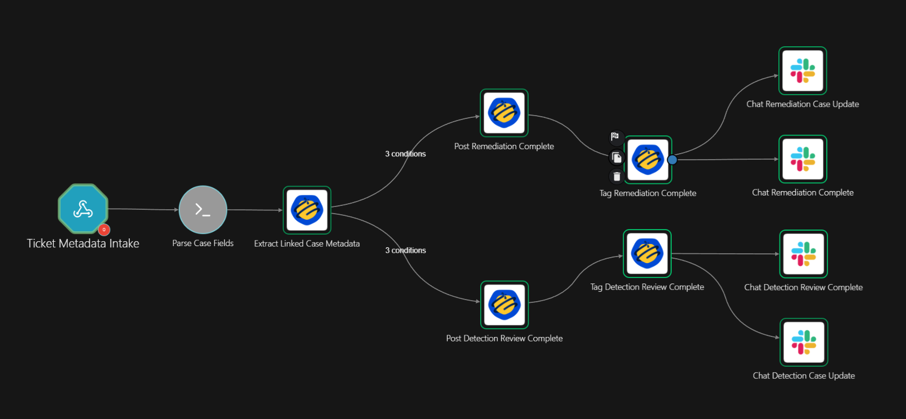
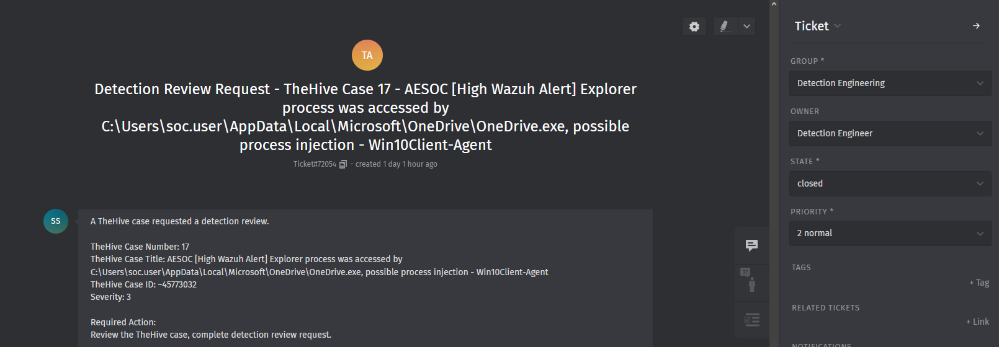
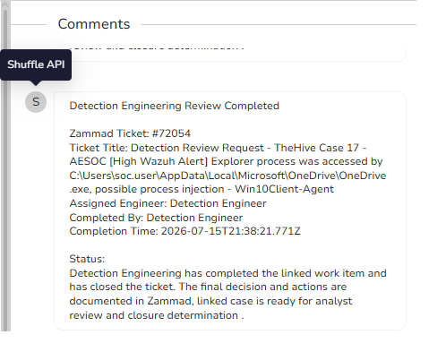
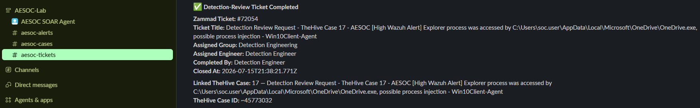
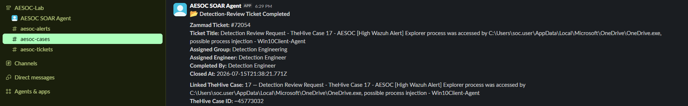

# 03 – Ticket Closure Handback

## Overview

The Ticket Closure Handback playbook returns completed Zammad work to the originating TheHive case.

When a linked Detection Engineering or Infrastructure Remediation ticket is closed, Shuffle processes the ticket metadata, identifies the associated TheHive case, updates the case with the completion status, and sends final notifications to the appropriate AESOC Slack channels.

This returns ownership to the SOC analyst for validation and final case-closure determination.

> **Validation scope:** This playbook was tested using controlled AESOC lab data. The displayed case details, ticket contents, comments, assignments, completion outcomes, and Slack messages are test payloads created to validate the automation. They do not represent a production incident or a substantive Detection Engineering review.

---

## Workflow

```text
Zammad Ticket Closed
        ↓
Shuffle Ticket Metadata Intake
        ↓
Parse Ticket and Case Fields
        ↓
Extract Linked TheHive Case
        ↓
Determine Ticket Type
   ┌──────────────┴──────────────┐
   ↓                             ↓
Detection Review          Infrastructure Remediation
   ↓                             ↓
Post Completion Result to TheHive
        ↓
Add Completion Tag
        ↓
Notify #aesoc-tickets
        ↓
Notify #aesoc-cases
        ↓
Tier 2 Analyst Validation
```

### Implemented Shuffle Workflow

The workflow contains separate completion paths for:

- Detection Engineering review
- Infrastructure remediation
- TheHive case comments
- TheHive completion tags
- Ticket-completed notifications
- Case handback notifications

[](Workflow-Diagram.png)

[Open the workflow image at full size](Workflow-Diagram.png)

---

## Routing Logic

| Closed ticket type | Automated result |
|---|---|
| Detection Review | Add the completion result to TheHive, apply the detection-review completion tag, and send ticket and case notifications |
| Infrastructure Remediation | Add the remediation result to TheHive, apply the remediation completion tag, and send ticket and case notifications |
| Missing or invalid linked case information | Manual analyst review is required |

The documented validation follows the Detection Review path.

```text
Detection Review Ticket Closed
        ↓
Linked TheHive Case Identified
        ↓
Detection Review Branch Selected
        ↓
Completion Comment Added
        ↓
detection-review-complete Tag Added
        ↓
Slack Notifications Delivered
```

---

## Systems Involved

| System | Purpose |
|---|---|
| Zammad | Tracks the assigned Detection Engineering or remediation work |
| Shuffle SOAR | Receives the closure event, extracts the linked case, and executes the handback |
| TheHive | Receives the completion comment and workflow tag |
| Slack | Notifies the ticket and case channels that the assigned work reached its completed state |

---

## Automated Actions

For a supported closed Zammad ticket, the playbook:

1. Receives the ticket metadata through a Shuffle webhook.
2. Parses the ticket number, title, group, owner, and closure information.
3. Extracts the linked TheHive case number and case ID.
4. Determines whether the ticket represents Detection Review or Infrastructure Remediation.
5. Adds a completion comment to the linked TheHive case.
6. Adds the corresponding completion tag.
7. Posts a completion notification to `#aesoc-tickets`.
8. Posts a case handback notification to `#aesoc-cases`.
9. Returns the case to Tier 2 for validation and closure determination.

The playbook does not automatically close the TheHive case.

A closed Zammad ticket means the assigned work item reached its configured completion state. Tier 2 must still review the result and determine whether the incident can be closed.

---

## Ownership and Handoff

| Stage | Owner | Responsibility |
|---|---|---|
| Assigned ticket work | Detection Engineering or IT/Remediation | Complete the requested action and close the Zammad ticket |
| Automated synchronization | Shuffle SOAR | Transfer the completion status back to TheHive |
| Investigation record | TheHive | Maintain the case, comments, tags, and final analyst decision |
| Final validation | Tier 2 SOC Analyst | Review the result and determine whether additional action or case closure is appropriate |
| Ticket visibility | `#aesoc-tickets` | Announce that the assigned work item was completed |
| Case visibility | `#aesoc-cases` | Notify the SOC that the case is ready for analyst review |

TheHive remains the authoritative investigation record. Zammad tracks the assigned work item, while Slack provides operational visibility.

---

## Validation Scenario

The Detection Review handback path was tested using Zammad Ticket `#72054` and TheHive Case `17`.

The scenario assumes that:

1. Tier 2 requested a Detection Engineering review.
2. Playbook 2 created the linked Zammad ticket.
3. The Detection Engineering ticket was assigned and moved to the closed state.
4. Shuffle received the ticket-closure event.
5. The linked TheHive case was identified.
6. A completion comment and tag were added to the case.
7. Slack received the ticket and case notifications.

| Field | Test value |
|---|---|
| Zammad ticket number | `72054` |
| Ticket group | Detection Engineering |
| Ticket state | Closed |
| TheHive case number | `17` |
| TheHive case ID | `~45773032` |
| Expected branch | Detection Review |
| Expected TheHive result | Completion comment and `detection-review-complete` tag |
| Expected Slack result | Ticket-completed and case-update notifications |

The case, ticket, completion text, user assignments, and status messages shown in this test are controlled payloads used to validate the workflow.

---

## Closed Zammad Ticket

The Zammad ticket was assigned to the Detection Engineering group and moved to the closed state.

This closure event serves as the trigger for the handback workflow.

[](Evidence/01-Zammad-Detection-Ticket-Closed.png)

[Open the closed Zammad ticket image at full size](Evidence/01-Zammad-Detection-Ticket-Closed.png)

---

## TheHive Completion Tag

After processing the ticket closure, Shuffle updated the linked TheHive case with the `detection-review-complete` tag.

The tag indicates that the linked Detection Engineering work item reached its configured completion state and that the case is ready for SOC analyst review.

[](Evidence/02-TheHive-Detection-Review-Complete.png)

[Open the TheHive case image at full size](Evidence/02-TheHive-Detection-Review-Complete.png)

---

## TheHive Completion Comment

Shuffle added a completion comment to the linked TheHive case containing:

- Zammad ticket number
- Ticket title
- Assigned engineer
- Completing user
- Completion timestamp
- Ticket completion status
- Analyst handback guidance

[](Evidence/03-TheHive-Completion-Comment.png)

[Open the TheHive completion comment at full size](Evidence/03-TheHive-Completion-Comment.png)

The message content shown in the screenshot is a generic test payload used to validate field transfer and comment creation.

---

## Ticket-Completed Notification

Shuffle posted a ticket-completed notification to `#aesoc-tickets`.

The notification included:

- Zammad ticket number
- Ticket title
- Assigned group
- Assigned engineer
- Completing user
- Closure timestamp
- Linked TheHive case information

[](Evidence/04-Slack-Ticket-Completed-Notification.png)

[Open the ticket-completed notification at full size](Evidence/04-Slack-Ticket-Completed-Notification.png)

---

## Case Handback Notification

Shuffle also posted a case update to `#aesoc-cases`.

This notification informs the SOC that the linked work item was closed and that the case is ready for Tier 2 review and closure determination.

[](Evidence/05-Slack-Case-Updated-Notification.png)

[Open the case-update notification at full size](Evidence/05-Slack-Case-Updated-Notification.png)

---

## Validation Result

The test confirmed that:

- The Zammad ticket reached the closed state.
- Shuffle processed the ticket-closure event.
- The linked TheHive case was identified.
- The Detection Review branch executed.
- A completion comment was added to TheHive.
- The `detection-review-complete` tag was added to the case.
- The ticket-completed notification was delivered to `#aesoc-tickets`.
- The case handback notification was delivered to `#aesoc-cases`.
- The workflow returned the case to Tier 2 for final review.

**Validation status: Passed**

---

## Test Data Notice

The case information, ticket contents, user assignments, comments, completion statements, and Slack messages shown in this documentation are controlled test payloads.

The evidence demonstrates that the automation can:

- Process a closed Zammad ticket
- Extract a linked TheHive case
- Select the correct workflow branch
- Add comments and tags to TheHive
- Deliver ticket and case notifications

The evidence does not claim that a real detection rule was modified, a production incident was resolved, or a formal Detection Engineering assessment was completed.

---

## Known Limitations

- The documented case, ticket, assignments, comments, and completion messages are controlled test payloads.
- The test validates automation behavior rather than the quality of an investigation or Detection Engineering decision.
- The linked TheHive case depends on case information being stored consistently in the Zammad ticket.
- Missing or incorrectly formatted case identifiers may require manual review.
- Ticket closure does not automatically confirm that the incident is resolved.
- Tier 2 validation is required before the linked TheHive case is closed.
- The Infrastructure Remediation branch is implemented but is not represented in this evidence set.
- The workflow was implemented and tested in a controlled home-lab environment.

---

## Status

**Implementation status:** Complete and lab validated  
**Validated handback path:** Detection Review ticket closure  
**Configured alternative path:** Infrastructure Remediation closure  
**Environment:** AESOC Home Lab  
**SOAR platform:** Shuffle  
**Case management:** TheHive  
**Ticketing platform:** Zammad  
**Notification platform:** Slack
