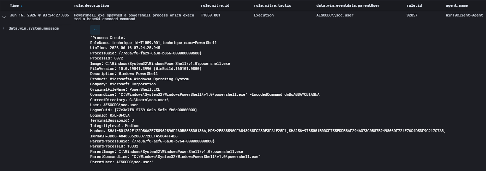

# Case-001: PowerShell Encoded Command Execution

## Objective

Investigate a PowerShell execution alert generated by Wazuh following execution of an encoded PowerShell command and determine whether the activity was malicious or authorized.

---

## Alert Information

| Field | Value |
|---------|---------|
| Platform | Wazuh |
| Severity | High |
| Rule ID | 92057 |
| Host | Win10Client |
| User | AESOCDC\soc.user |
| Technique | T1059.001 |
| Status | Closed |

---

## Alert Triage

Wazuh generated a high-severity alert after detecting execution of PowerShell with the `-EncodedCommand` parameter on the Windows 10 endpoint.

Because encoded PowerShell commands are frequently associated with attacker tradecraft, the activity was reviewed to determine whether it represented unauthorized execution or an approved security test.

---

## Detection Validation

An encoded PowerShell command was executed using the `-EncodedCommand` parameter as part of a controlled adversary emulation exercise.

Wazuh successfully detected the activity and mapped it to MITRE ATT&CK technique T1059.001 (PowerShell).

**Validation Confirmed:**

- Alert generation
- Process creation logging
- Command-line visibility
- ATT&CK mapping

---

## Investigation

### Key Artifacts

| Artifact | Value |
|----------|----------|
| User | AESOCDC\soc.user |
| Host | Win10Client |
| Process | powershell.exe |
| Rule ID | 92057 |
| Technique | T1059.001 |

### Investigation Summary

Review of the alert telemetry confirmed execution of PowerShell with the `-EncodedCommand` parameter.

Sysmon Process Creation telemetry captured the command execution, user context, host information, and ATT&CK mapping. No evidence of malicious follow-on activity was identified.

---

## Findings

| Category | Result |
|------------|------------|
| Classification | True Positive – Authorized Activity |
| Detection Status | Successful |
| Status | Closed |

The alert accurately detected the emulated activity and provided sufficient telemetry to support investigation and attribution.

---

## MITRE ATT&CK Mapping

| Technique | Description |
|------------|------------|
| T1059.001 | PowerShell |

---

## Screenshots

### Attack Simulation

### Detection Validation

### Investigation

---

## Lessons Learned

- Encoded PowerShell execution is commonly associated with attacker activity.
- Wazuh successfully detected and mapped the activity to ATT&CK technique T1059.001.
- Sysmon Process Creation telemetry provides valuable visibility into PowerShell execution events.
- Adversary emulation exercises are effective for validating detection coverage and investigation workflows.
