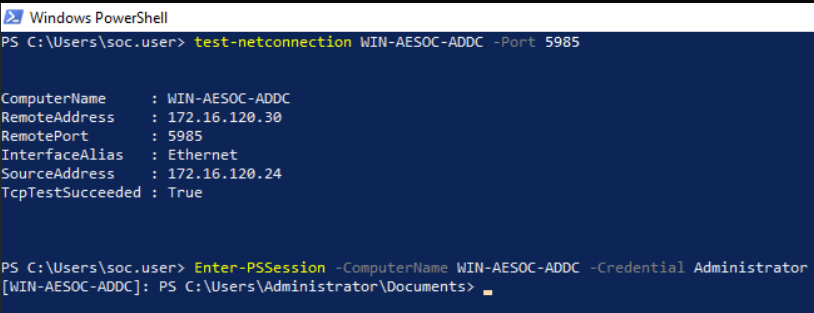
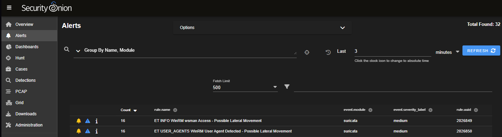
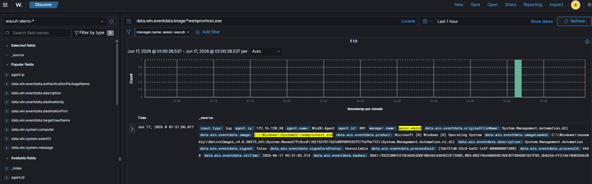
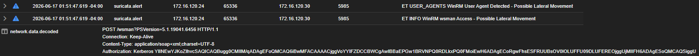
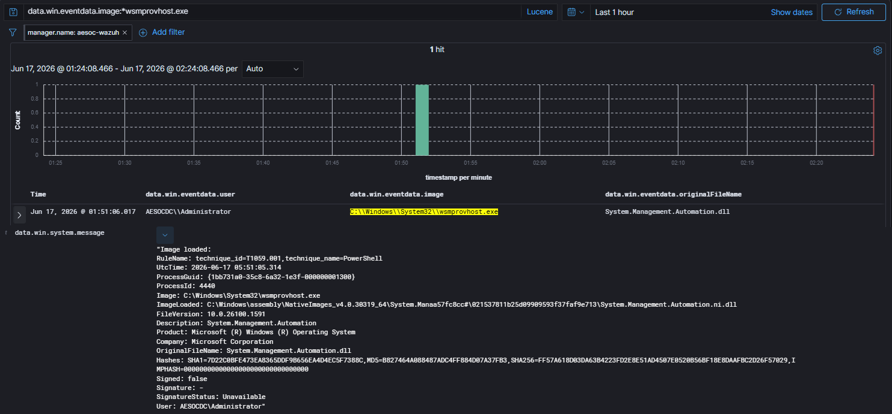
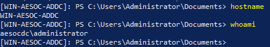

# Case-003: WinRM Lateral Movement

## Objective

Investigate WinRM-based lateral movement activity detected by Security Onion and Wazuh following a PowerShell Remoting session from a Windows workstation to the Domain Controller and determine whether the activity was malicious or authorized.

---

## Alert Information

| Field            | Value                     |
| ---------------- | ------------------------- |
| Platform         | Security Onion / Wazuh    |
| Severity         | High                      |
| Source Host      | Win10Client               |
| Source IP        | 172.16.120.24             |
| Destination Host | WinDC                     |
| Destination IP   | 172.16.120.30             |
| User             | AESOCDC\Administrator     |
| Technique        | T1021.006                 |
| MITRE ATT&CK     | Windows Remote Management |
| Status           | Closed                    |

---

## Alert Triage

Security Onion generated alerts indicating potential lateral movement activity associated with Windows Remote Management (WinRM).

Shortly after alert generation, Wazuh recorded endpoint telemetry associated with PowerShell Remoting activity on the Domain Controller.

Because WinRM is frequently leveraged by attackers for remote administration and lateral movement, the activity was investigated to determine whether the behavior represented unauthorized access or an approved adversary emulation exercise.

---

## Detection Validation

A remote PowerShell session was established from Win10Client to WinDC using Administrator credentials.

Connectivity was first validated over TCP port 5985 before initiating the remote session.

### Validation Commands

```powershell
Test-NetConnection WIN-AESOC-ADDC -Port 5985

Enter-PSSession -ComputerName WIN-AESOC-ADDC -Credential Administrator
```

### Detection Validation Confirmed

#### Security Onion

* WinRM network traffic detected
* Lateral movement alerts generated
* Source and destination systems identified
* Kerberos authentication observed

#### Wazuh

* PowerShell Remoting telemetry captured
* Process execution visibility provided
* User attribution available
* Endpoint activity successfully logged

---

## Investigation

### Network Analysis (Security Onion)

Analysis of Security Onion telemetry identified communication between the following systems:

| Field          | Value         |
| -------------- | ------------- |
| Source IP      | 172.16.120.24 |
| Destination IP | 172.16.120.30 |
| Protocol       | TCP           |
| Port           | 5985          |

Review of decoded network traffic identified:

```text
POST /wsman
Authorization: Kerberos
```

The `/wsman` endpoint is used by Windows Remote Management services while the Kerberos header confirmed authenticated communication between the source and destination systems.

Security Onion generated the following alerts:

* ET INFO WinRM wsman Access – Possible Lateral Movement
* ET USER_AGENTS WinRM User Agent Detected – Possible Lateral Movement

The observed activity aligned with ATT&CK technique T1021.006 – Windows Remote Management.

---

### Endpoint Analysis (Wazuh)

Endpoint telemetry on the Domain Controller identified execution of:

```text
C:\Windows\System32\wsmprovhost.exe
```

under the security context:

```text
AESOCDC\Administrator
```

Additional telemetry identified loading of:

```text
System.Management.Automation.dll
```

which is commonly associated with PowerShell Remoting functionality.

The presence of `wsmprovhost.exe` provided endpoint evidence that a remote PowerShell session had successfully been established on the destination host.

---

### Telemetry Correlation

Correlation between Security Onion and Wazuh telemetry demonstrated that both platforms recorded activity associated with the same WinRM session.

| Platform       | Timestamp |
| -------------- | --------- |
| Wazuh          | 01:51:06  |
| Security Onion | 01:51:47  |

The alerts occurred within the same activity window and corresponded to the WinRM session established between Win10Client and WinDC.

Network telemetry identified the WinRM communications while endpoint telemetry confirmed execution activity on the destination host.

This correlation validated the detection across both network and endpoint monitoring platforms.

---

## Additional Validation

To verify successful execution on the destination host, commands were executed through the remote PowerShell session.

### Validation Commands

```powershell
hostname
whoami
```

### Output

```text
WIN-AESOC-ADDC
aesocdc\administrator
```

The results confirmed successful remote command execution on the Domain Controller under the Administrator account.

---

## Findings

| Category         | Result                              |
| ---------------- | ----------------------------------- |
| Classification   | True Positive – Authorized Activity |
| Detection Status | Successful                          |
| Severity         | High                                |
| Status           | Closed                              |

The investigation confirmed successful WinRM-based lateral movement from Win10Client to WinDC.

Security Onion provided network visibility into the WinRM session while Wazuh provided endpoint visibility into PowerShell Remoting activity occurring on the destination system.

---

## MITRE ATT&CK Mapping

| Technique | Description               |
| --------- | ------------------------- |
| T1021.006 | Windows Remote Management |

---

## Screenshots

### Screenshot 1 – Attack Simulation

A remote PowerShell session was established from Win10Client to WinDC using Administrator credentials.



---

### Screenshot 2 – Detection Validation (Security Onion)

Security Onion generated WinRM lateral movement alerts associated with the PowerShell Remoting session.



---

### Screenshot 3 – Detection Validation (Wazuh)

Wazuh detected PowerShell Remoting activity on the destination host.



---

### Screenshot 4 – Investigation (Security Onion)

Investigation identified WinRM communications utilizing `/wsman` and Kerberos authentication over TCP port 5985.



---

### Screenshot 5 – Investigation (Wazuh)

Investigation confirmed execution of `wsmprovhost.exe` and loading of PowerShell automation components on the destination host.



---

### Screenshot 6 – Additional Validation

Remote command execution confirmed successful access to the Domain Controller using Administrator credentials.



---

## Lessons Learned

* WinRM provides a native Windows mechanism frequently leveraged for lateral movement.
* Security Onion successfully detected network-level indicators of WinRM activity.
* Wazuh provided endpoint visibility into PowerShell Remoting activity.
* Correlating network and endpoint telemetry significantly improves investigation confidence.
* Timestamp correlation across multiple platforms helps validate analyst findings.
* Adversary emulation exercises are effective for validating detection coverage and investigation workflows.

---

## Conclusion

A WinRM-based lateral movement simulation was successfully performed from Win10Client to WinDC using Administrator credentials.

Security Onion detected the associated WinRM communications and generated alerts indicating potential lateral movement activity. Wazuh identified PowerShell Remoting activity on the destination system through execution of `wsmprovhost.exe` and related PowerShell automation components.

Correlation of network and endpoint telemetry provided sufficient evidence to reconstruct the activity, validate detection coverage, and confirm successful execution of ATT&CK technique T1021.006 – Windows Remote Management.

The activity was determined to be a **True Positive – Authorized Activity** resulting from a controlled adversary emulation exercise.

