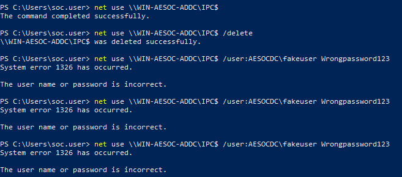
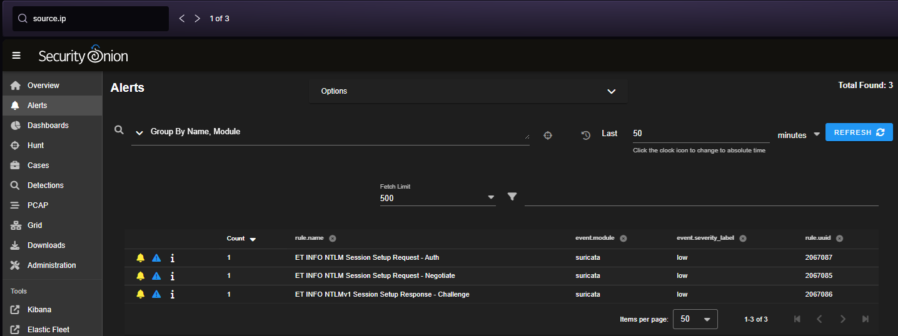
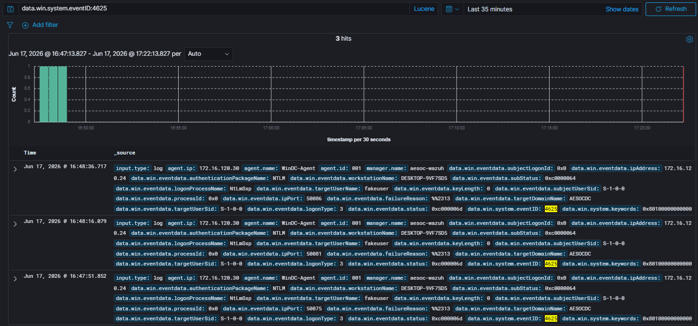
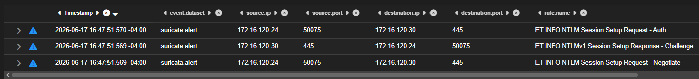
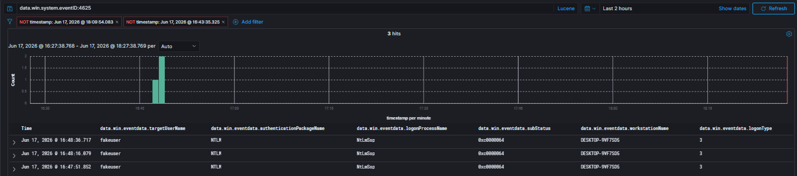

# Case-004: NTLM Authentication Investigation

## Objective

Investigate failed NTLM authentication activity detected by Security Onion and Wazuh following an authentication attempt against the Domain Controller and determine whether the activity was malicious or authorized.

---

## Alert Information

| Field                 | Value                  |
| --------------------- | ---------------------- |
| Platform              | Security Onion / Wazuh |
| Severity              | Medium                 |
| Source Host           | Win10Client            |
| Source IP             | 172.16.120.24          |
| Destination Host      | WinDC                  |
| Destination IP        | 172.16.120.30          |
| User                  | AESOCDC\fakeuser       |
| Authentication Method | NTLM                   |
| Status                | Closed                 |

---

## Alert Triage

Security Onion generated alerts indicating NTLM authentication activity occurring between Win10Client and the Domain Controller.

Shortly afterward, Wazuh recorded a failed logon event on the Domain Controller.

Because failed authentication attempts are commonly associated with credential access activity, account enumeration, password guessing, and unauthorized access attempts, the activity was investigated to determine whether it represented malicious behavior or an authorized adversary emulation exercise.

---

## Detection Validation

An authentication attempt was generated from Win10Client against the Domain Controller using a non-existent domain account.

### Validation Command

```powershell
net use \\WIN-AESOC-ADDC\IPC$ /user:AESOCDC\fakeuser WrongPassword123
```

The authentication attempt failed as expected and generated telemetry within both Security Onion and Wazuh.

### Detection Validation Confirmed

#### Security Onion

* NTLM authentication negotiation detected
* SMB communication observed
* Source and destination systems identified
* Authentication challenge-response activity recorded

#### Wazuh

* Failed logon event captured
* Authentication package identified
* Source workstation identified
* Failure reason recorded
* User attribution available

---

## Investigation

### Network Analysis (Security Onion)

Security Onion telemetry was reviewed to determine the authentication activity occurring between the source and destination systems.

Analysis identified communication between:

| Field            | Value         |
| ---------------- | ------------- |
| Source IP        | 172.16.120.24 |
| Destination IP   | 172.16.120.30 |
| Destination Port | 445           |
| Protocol         | SMB           |

Security Onion generated the following detections:

* ET INFO NTLM Session Setup Request - Auth
* ET INFO NTLM Session Setup Request - Negotiate
* ET INFO NTLMv1 Session Setup Response - Challenge

The observed activity indicated that an NTLM authentication attempt was initiated from Win10Client toward the Domain Controller over SMB.

---

### Endpoint Analysis (Wazuh)

Wazuh telemetry was reviewed to determine the outcome of the authentication attempt observed within Security Onion.

Analysis identified the following Windows Security Event:

```text
Event ID: 4625
```

Key fields included:

```text
TargetUserName: fakeuser
AuthenticationPackageName: NTLM
LogonProcessName: NtLmSsp
LogonType: 3
Source IP: 172.16.120.24
WorkstationName: DESKTOP-9VF7SD5
```

The event status identified the reason for the failed authentication attempt:

```text
SubStatus: 0xC0000064
```

The substatus code indicated that the specified account did not exist within the domain.

This finding aligned with the adversary emulation activity, which intentionally attempted authentication using an invalid account.

---

### Telemetry Correlation

Correlation between Security Onion and Wazuh telemetry demonstrated that both platforms recorded activity associated with the same authentication attempt.

| Platform       | Evidence                                        |
| -------------- | ----------------------------------------------- |
| Security Onion | NTLM negotiation and challenge-response traffic |
| Wazuh          | Event ID 4625 failed logon event                |

Network telemetry identified the authentication exchange while endpoint telemetry identified the specific account, authentication package, source host, and failure reason.

This correlation provided sufficient evidence to reconstruct the authentication attempt and validate detection coverage across both monitoring platforms.

---

## Analysis

### Activity Observed

Failed NTLM network authentication attempt against a Domain Controller.

### Authentication Method

```text
Authentication Package: NTLM
Logon Process: NtLmSsp
```

### Failure Reason

```text
SubStatus: 0xC0000064
```

The specified account did not exist within the domain.

### Systems Involved

| Role           | System                      |
| -------------- | --------------------------- |
| Source         | Win10Client (172.16.120.24) |
| Destination    | WinDC (172.16.120.30)       |
| Target Account | AESOCDC\fakeuser            |

---

## Findings

| Category         | Result                              |
| ---------------- | ----------------------------------- |
| Classification   | True Positive – Authorized Activity |
| Detection Status | Successful                          |
| Severity         | Medium                              |
| Status           | Closed                              |

The investigation confirmed a failed NTLM authentication attempt from Win10Client to WinDC using a non-existent domain account.

Security Onion provided network visibility into the authentication exchange while Wazuh recorded the resulting failed logon event on the Domain Controller.

---

## MITRE ATT&CK Mapping

| Technique | Description    |
| --------- | -------------- |
| T1110     | Brute Force    |
| T1078     | Valid Accounts |

### Analyst Note

While the simulation consisted of a single failed authentication attempt rather than a brute force attack, the activity aligns with credential-access techniques commonly observed during password guessing and account validation activity.

---

## Screenshots

### Screenshot 1 – Attack Simulation

A failed NTLM authentication attempt was generated using a non-existent domain account.



---

### Screenshot 2 – Detection Validation (Security Onion)

Security Onion detected NTLM negotiation traffic occurring over SMB between the source and destination systems.



---

### Screenshot 3 – Detection Validation (Wazuh)

Wazuh recorded Event ID 4625 indicating a failed logon attempt.



---

### Screenshot 4 – Investigation (Security Onion)

Network telemetry identified NTLM authentication negotiation between Win10Client and WinDC over TCP port 445.



---

### Screenshot 5 – Investigation (Wazuh)

Endpoint telemetry identified the target account, authentication package, source host, and failure reason.



---

## Lessons Learned

* Failed NTLM authentication attempts generate telemetry across both network and endpoint monitoring platforms.
* Security Onion provides visibility into NTLM authentication negotiations occurring over SMB.
* Wazuh records detailed authentication failure information through Windows Security Event ID 4625.
* Correlating network and endpoint telemetry improves investigation confidence and accuracy.
* Authentication failure codes provide valuable context regarding the cause of failed logon attempts.
* Adversary emulation exercises are effective for validating authentication monitoring and detection coverage.

---

## Conclusion

A failed NTLM authentication attempt was successfully simulated from Win10Client against WinDC using a non-existent domain account.

Security Onion detected the NTLM authentication negotiation occurring over SMB, while Wazuh recorded the corresponding failed logon event and associated authentication details. Investigation determined that the authentication attempt originated from Win10Client and targeted the invalid account `AESOCDC\fakeuser`.

Analysis identified NTLM authentication through the NtLmSsp logon process and confirmed the failure reason as an invalid account through substatus code `0xC0000064`.

Correlation of Security Onion and Wazuh telemetry provided sufficient evidence to reconstruct the authentication attempt and validate detection coverage for failed NTLM authentication activity within the AESOC environment.

The activity was determined to be a **True Positive – Authorized Activity** resulting from a controlled adversary emulation exercise.
