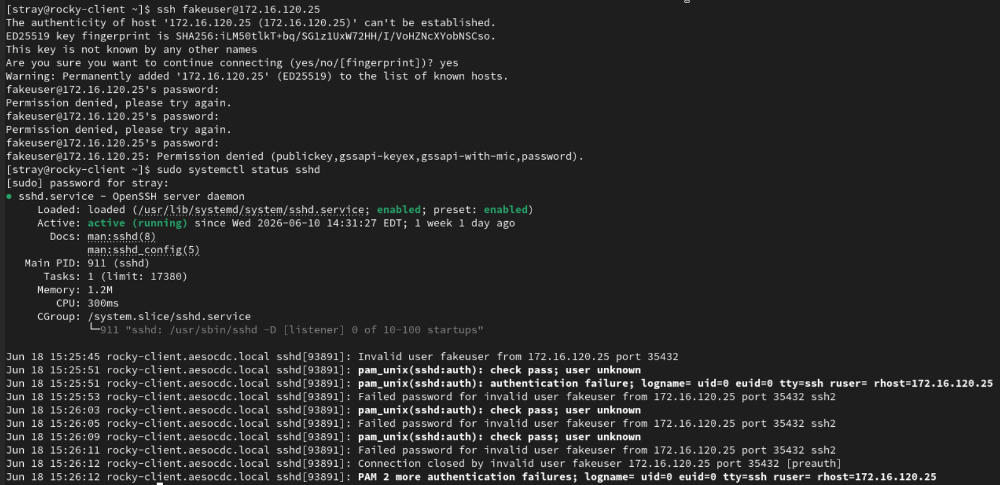
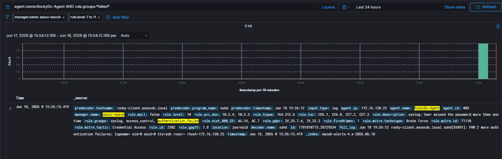
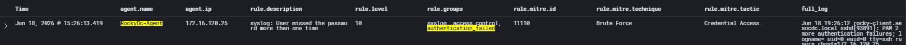

# Case-006: SSH Authentication Attack Investigation

## Objective

Investigate repeated failed SSH authentication attempts against a Rocky Linux system and determine whether the activity was malicious, benign, or part of an authorized adversary emulation exercise.

---

## Alert Information

| Field | Value |
|---------|---------|
| Platform | Wazuh |
| Severity | Medium |
| Rule ID | 2502 |
| Source Host | Win10Client |
| Target Host | Rocky Linux |
| Source IP | 172.16.120.24 |
| ATT&CK Technique | T1110 |
| ATT&CK Tactic | TA0006 – Credential Access |
| Status | Closed |

---

## Alert Triage

Wazuh generated an alert after detecting multiple failed SSH authentication attempts against the Rocky Linux endpoint.

Repeated authentication failures are commonly associated with brute-force attacks and credential access activity. The alert was reviewed to determine whether the activity represented malicious behavior or authorized adversary emulation.

---

## Detection Validation

SSH authentication failures were intentionally generated from Win10Client using an invalid username and incorrect password.

### Command Executed

```bash
ssh fakeuser@172.16.120.25
```

The command was executed multiple times using a non-existent account.

Authentication attempts failed as expected.

Wazuh successfully detected and correlated the activity.

### Detection Validation Confirmed

- SSH authentication monitoring
- Failed authentication correlation
- ATT&CK mapping
- Source IP attribution
- Linux authentication logging
- SSH daemon visibility

---

## Investigation

### Alert Review

Investigation began by reviewing the Wazuh alert generated by the repeated SSH authentication failures.

Analysis identified:

```text
Rule ID: 2502

Description:
syslog: User missed the password more than one time
```

The alert was categorized under:

```text
syslog
access_control
authentication_failed
```

and mapped to:

```text
ATT&CK Tactic:
Credential Access

ATT&CK Technique:
T1110 – Brute Force
```

Severity was recorded as:

```text
Level 10
```

---

### SSH Authentication Analysis

Analysis of the Rocky Linux SSH daemon logs identified repeated authentication failures associated with the account:

```text
fakeuser
```

Evidence showed:

```text
Failed password for invalid user fakeuser
```

The SSH service recorded multiple authentication failures before terminating the connection.

### Evidence

```text
Failed password for invalid user fakeuser
```

```text
PAM 2 more authentication failures
```

---

### Source Attribution

Analysis of SSH daemon logs identified the originating system responsible for the authentication attempts.

Evidence showed:

```text
rhost=172.16.120.24
```

This IP address was correlated to:

```text
Win10Client
```

confirming that the authentication attempts originated from the Windows endpoint and targeted the Rocky Linux SSH service.

---

### Authentication Service Analysis

The failed logins originated from:

```text
sshd
```

running on:

```text
rocky-client.aesocdc.local
```

This confirmed that the activity targeted the Linux SSH service rather than a local console or alternative authentication mechanism.

---

## Analysis

### Activity Observed

Repeated failed SSH authentication attempts against a Rocky Linux endpoint.

### Authentication Service

```text
sshd
```

### Source System

```text
Win10Client
```

### Source IP

```text
172.16.120.24
```

### Target System

```text
rocky-client.aesocdc.local
```

### Authentication Result

```text
Failed
```

### User Account

```text
fakeuser
```

### Supporting Evidence

#### Wazuh Evidence

- Rule 2502 generated
- Severity Level 10 alert
- Authentication failure correlation
- ATT&CK T1110 mapping
- SSH daemon identified as event source

#### SSHD Evidence

- Multiple authentication failures recorded
- PAM authentication failures observed
- Source IP identified
- Invalid username identified
- SSH service identified
- Remote authentication activity confirmed

### Assessment

Wazuh successfully detected repeated failed SSH authentication attempts against the Rocky Linux host and generated Rule 2502 based on multiple authentication failures occurring within the correlation window.

Analysis confirmed that the activity originated from Win10Client (172.16.120.24) and targeted the SSH service running on rocky-client.aesocdc.local.

Although Wazuh mapped the activity to ATT&CK technique T1110 (Brute Force), investigation determined the activity was generated as part of a controlled adversary emulation exercise using a non-existent account.

The collected telemetry provided sufficient evidence to identify the authentication service, source system, source IP address, targeted account, and authentication outcome associated with the activity.

---

## Findings

| Category | Result |
|------------|------------|
| Detection Status | Successful |
| Classification | True Positive – Benign |
| Severity | Medium |
| Status | Closed |

The alert accurately detected repeated failed SSH authentication attempts and provided sufficient telemetry to support attribution and investigation.

---

## MITRE ATT&CK Mapping

| Technique | Description |
|------------|------------|
| T1110 | Brute Force |

---

## Screenshots

### Screenshot 1 – Attack Simulation

Repeated SSH authentication attempts were generated against the Rocky Linux endpoint using an invalid account.



---

### Screenshot 2 – Detection Validation

Wazuh successfully detected and correlated the failed SSH authentication attempts, generating Rule 2502 and mapping the activity to ATT&CK technique T1110.



---

### Screenshot 3 – Investigation

Investigation confirmed the failed authentication attempts, identified the source IP address, validated the targeted account, and correlated the activity to the SSH service.



---

## Lessons Learned

- Repeated authentication failures are commonly associated with brute-force activity.
- SSH daemon logs provide valuable authentication telemetry.
- Source IP attribution is critical during authentication investigations.
- Wazuh successfully correlates multiple authentication failures into a single alert.
- ATT&CK mapping improves investigation context and classification.
- Adversary emulation exercises are effective for validating Linux authentication monitoring.

---

## Conclusion

A simulated SSH authentication attack was successfully performed against Rocky Linux using repeated failed authentication attempts from Win10Client.

Wazuh correlated the authentication failures and generated Rule 2502, identifying the activity as a potential brute-force event and mapping the alert to ATT&CK technique T1110.

Investigation determined that the activity originated from Win10Client (172.16.120.24) and targeted the SSH service on rocky-client.aesocdc.local. Analysis of SSH daemon logs confirmed multiple authentication failures and provided source attribution for the activity.

The investigation validated Wazuh detection coverage for SSH authentication attacks and demonstrated analyst workflow for reviewing authentication alerts, analyzing SSH daemon logs, identifying source systems, and validating ATT&CK-mapped detections within the AESOC environment.

The activity was determined to be a **True Positive – Benign** event resulting from an authorized adversary emulation exercise.
