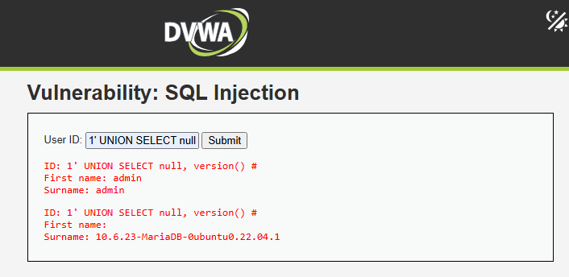
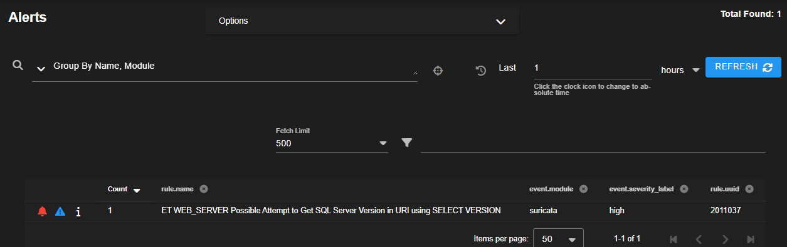
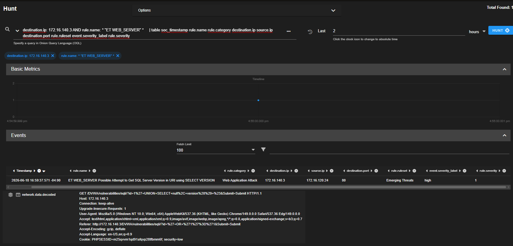

# Case-007: SQL Injection Investigation

## Objective

Investigate a SQL Injection attack against DVWA and determine whether the activity was malicious, benign, or part of an authorized adversary emulation exercise.

---

## Alert Information

| Field | Value |
|---------|---------|
| Platform | Security Onion |
| Severity | High |
| Source Host | Win10Client |
| Source IP | 172.16.120.24 |
| Target Application | DVWA |
| Target IP | 172.16.140.3 |
| ATT&CK Technique | T1190 |
| ATT&CK Tactic | TA0001 – Initial Access |
| Status | Closed |

---

## Alert Triage

Security Onion generated a high-severity alert after detecting a SQL Injection payload within an HTTP request sent to DVWA.

SQL Injection is a common web application attack technique used to manipulate backend databases, retrieve sensitive information, bypass authentication controls, and execute unauthorized queries.

The alert was reviewed to determine whether the activity represented malicious behavior or an authorized adversary emulation exercise.

---

## Detection Validation

A SQL Injection payload was executed against the DVWA SQL Injection module from Win10Client.

### Payload Executed

```sql
1' UNION SELECT null, version() #
```

The payload leveraged the SQL `UNION SELECT` operator to retrieve database version information from the backend database.

DVWA returned the database version, confirming successful SQL Injection execution.

Security Onion successfully detected the attack and generated a Suricata alert.

### Detection Validation Confirmed

- Web application attack detection
- SQL Injection visibility
- HTTP request inspection
- Source attribution
- Destination attribution
- Payload capture

---

## Investigation

### Alert Review

Investigation began by reviewing the Suricata alert generated by Security Onion.

The alert identified:

```text
ET WEB_SERVER Possible Attempt to Get SQL Server Version in URI using SELECT VERSION
```

Additional alert details included:

```text
Category:
Web Application Attack
```

```text
Ruleset:
Emerging Threats
```

```text
Severity:
High
```

The alert correctly identified SQL-related keywords embedded within the URI and classified the request as a web application attack.

---

### Source and Destination Attribution

Analysis identified the source system responsible for the attack.

### Source Host

```text
Win10Client
```

### Source IP

```text
172.16.120.24
```

### Destination Host

```text
DVWA
```

### Destination IP

```text
172.16.140.3
```

### Destination Port

```text
80
```

The evidence confirmed that the attack originated from Win10Client and targeted the DVWA web application.

---

### HTTP Request Analysis

Investigation of the decoded HTTP request revealed the SQL Injection payload embedded within the URI.

### Captured Request

```http
GET /DVWA/vulnerabilities/sqli/?id=1' UNION SELECT null, version() #&Submit=Submit HTTP/1.1
```

Key indicators observed:

```text
UNION SELECT
```

```text
version()
```

These indicators demonstrated an attempt to enumerate backend database version information through SQL Injection.

The decoded HTTP request provided direct evidence of the attack technique and objective.

---

## Analysis

### Activity Observed

SQL Injection attack against DVWA.

### Attack Method

```text
UNION-Based SQL Injection
```

### Source System

```text
Win10Client
```

### Source IP

```text
172.16.120.24
```

### Target Application

```text
DVWA
```

### Target IP

```text
172.16.140.3
```

### Destination Port

```text
80
```

### Supporting Evidence

#### Security Onion Evidence

- Suricata alert generated
- High severity alert classification
- Web Application Attack categorization
- Source attribution
- Destination attribution
- Decoded HTTP request captured
- SQL Injection payload identified

#### Payload Indicators

```text
UNION SELECT
```

```text
version()
```

```text
GET /DVWA/vulnerabilities/sqli/
```

### Assessment

Security Onion successfully detected and captured a SQL Injection attack targeting DVWA.

Analysis of the decoded HTTP request identified a UNION-based SQL Injection payload designed to retrieve database version information from the backend database.

Investigation confirmed that the request originated from Win10Client (172.16.120.24) and targeted the DVWA application hosted at 172.16.140.3.

The generated Suricata alert correctly identified the attack pattern and provided sufficient evidence to reconstruct the malicious request and determine the attack objective.

---

## Findings

| Category | Result |
|------------|------------|
| Detection Status | Successful |
| Classification | True Positive – Malicious |
| Severity | High |
| Status | Closed |

The alert accurately detected a SQL Injection attack and provided sufficient telemetry to support attribution and investigation.

---

## MITRE ATT&CK Mapping

| Technique | Description |
|------------|------------|
| T1190 | Exploit Public-Facing Application |

---

## Screenshots

### Screenshot 1 – Attack Simulation

A UNION-based SQL Injection payload was executed against DVWA to retrieve backend database version information.



---

### Screenshot 2 – Detection Validation

Security Onion successfully detected the SQL Injection payload and generated a Suricata alert identifying the attack as a web application attack.



---

### Screenshot 3 – Investigation

Investigation confirmed the source and destination systems, identified the SQL Injection payload within the HTTP request, and validated the attack objective.



---

## Lessons Learned

- SQL Injection remains one of the most common web application attack techniques.
- Security Onion provides visibility into malicious HTTP requests through Suricata inspection.
- Decoded HTTP requests are valuable for identifying attack techniques and objectives.
- Source and destination attribution are critical during web application investigations.
- Captured payloads provide direct evidence of attacker intent.
- Adversary emulation exercises are effective for validating web application attack detection coverage.

---

## Conclusion

A SQL Injection attack was successfully simulated against DVWA using a UNION-based payload designed to enumerate backend database version information.

Security Onion detected the malicious request and generated a Suricata alert identifying SQL Injection indicators within the URI. Investigation confirmed that the request originated from Win10Client and targeted the DVWA application hosted at 172.16.140.3.

Analysis of the decoded HTTP request revealed the use of the `UNION SELECT` operator and the `version()` function, demonstrating an attempt to retrieve backend database information through SQL Injection.

The investigation validated Security Onion's ability to detect web application attacks and demonstrated analyst workflow for reviewing alerts, analyzing HTTP requests, identifying malicious payloads, and attributing network-based attacks within the AESOC environment.

The activity was determined to be a **True Positive – Malicious** event resulting from a successful SQL Injection attack against a vulnerable web application.
