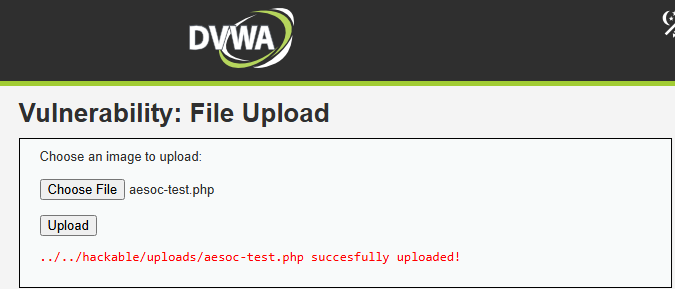
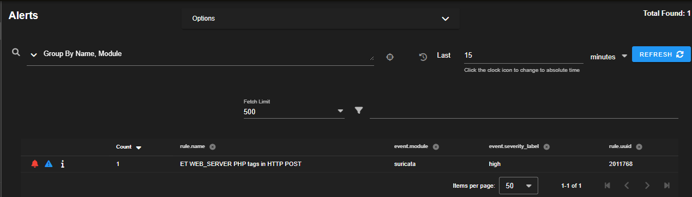
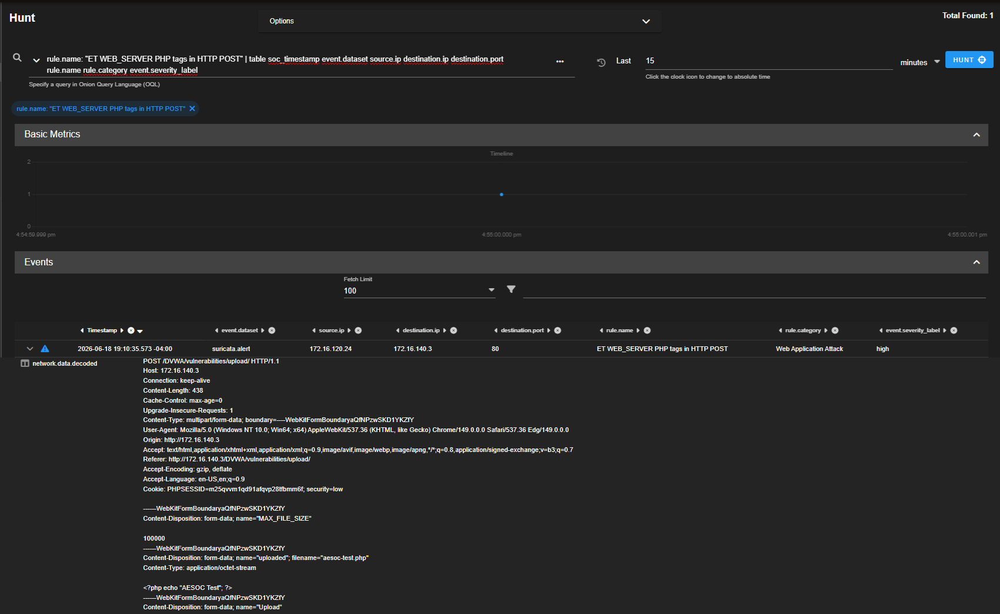

# Case-008: Malicious File Upload Investigation


## Objective


Investigate a malicious file upload against DVWA and determine whether the activity was malicious, benign, or part of an authorized adversary emulation exercise.


---


## Alert Information


| Field | Value |

|---------|---------|

| Platform | Security Onion |

| Severity | High |

| Source Host | Win10Client |

| Source IP | 172.16.120.24 |

| Target Application | DVWA |

| Target IP | 172.16.140.3 |

| ATT&CK Technique | T1190 |

| ATT&CK Tactic | TA0001 – Initial Access |

| Status | Closed |


---


## Alert Triage


Security Onion generated a high-severity alert after detecting PHP code embedded within an HTTP POST request sent to the DVWA File Upload module.


Malicious file uploads are commonly used by attackers to establish persistence, deploy web shells, execute arbitrary code, and gain unauthorized access to web servers.


The alert was reviewed to determine whether the activity represented malicious behavior or an authorized adversary emulation exercise.


---


## Detection Validation


A PHP file was uploaded through the DVWA File Upload module from Win10Client.


### Uploaded File


```php

<?php echo "AESOC Test"; ?>

```


### Filename


```text

aesoc-test.php

```


DVWA accepted the upload and stored the file within the application's upload directory.


Security Onion successfully detected the activity and generated a Suricata alert.


### Detection Validation Confirmed


- Web application attack detection

- HTTP POST inspection

- PHP code detection

- File upload visibility

- Source attribution

- Destination attribution


---


## Investigation


### Alert Review


Investigation began by reviewing the generated Suricata alert.


The alert identified:


```text

ET WEB_SERVER PHP tags in HTTP POST

```


Additional alert details included:


```text

Category:

Web Application Attack

```


```text

Ruleset:

Emerging Threats

```


```text

Severity:

High

```


The alert correctly identified PHP code transmitted within an HTTP POST request and classified the activity as a web application attack.


---


### Source and Destination Attribution


Analysis identified the source system responsible for the upload.


### Source Host


```text

Win10Client

```


### Source IP


```text

172.16.120.24

```


### Destination Host


```text

DVWA

```


### Destination IP


```text

172.16.140.3

```


### Destination Port


```text

80

```


The evidence confirmed that the upload originated from Win10Client and targeted the DVWA web application.


---


### HTTP Request Analysis


Security Onion captured the complete HTTP request responsible for the upload.


### Captured Request


```http

POST /DVWA/vulnerabilities/upload/ HTTP/1.1

```


The request contained multipart form-data used to transfer the file to the target application.


Analysis identified:


```text

filename="aesoc-test.php"

```


and


```php

<?php echo "AESOC Test"; ?>

```


embedded directly within the HTTP POST request body.


This confirmed that a PHP file was transmitted from the source host to the target application.


---


### File Analysis


The uploaded file contained executable PHP code.


### Uploaded Filename


```text

aesoc-test.php

```


### File Contents


```php

<?php echo "AESOC Test"; ?>

```


Although benign for lab purposes, PHP file uploads are frequently associated with:


- Web shell deployment

- Remote code execution preparation

- Persistence mechanisms

- Malicious tool delivery

- Unauthorized server access


The detection successfully identified PHP content before execution occurred on the target server.


---


## Analysis


### Activity Observed


Malicious file upload against DVWA.


### Attack Method


```text

PHP File Upload

```


### Source System


```text

Win10Client

```


### Source IP


```text

172.16.120.24

```


### Target Application


```text

DVWA

```


### Target IP


```text

172.16.140.3

```


### Destination Port


```text

80

```


### Uploaded File


```text

aesoc-test.php

```


### Supporting Evidence


#### Security Onion Evidence


- Suricata alert generated

- HTTP POST request captured

- Upload URI identified

- Filename captured

- PHP code recovered

- Source attribution confirmed

- Destination attribution confirmed


#### Indicators Identified


```text

POST /DVWA/vulnerabilities/upload/

```


```text

filename="aesoc-test.php"

```


```php

<?php echo "AESOC Test"; ?>

```


### Assessment


Security Onion successfully detected and captured a PHP file upload transmitted to a vulnerable web application.


Analysis confirmed that the request originated from Win10Client (172.16.120.24) and targeted the DVWA application hosted at 172.16.140.3.


Investigation identified the uploaded filename, recovered the contents of the uploaded file, and verified that executable PHP code was present within the HTTP POST request body.


The generated Suricata alert correctly identified PHP tags within the upload and provided sufficient evidence to reconstruct the activity and determine its potential security impact.


---


## Findings


| Category | Result |

|------------|------------|

| Detection Status | Successful |

| Classification | True Positive – Malicious |

| Severity | High |

| Status | Closed |


The alert accurately detected a malicious file upload and provided sufficient telemetry to support attribution and investigation.


---


## MITRE ATT&CK Mapping


| Technique | Description |

|------------|------------|

| T1190 | Exploit Public-Facing Application |


---


## Screenshots


### Screenshot 1 – Attack Simulation


A PHP file was uploaded through the DVWA File Upload module to simulate a malicious file upload attack.





---


### Screenshot 2 – Detection Validation


Security Onion successfully detected the upload and generated a Suricata alert identifying PHP code within the HTTP POST request.





---


### Screenshot 3 – Investigation


Investigation confirmed the source and destination systems, identified the uploaded filename, and recovered the PHP code contained within the HTTP request body.





---


## Lessons Learned


- Malicious file uploads remain a common web application attack technique.

- Security Onion provides visibility into uploaded content transmitted through HTTP POST requests.

- Suricata can identify executable code embedded within uploaded files.

- Source and destination attribution are critical during web application investigations.

- Captured HTTP requests provide valuable evidence for reconstructing file upload activity.

- Adversary emulation exercises are effective for validating web application attack detection capabilities.


---


## Conclusion


A malicious file upload was successfully simulated against DVWA using a PHP file named `aesoc-test.php`.


Security Onion detected the upload and generated a Suricata alert identifying PHP code within the HTTP POST request body. Investigation confirmed that the request originated from Win10Client (172.16.120.24) and targeted the DVWA application hosted at 172.16.140.3.


Analysis of the captured HTTP request revealed the uploaded filename and recovered the PHP code contained within the file. The alert provided complete visibility into the upload process and demonstrated Security Onion's ability to detect potentially dangerous file uploads to web applications.


The investigation validated analyst workflow for reviewing web application alerts, analyzing HTTP POST requests, identifying uploaded files, extracting file contents, and assessing the security impact of file upload activity within the AESOC environment.


The activity was determined to be a **True Positive – Malicious** event resulting from a successful malicious file upload against a vulnerable web application.
