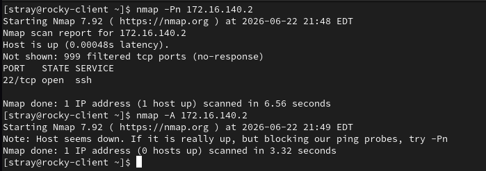
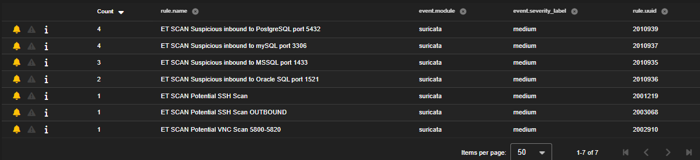

# Case-009: Network Service Discovery Threat Hunt

## Objective

Investigate network service discovery activity detected by Security Onion and determine whether the behavior represented legitimate network activity, benign administrative activity, or reconnaissance associated with adversary behavior.

---

## Alert Information

| Field | Value |
|---------|---------|
| Platform | Security Onion |
| Severity | Medium |
| Source Host | Rocky Linux Client |
| Source IP | 172.16.120.25 |
| Target Host | SO-IDH Honeypot |
| Target IP | 172.16.140.2 |
| ATT&CK Technique | T1046 |
| ATT&CK Tactic | TA0007 – Discovery |
| Status | Closed |

---

## Alert Triage

Security Onion generated multiple correlated alerts indicating network service discovery activity directed toward a deception asset hosted within the AESOC environment.

Network service discovery is commonly performed by attackers following initial access to identify available services, discover attack paths, and locate systems of interest.

The alerts were reviewed to determine whether the activity represented legitimate administrative behavior or reconnaissance associated with adversary activity.

---

## Detection Validation

A network service discovery scan was performed against the SO-IDH deception asset using Nmap.

### Attack Simulation

```bash
nmap -Pn 172.16.140.2
```

The `-Pn` option was used to bypass host discovery and force service enumeration against the target host.

### Observed Result

```text
22/tcp open ssh
999 filtered ports
```

Security Onion successfully detected the activity and generated multiple correlated ET SCAN alerts.

### Detection Validation Confirmed

- Network service discovery detection
- Port scanning visibility
- Service enumeration visibility
- Source attribution
- Destination attribution
- Alert correlation across multiple services

---

## Investigation

### Alert Correlation

Investigation began by reviewing all generated Security Onion alerts associated with the scan activity.

Analysis determined that all alerts originated from:

```text
172.16.120.25
```

Host:

```text
Rocky Linux Client
```

and targeted:

```text
172.16.140.2
```

Host:

```text
SO-IDH Honeypot
```

---

### Alert Summary

Security Onion generated alerts associated with multiple service categories.

| Service | Port | Alert Count |
|----------|----------|----------|
| MySQL | 3306 | 4 |
| PostgreSQL | 5432 | 4 |
| MSSQL | 1433 | 3 |
| Oracle SQL | 1521 | 2 |
| SSH | 22 | 2 |
| VNC | 5802 | 1 |

### Total Alerts

```text
16
```

The alert distribution demonstrated reconnaissance behavior targeting multiple service types across the host.

---

### Timeline Reconstruction

Alert timestamps were reviewed to reconstruct the reconnaissance sequence.

### Activity Window

```text
21:48:41 – 21:48:57
```

### Duration

```text
16 Seconds
```

### Observed Service Enumeration

| Time | Service |
|----------|----------|
| 21:48:41 | MySQL |
| 21:48:43 | MySQL |
| 21:48:46 | PostgreSQL |
| 21:48:47 | MSSQL |
| 21:48:51 | MySQL |
| 21:48:53 | MySQL |
| 21:48:55 | PostgreSQL |
| 21:48:55 | MSSQL |
| 21:48:56 | Oracle SQL |
| 21:48:56 | VNC |
| 21:48:57 | SSH |

The timeline showed rapid service enumeration across multiple ports within a short period of time.

---

## Analysis

### Activity Observed

Network service discovery against a deception asset.

### Attack Method

```text
Nmap Service Enumeration
```

### Source Host

```text
Rocky Linux Client
```

### Source IP

```text
172.16.120.25
```

### Target Host

```text
SO-IDH Honeypot
```

### Target IP

```text
172.16.140.2
```

### Services Targeted

- SSH (22)
- MySQL (3306)
- MSSQL (1433)
- Oracle SQL (1521)
- PostgreSQL (5432)
- VNC (5802)

### Supporting Evidence

#### Security Onion Evidence

- ET SCAN alerts generated
- Source attribution confirmed
- Destination attribution confirmed
- Multiple service categories identified
- Timeline reconstruction completed
- Reconnaissance pattern observed

#### Indicators Identified

```text
ET SCAN Potential SSH Scan
```

```text
ET SCAN Potential SSH Scan OUTBOUND
```

```text
ET SCAN Suspicious inbound to PostgreSQL port 5432
```

```text
ET SCAN Suspicious inbound to MSSQL port 1433
```

```text
ET SCAN Suspicious inbound to Oracle SQL port 1521
```

```text
ET SCAN Suspicious inbound to MySQL port 3306
```

```text
ET SCAN Potential VNC Scan 5800-5820
```

### Assessment

The source host interacted with multiple services across the target system in rapid succession.

The targeted services included database services, remote administration services, and remote access protocols.

The activity occurred within a short timeframe and demonstrated a clear pattern of service discovery rather than normal application communication.

The use of the `-Pn` option allowed enumeration to continue despite limited host discovery visibility, reflecting a common reconnaissance technique used when targets suppress ICMP or other discovery responses.

The observed behavior is consistent with adversary reconnaissance activity and aligns with Network Service Discovery techniques documented in MITRE ATT&CK.

---

## Findings

| Category | Result |
|------------|------------|
| Detection Status | Successful |
| Classification | True Positive – Malicious |
| Severity | Medium |
| Status | Closed |

The alerts accurately detected reconnaissance activity and provided sufficient telemetry to support investigation and attribution.

---

## MITRE ATT&CK Mapping

| Technique | Description |
|------------|------------|
| T1046 | Network Service Discovery |

---

## Screenshots

### Screenshot 1 – Attack Simulation

An Nmap scan was executed against the SO-IDH deception asset to simulate adversary reconnaissance and service discovery activity.



---

### Screenshot 2 – Detection Validation

Security Onion generated multiple correlated ET SCAN alerts identifying attempts to enumerate services hosted on the target system.



---

### Screenshot 3 – Investigation

Investigation correlated the generated alerts and reconstructed the reconnaissance timeline, identifying the targeted services and confirming source and destination attribution.


---

## Lessons Learned

- Security Onion successfully detected network service discovery activity.
- Reconnaissance behavior often generates multiple related alerts that should be investigated collectively.
- Alert correlation provides greater context than reviewing individual alerts in isolation.
- Deception assets provide valuable visibility into reconnaissance behavior.
- Attackers frequently target multiple service categories during discovery operations.
- Timeline reconstruction helps identify scanning patterns and attack methodology.
- Service enumeration activity maps directly to MITRE ATT&CK T1046 Network Service Discovery.

---

## Conclusion

A network service discovery exercise was conducted against the SO-IDH deception asset to emulate adversary reconnaissance behavior.

Security Onion successfully detected the activity and generated sixteen correlated alerts spanning multiple service categories including SSH, MySQL, PostgreSQL, MSSQL, Oracle SQL, and VNC.

Investigation confirmed that the activity originated from the Rocky Linux client (172.16.120.25) and targeted the SO-IDH honeypot (172.16.140.2). Alert correlation and timeline reconstruction demonstrated a clear pattern of reconnaissance activity consistent with MITRE ATT&CK T1046 Network Service Discovery.

The investigation validated Security Onion's ability to detect, correlate, and provide actionable visibility into internal reconnaissance activity within the AESOC environment.

The activity was determined to be a **True Positive – Malicious** event resulting from an authorized adversary emulation exercise.
