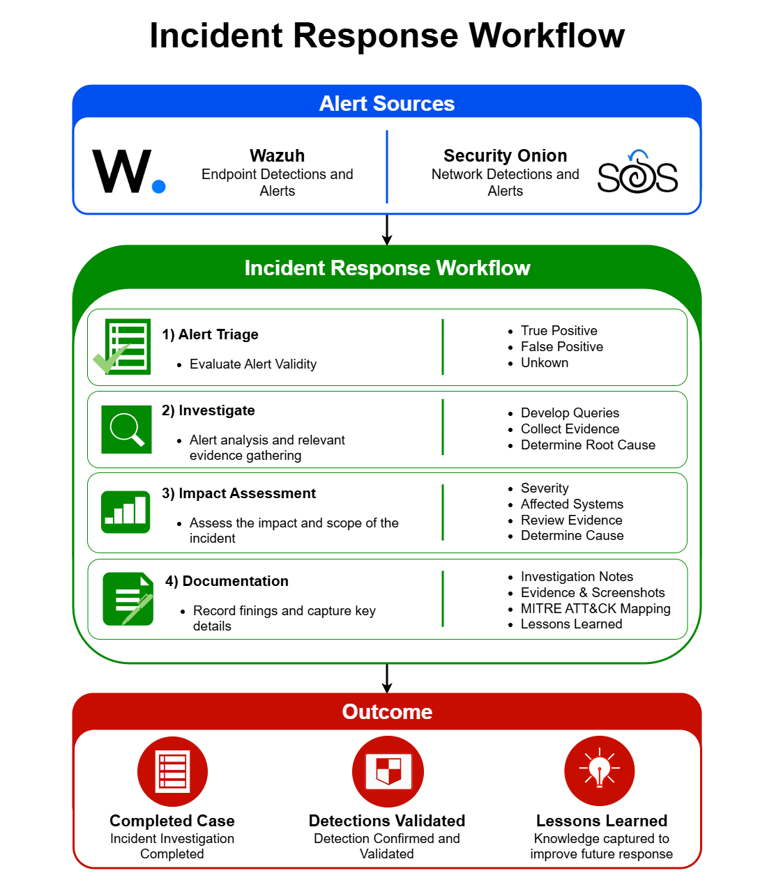

# Security Investigations

This section contains documented security investigations performed within the AESOC environment.

Each investigation follows a structured workflow:

1. Alert Triage
2. Investigation
3. Impact Assessment
4. Documentation

Investigations focus on validating detections, analyzing telemetry, identifying root cause, and mapping activity to the MITRE ATT&CK framework.

---

## Investigation Categories

### Windows Investigations

| Case ID | Investigation |
|----------|----------|
| Case-001 | PowerShell Encoded Command Execution |
| Case-002 | Registry Run Key Persistence |
| Case-003 | Lateral Movement |
| Case-004 | Authentication Investigation |

### Linux Investigations

| Case ID | Investigation |
|----------|----------|
| Case-005 | Sudo Privilege Investigation |
| Case-006 | SSH Authentication Investigation |

### Network & Application Investigations

| Case ID | Investigation |
|----------|----------|
| Case-007 | SQL Injection Investigation |
| Case-008 | Malicious File Upload Investigation |
| Case-009 | Network Service Discovery Investigation|

---

## Investigation Methodology

All investigations include:

- Objective
- Alert Triage
- Detection Validation
- Investigation
- Findings
- MITRE ATT&CK Mapping
- Lessons Learned
- Conclusion

## Pre-SOAR Investigation Workflow

The following diagram represents the investigation process used before the implementation of Shuffle, TheHive, Zammad, and the full alert-to-resolution lifecycle.

[Open the workflow diagram at full size](Pre-SOAR-Investigation-Workflow.png)
