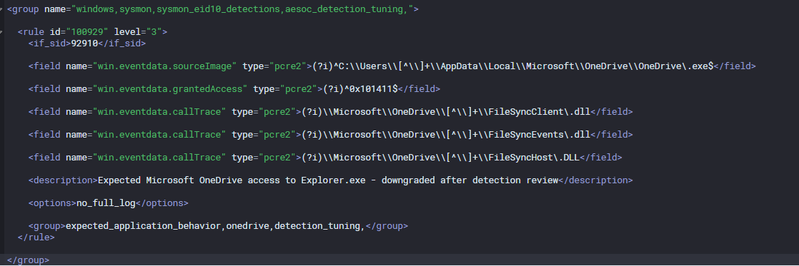
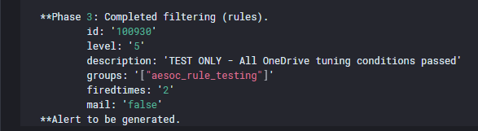
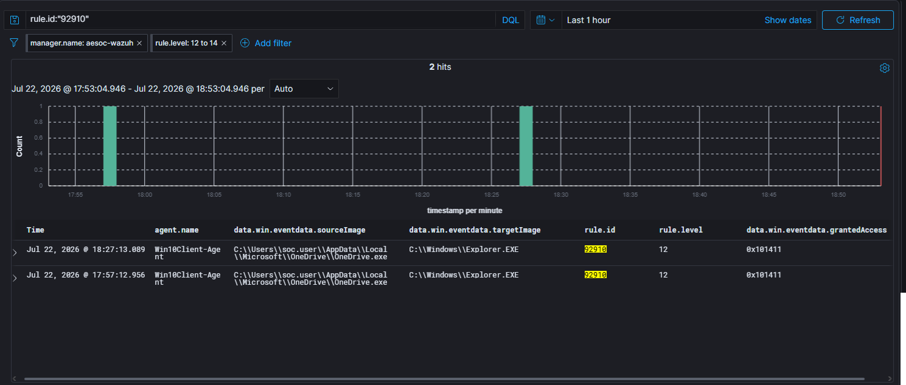

# Detection Engineering Review

Detection Engineering accepted Zammad Ticket `#72057` and confirmed
that Wazuh Rule `92910` created repeated High-severity noise for
validated OneDrive behavior.

## Review Accepted

The request included the Tier 2 scope review, binary validation, access
mask analysis, call-trace analysis, and review of the original Wazuh
rule logic.

## Proposed Rule

Custom Rule `100929` was proposed to downgrade only the approved
OneDrive-to-Explorer pattern while preserving Rule `92910` for events
that did not meet the reviewed conditions.

The proposed rule evaluated:

- Expected OneDrive installation path
- Granted access `0x101411`
- Expected OneDrive FileSync DLLs in the call trace

- [View the proposed production rule](Proposed-Wazuh-Rule-100929.xml)
- [View the temporary controlled-test rule](Temporary-Test-Rule-100930.xml)

## Controlled Testing

Temporary Rule `100930` was used to test the proposed field conditions
independently of the live Windows EventChannel parent-rule chain.

| Test | Expected result | Observed result |
|---|---|---|
| Approved OneDrive pattern | Test rule matches | Phase 3 matched Rule `100930`, Level 5 |
| Unexpected source path | Test rule does not match | Phase 2 only |
| Different access mask | Test rule does not match | Phase 2 only |
| Unexpected call trace | Test rule does not match | Phase 2 only |

Supporting artifacts:
- [Test-input payloads](Test-Inputs/)

## Live Validation

After the proposed production rule was saved and the manager restarted,
new natural OneDrive events continued to match Rule `92910` at Level 12
rather than Rule `100929` at Level 3.

The proposed production change was not retained. Rule `92910` remained
enabled at its original severity, preserving existing detection
coverage.

Detection tuning remained warranted but was deferred until a supported
platform update or alternate rule-precedence design could be validated.

## Review Completed and Ticket Closed

[Return to the full investigation](../)
