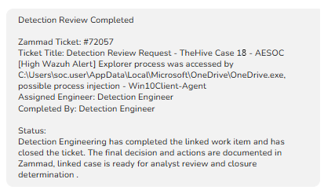

# Final Disposition

After Zammad Ticket `#72057` closed, Shuffle synchronized the Detection
Engineering completion status back to TheHive for Tier 2 review.

> **Workflow note:** The synchronized ticket title displays TheHive
> Case 17 because of a field-mapping issue in the closure workflow.
> Zammad Ticket `#72057` belongs to this investigation, TheHive Case 18.

Tier 2 reviewed the completed Detection Engineering work and closed the
case.

## Closure Decision

| Field | Result |
|---|---|
| Status | True Positive |
| Classification | Benign Application Behavior |
| Impact | No |
| Endpoint compromise | Not identified |
| Containment | Not required |
| Remediation | Not required |
| Detection tuning | Required but deferred |
| Existing detection coverage | Preserved |

The remaining issue was repeated alert noise and analyst workload, not
active security risk.

No production tuning change was retained because the proposed custom
rule did not pass live validation.

[Return to the full investigation](../)
