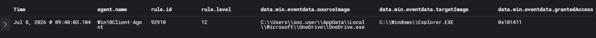
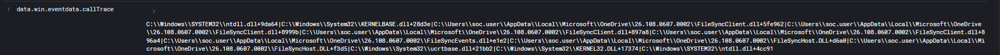
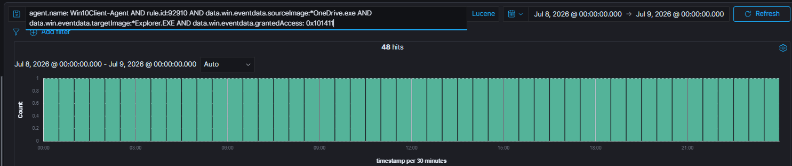
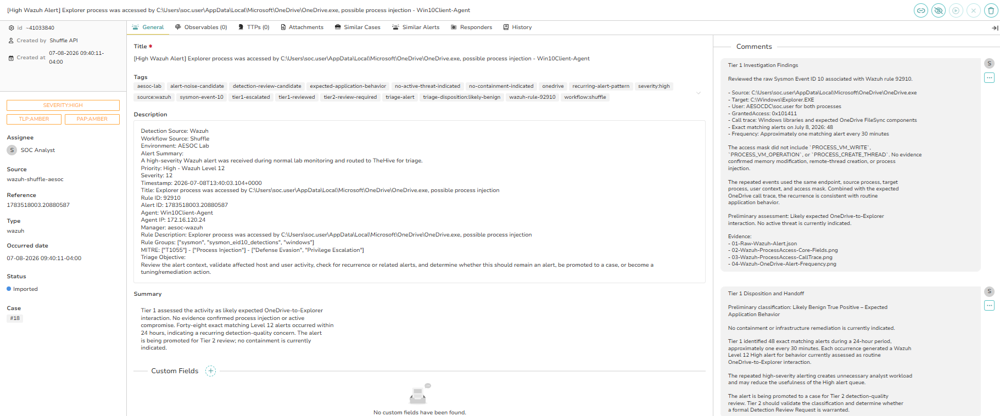
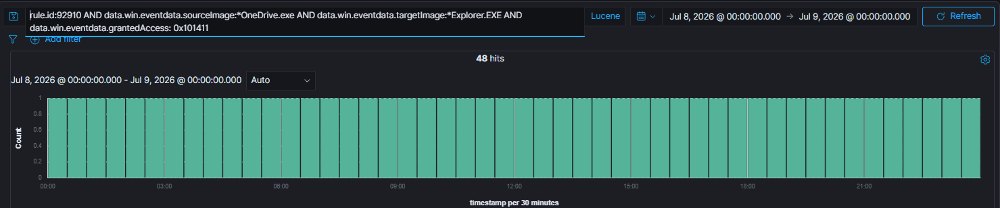
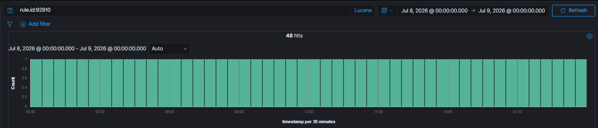
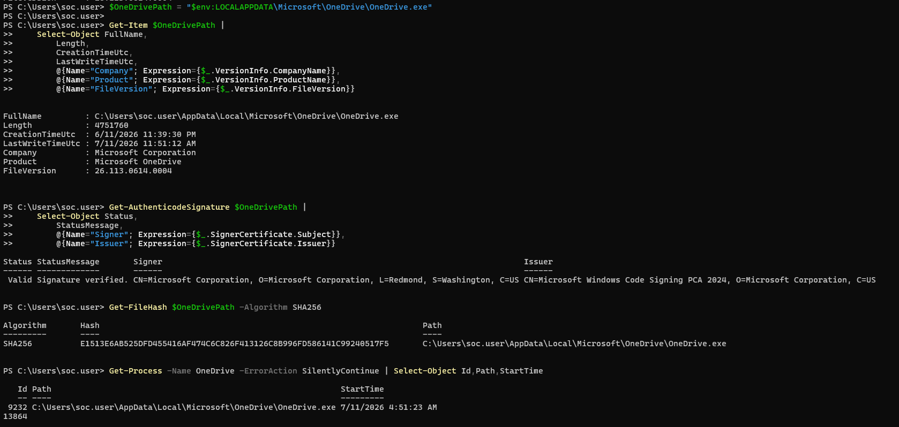
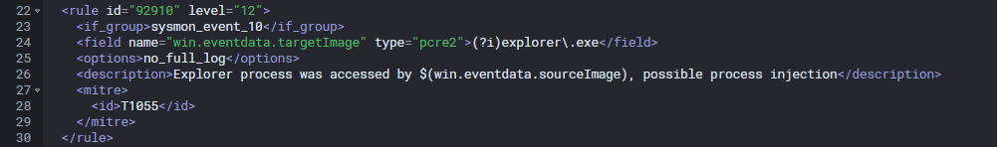
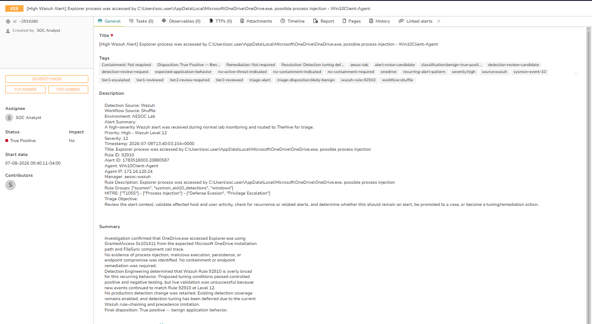

# OneDrive.exe Access to Explorer.exe Investigation

## Executive Summary

Wazuh generated a Level 12 alert after Microsoft OneDrive accessed
Explorer.exe through Sysmon Event ID 10.

The alert progressed through the complete AESOC alert-to-resolution
lifecycle:

Wazuh → Shuffle → TheHive → Tier 1 → Tier 2 →
Detection Engineering → Zammad → TheHive Closure

The activity was confirmed as legitimate Microsoft OneDrive behavior.
No evidence of process injection or endpoint compromise was identified.

Detection Engineering confirmed that Wazuh Rule 92910 was overly broad.
A proposed tuning rule passed controlled condition testing but failed
live validation. Detection tuning was therefore deferred, while the
original detection coverage remained enabled.

## Final Outcome

| Field | Result |
|---|---|
| Classification | True Positive — Benign Application Behavior |
| Impact | No |
| Containment | Not required |
| Remediation | Not required |
| Detection tuning | Required but deferred |
| Case status | Closed |

---

## 1. Alert Intake

Wazuh Rule 92910 generated a Level 12 alert for a Sysmon Event ID 10
process-access event.

| Field | Value |
|---|---|
| Endpoint | Win10Client-Agent |
| Source process | OneDrive.exe |
| Target process | Explorer.exe |
| Granted access | 0x101411 |
| MITRE mapping | T1055 — Process Injection |

The call trace contained expected OneDrive FileSync components:

- FileSyncClient.dll
- FileSyncEvents.dll
- FileSyncHost.DLL

The complete alert is available as
[raw JSON](00-Alert-Intake/01-Raw-Wazuh-Alert-1783532403.27005643.json).

---

## 2. Tier 1 Triage

Tier 1 reviewed the event and identified 48 exact matching alerts within
24 hours, occurring approximately once every 30 minutes.

No process permissions indicating direct memory writing or remote-thread
creation were identified.

Tier 1 assessed the activity as likely benign application behavior.
No containment was required, but the alert was promoted to TheHive
Case 18 for Tier 2 detection-quality review.

[View the Tier 1 deep dive](01-Tier-1-Triage/)

---

## 3. Tier 2 Investigation

Tier 2 expanded the query across the AESOC environment.

The exact OneDrive-to-Explorer pattern returned 48 alerts. A query for
all Rule 92910 alerts returned the same total, indicating that all
observed Rule 92910 activity during the review period came from this
single recurring pattern.

The currently installed OneDrive executable was validated as a
Microsoft-signed binary running from the expected path.

Rule 92910 was found to evaluate only Sysmon Event ID 10 events targeting
Explorer.exe. It did not evaluate source process, access mask, signature,
call trace, or user context.

Tier 2 concluded that the activity was benign, but the repeated
High-severity alerts warranted Detection Engineering review.

[View the Tier 2 deep dive](02-Tier-2-Investigation/)

---

## 4. Detection Engineering

Detection Engineering accepted the request and confirmed that tuning
was warranted.

Custom Rule 100929 was proposed to downgrade only the validated
OneDrive pattern.

The proposed conditions required:

- Expected OneDrive path
- GrantedAccess 0x101411
- Expected FileSync DLL call trace

Controlled testing produced the following results:

| Test | Result |
|---|---|
| Approved OneDrive pattern | Passed |
| Unexpected source path | Rejected |
| Different access mask | Rejected |
| Unexpected call trace | Rejected |

Live validation failed because new events continued to match Rule 92910
at Level 12 instead of Rule 100929 at Level 3.

No production detection change was retained. Detection tuning was
deferred because of the current Wazuh rule-chaining and precedence
behavior.

[View the Detection Engineering deep dive](03-Detection-Engineering/)

---

## 5. Final Disposition

Tier 2 reviewed the completed Detection Engineering work and closed the
TheHive case.

Final determination:

- True Positive — Benign Application Behavior
- No security impact
- No containment required
- No remediation required
- Detection tuning deferred
- Existing detection coverage preserved

[View the final disposition](04-Final-Disposition/)

---

## Skills Demonstrated

- Alert triage
- Process-access analysis
- Wazuh and Sysmon investigation
- Scope and frequency analysis
- Binary and digital-signature validation
- Detection-logic review
- Detection Engineering handoff
- Controlled positive and negative rule testing
- Case and ticket lifecycle management
- Honest documentation of unsuccessful production validation
