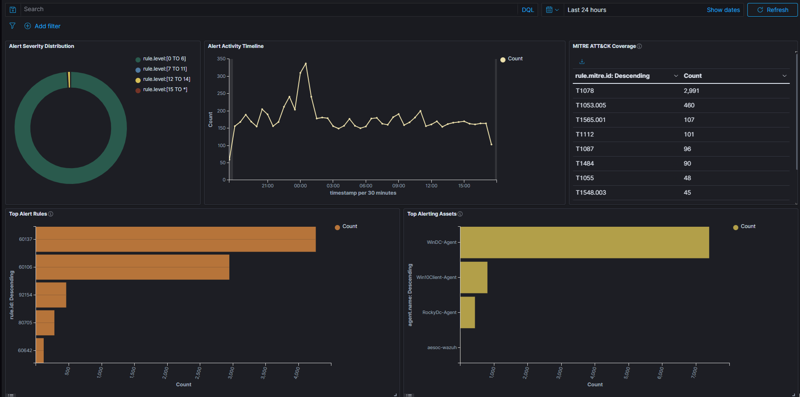

# Wazuh Dashboard 001: Wazuh Security Monitoring Dashboard

## Objective

Develop a centralized Wazuh dashboard that provides real-time visibility into endpoint security telemetry, alert activity, MITRE ATT&CK coverage, detection performance, and asset-level alert generation across the AESOC environment.

---

## Dashboard Information

| Field | Value |
|---------|---------|
| Platform | Wazuh |
| Data Sources | Sysmon, Windows Event Logs, Auditd, Wazuh Agents |
| Dashboard Type | Endpoint Security Monitoring |
| Purpose | Security Monitoring & Alert Triage |
| Status | Operational |

---

## Background

The AESOC environment generates endpoint telemetry from Windows and Linux systems using:

- Sysmon
- Windows Event Logs
- Auditd
- Wazuh Agents

As the number of investigations, custom detections, and adversary emulation exercises increased, a centralized monitoring dashboard became necessary to improve analyst visibility and streamline alert triage activities.

To address this requirement, a custom Wazuh Security Monitoring Dashboard was developed to provide a single-pane-of-glass view of endpoint security events across the environment. 

---

## Dashboard Goals

The dashboard was designed to provide visibility into:

- Alert Severity Distribution
- Detection Activity Trends
- MITRE ATT&CK Coverage
- Frequently Triggered Detection Rules
- Endpoint Alert Volume
- Security Monitoring Metrics
- Detection Validation Activities

---

## Dashboard Overview

### Screenshot 1 – Wazuh Security Monitoring Dashboard

The dashboard consolidates key endpoint security metrics into a single operational view.



---

## Dashboard Components

### Alert Severity Distribution

Located in the upper-left section of the dashboard.

Displays alert distribution using the native Wazuh severity model:

```text
Low      : 0-6
Medium   : 7-11
High     : 12-14
Critical : 15+
```

This visualization allows quick assessment of the overall security posture of the environment and identify elevated alert activity.

---

### Alert Activity Timeline

Located in the upper-center section of the dashboard.

Displays alert volume over time.

The timeline assists in identifying:

- Adversary Emulation Activity
- Detection Engineering Testing
- Investigation Exercises
- Unusual Endpoint Behavior
- Alert Spikes

This visualization provides rapid awareness of changes in endpoint activity levels.

---

### MITRE ATT&CK Coverage

Located in the upper-right section of the dashboard.

Displays observed ATT&CK techniques based on generated alerts.

Examples observed within the AESOC environment include:

```text
T1078  - Valid Accounts

T1053.005 - Scheduled Task

T1565.001 - Stored Data Manipulation

T1112 - Modify Registry

T1087 - Account Discovery

T1055 - Process Injection

T1548.003 - Sudo and Sudo Caching
```

This component helps understand which ATT&CK techniques are actively represented within the environment.

---

### Top Alert Rules

Located in the lower-left section of the dashboard.

Displays the most frequently triggered detection rules.

Benefits include:

- Identifying recurring alerts
- Identifying potential false positives
- Measuring detection effectiveness
- Prioritizing detection tuning efforts
- Highlighting high-volume detections

Examples observed include:

```text
60137
60106
92154
80705
60642
```

This visualization supports continuous detection improvement efforts.

---

### Top Alerting Assets

Located in the lower-right section of the dashboard.

Displays systems generating the highest volume of alerts.

Observed assets include:

```text
WinDC-Agent
Win10Client-Agent
RockyDC-Agent
```

This visualization allows quickl identification of which systems are generating the most security-relevant activity.

---

## Operational Use Cases

The dashboard supports:

### Security Monitoring

Provides continuous visibility into endpoint security activity.

### Alert Triage

Allows rapid identification of high-severity alerts requiring review.

### Detection Validation

Supports testing and validation of:

- Wazuh Rules
- Sysmon Rules
- Auditd Rules
- Custom Detection Logic

### Threat Hunting

Provides visibility into ATT&CK techniques and endpoint behavior trends.

### Detection Engineering

Highlights noisy detections and opportunities for tuning.

---

## Findings

Analysis of dashboard telemetry revealed:

### Endpoint Visibility

The dashboard successfully consolidated telemetry from Windows and Linux systems into a centralized monitoring interface.

---

### ATT&CK Coverage Visibility

ATT&CK mappings provided immediate insight into the techniques represented within the environment, allowing validatation of detection coverage.

---

### Detection Performance Monitoring

Top Alert Rules enabled rapid identification of high-volume detections and opportunities for tuning.

---

### Asset Prioritization

Top Alerting Assets allows quickl identification of systems generating the highest volume of security events.

---

### Investigation Efficiency

The dashboard significantly reduced the time required to:

- Locate alerts
- Review affected systems
- Validate detections
- Correlate endpoint activity

---

## Skills Demonstrated

- Wazuh
- Sysmon
- Auditd
- Endpoint Security Monitoring
- Security Dashboard Development
- Detection Engineering
- Threat Hunting
- MITRE ATT&CK Mapping
- Alert Triage
- SOC Operations
- Security Analytics
- Detection Validation

---

## MITRE ATT&CK Relevance

| Technique | Description |
|------------|------------|
| T1078 | Valid Accounts |
| T1087 | Account Discovery |
| T1112 | Modify Registry |
| T1053.005 | Scheduled Task |
| T1548.003 | Sudo and Sudo Caching |
| T1055 | Process Injection |
| T1565.001 | Stored Data Manipulation |

---

## Lessons Learned

- Centralized dashboards significantly improve efficiency.
- ATT&CK mappings provide valuable visibility into detection coverage.
- Asset-based alert monitoring simplifies investigation prioritization.
- High-volume detections can quickly be identified for tuning.
- Visualization of endpoint telemetry improves situational awareness.
- Dashboards complement investigation workflows by reducing time-to-triage.

---

## Conclusion

A custom Wazuh Security Monitoring Dashboard was developed to centralize endpoint security telemetry across the AESOC environment.

The dashboard provides visibility into alert severity, detection trends, ATT&CK coverage, alerting assets, and detection performance while supporting investigation, threat hunting, and detection engineering activities.

The project demonstrates practical experience with:

**Wazuh → Sysmon → Auditd → MITRE ATT&CK → Dashboard Development → Detection Engineering → Security Monitoring → SOC Operations**

The dashboard serves as the primary endpoint monitoring platform within the AESOC environment and complements the Security Onion Network Threat Monitoring Dashboard to provide complete host and network visibility.
