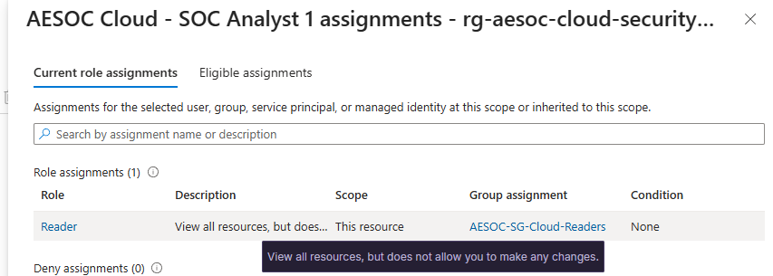
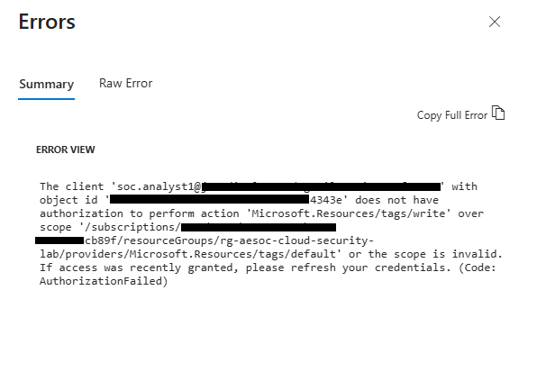
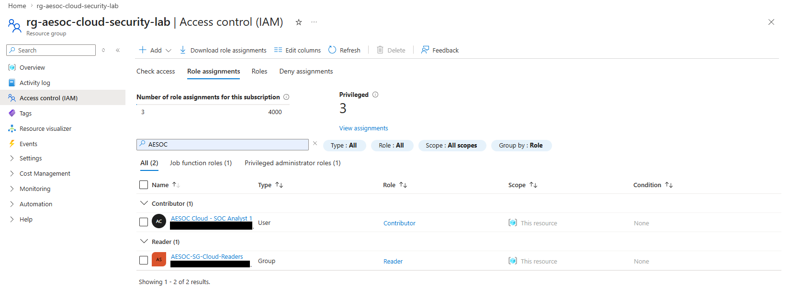
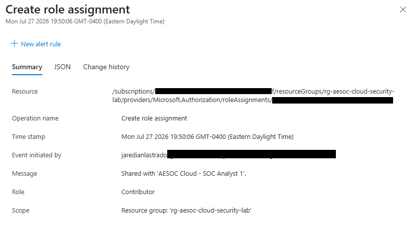
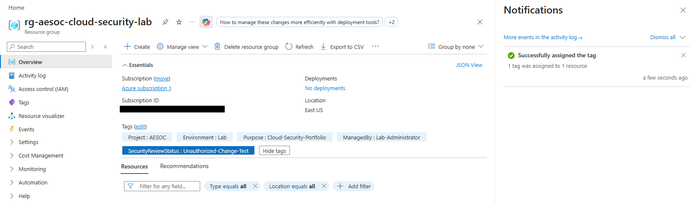
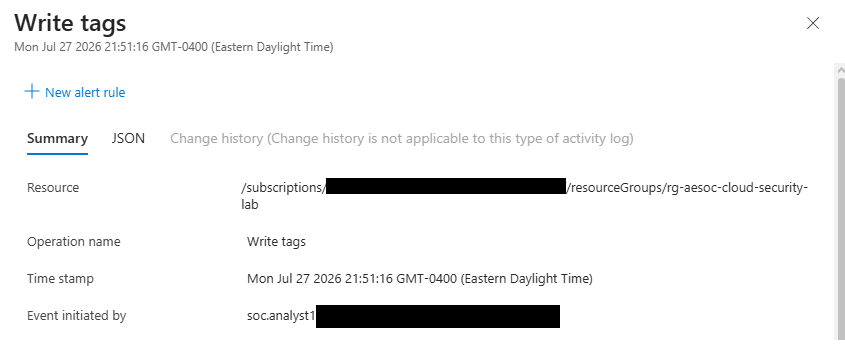
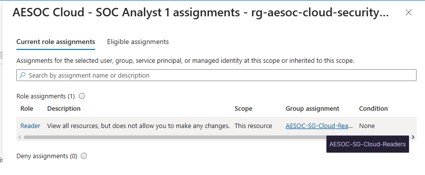
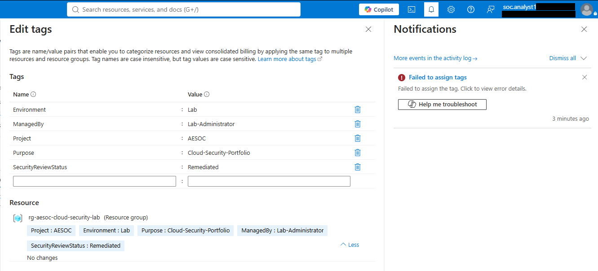

# Unauthorized Azure Contributor Assignment

## Summary

Investigated a simulated unauthorized Azure Contributor assignment that bypassed the approved group-based Reader access model.

The elevated access allowed a SOC analyst account to modify Azure resource-group tags. Azure Activity Log evidence was used to identify the role assignment, initiating administrator, affected identity, scope, and subsequent resource modification.

## Environment

- Microsoft Entra ID
- Azure RBAC
- Azure Activity Log
- Resource group: `rg-aesoc-cloud-security-lab`

## Expected Access

`AESOC Cloud - SOC Analyst 1` was approved for:

- Reader access
- Assigned through `AESOC-SG-Cloud-Readers`
- Scoped to the AESOC cloud-security resource group

## Investigation

1. Confirmed group-based Reader access.
2. Verified that tag modification was denied.
3. Assigned Contributor directly to the analyst.
4. Confirmed the assignment in Azure Activity Log.
5. Successfully modified the `SecurityReviewStatus` tag.
6. Attributed the tag-write event to the analyst account.
7. Removed the direct Contributor assignment.
8. Confirmed Reader access remained and tag modification was denied again.

## Finding

**Classification:** Unauthorized cloud role assignment  
**Severity:** High  
**Disposition:** True positive — authorized lab simulation

The direct Contributor assignment violated least privilege and enabled unauthorized modification of resource-group metadata.

## Response

- Removed the direct Contributor assignment
- Preserved approved group-based Reader access
- Changed `SecurityReviewStatus` to `Remediated`
- Repeated the write test and confirmed authorization failure

## Evidence

### Baseline

### Privilege Escalation

### Impact

### Containment and Recovery

## Outcome

The unauthorized Contributor assignment was removed, the configuration change was remediated, and least-privilege Reader access was restored.
