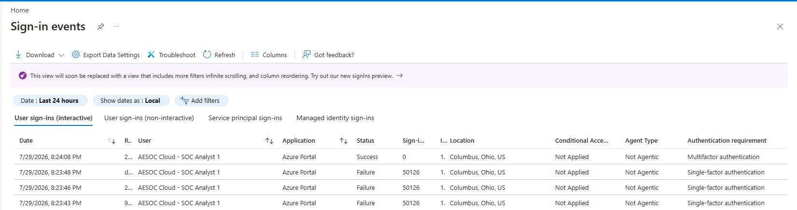
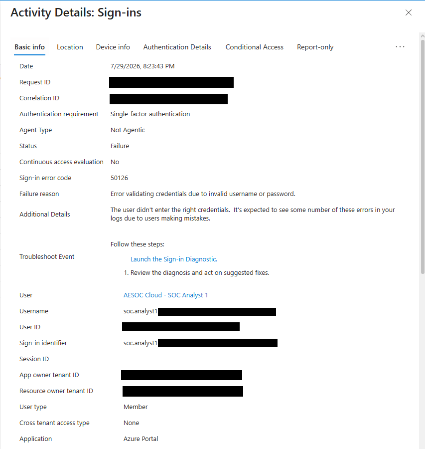
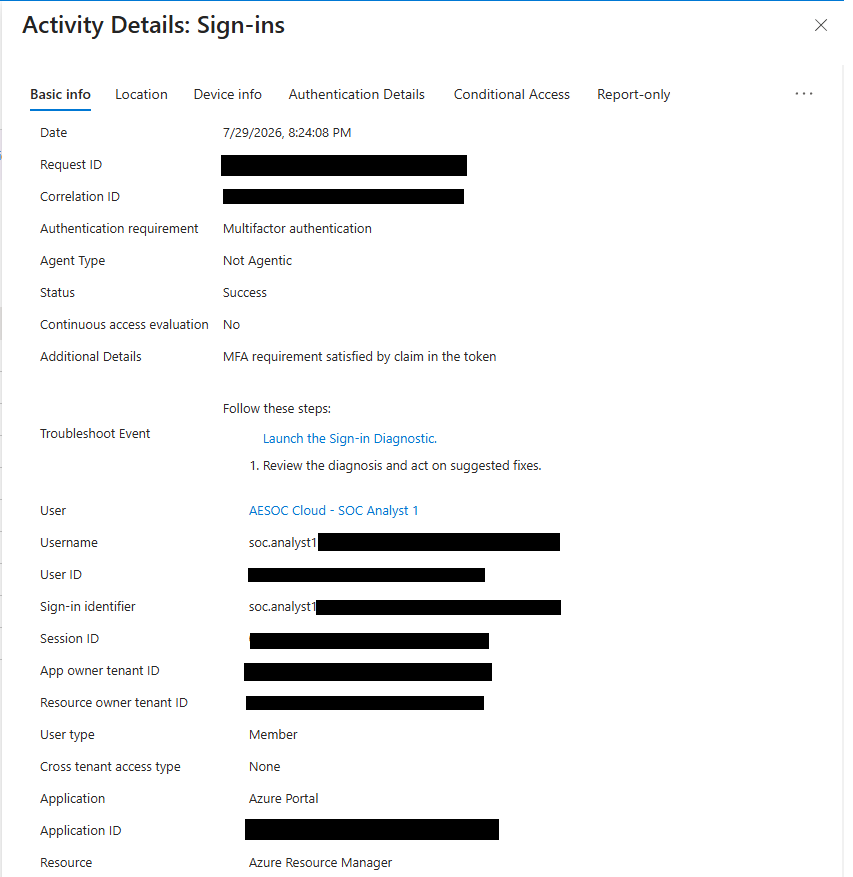
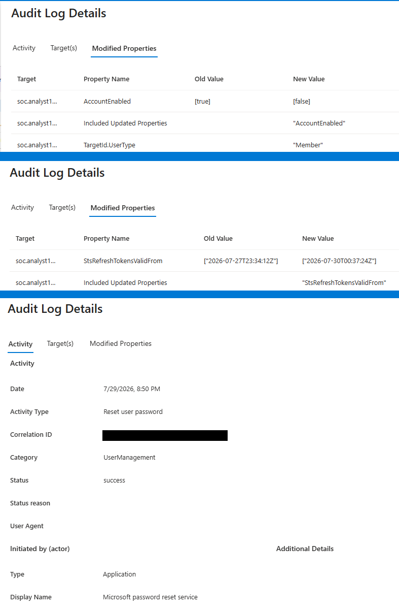
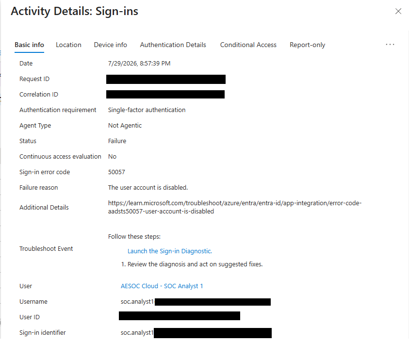
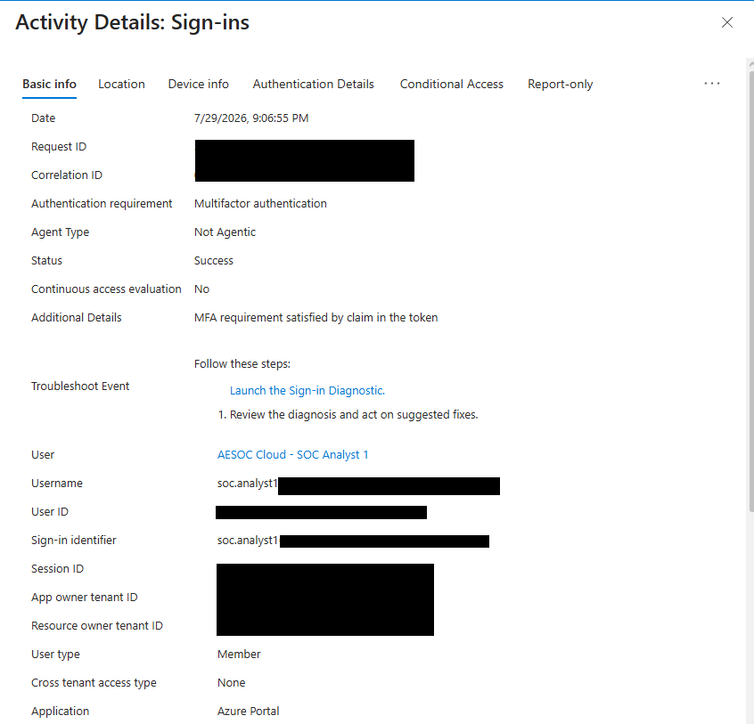

# Suspicious Entra Sign-In and Account Containment

## Summary

Investigated a simulated suspicious Microsoft Entra sign-in sequence involving three failed password attempts followed by a successful MFA-authenticated Azure Portal sign-in.

The affected account was disabled, active sessions were revoked, the password was reset, and sign-in blocking was validated before securely restoring access.

## Environment

- Microsoft Entra ID
- Entra sign-in logs
- Entra audit logs
- Microsoft Authenticator
- Azure Portal

## Investigation

1. Identified three failed sign-ins with error code `50126`.
2. Confirmed a successful MFA-authenticated sign-in immediately afterward.
3. Reviewed the affected identity, timestamps, application, authentication requirement, and failure reason.
4. Classified the sequence as suspicious authentication activity.
5. Disabled the affected account.
6. Revoked active sessions.
7. Reset the user password.
8. Confirmed a new sign-in was blocked with error code `50057`.
9. Re-enabled the account and validated successful MFA authentication.

## Finding

**Classification:** Suspicious authentication activity  
**Severity:** Medium  
**Disposition:** True positive — authorized lab simulation

Three invalid password attempts were followed by a successful MFA-authenticated Azure Portal session. Although no real compromise occurred, the sequence was treated as suspected account compromise for containment testing.

## Evidence

### Suspicious Authentication Sequence

### Containment

### Recovery

## Response

- Disabled the affected account
- Revoked active authentication sessions
- Reset the account password
- Verified that new authentication was blocked
- Re-enabled the account after remediation
- Validated successful MFA authentication

## Outcome

The suspicious authentication sequence was investigated, account access was contained, existing sessions were revoked, credentials were replaced, and secure MFA-protected access was restored.
