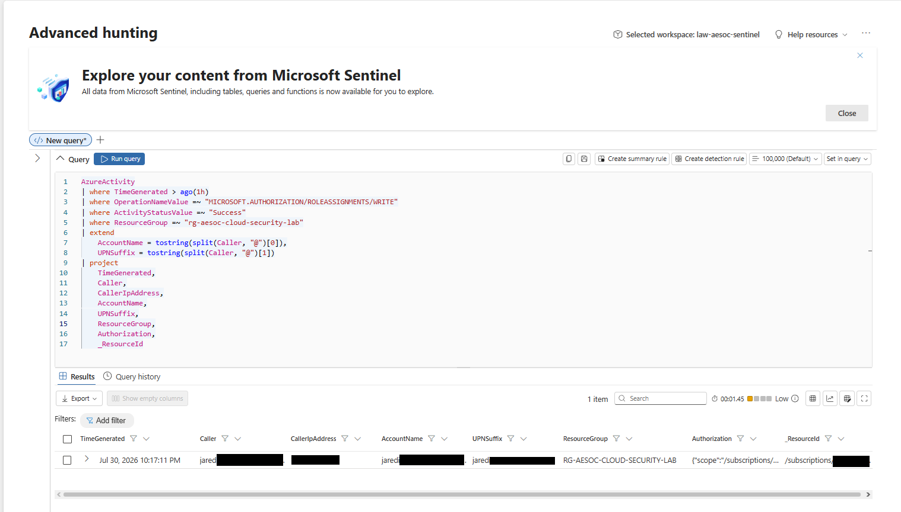
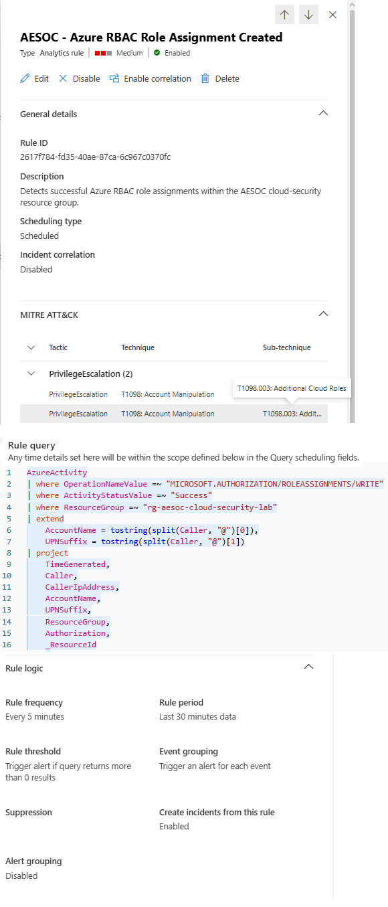
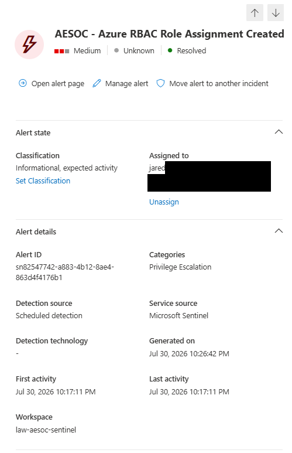
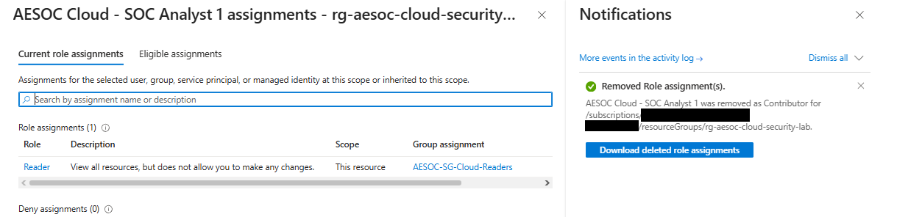
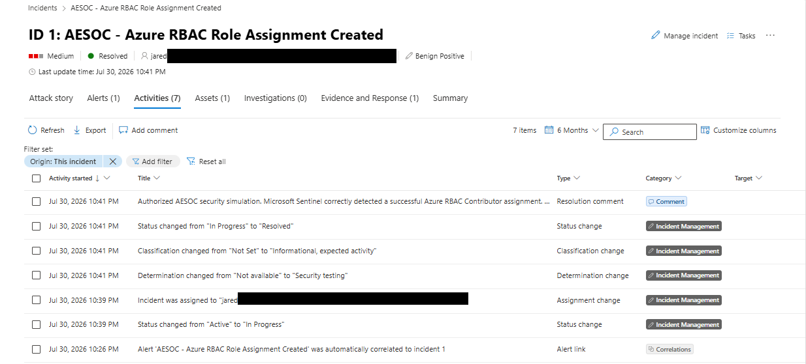

# Azure RBAC Role Assignment Detection

## Summary

Built and validated a Microsoft Sentinel analytics rule that detects successful Azure RBAC role assignments in the AESOC cloud-security resource group.

A controlled Contributor assignment tested the full workflow:

```text
Role assignment
→ Azure Activity logs
→ KQL detection
→ Sentinel alert
→ Incident investigation
→ Access removal
→ Incident closure
```

## Security Test

`AESOC Cloud - SOC Analyst 1` normally received Reader access through `AESOC-SG-Cloud-Readers`.

A direct Contributor assignment was added to simulate excessive cloud permissions and a least-privilege violation.

## Detection

Azure recorded the change as:

```text
Microsoft.Authorization/roleAssignments/write
```

The Microsoft Sentinel analytics rule:

- Ran every 5 minutes
- Reviewed the previous 30 minutes of Azure Activity logs
- Generated a Medium-severity alert
- Created an incident for investigation
- Mapped the activity to `T1098.003 — Additional Cloud Roles`


## Investigation and Response

The investigation reviewed:

- Initiating administrator account
- Source IP address
- Event timestamp
- Affected resource group
- Successful Azure RBAC operation

The direct Contributor assignment was removed while the approved group-based Reader access remained.

The incident was resolved as:

- **Classification:** Informational, expected activity
- **Determination:** Security testing
- **Status:** Resolved

## Evidence

### 1. KQL Detection

The successful role assignment was identified in Microsoft Sentinel.



### 2. Analytics Rule

The scheduled Microsoft Sentinel analytics rule was enabled and mapped to the relevant account and IP entities.



### 3. Generated Alert

Microsoft Sentinel generated a Medium-severity alert from the successful role-assignment event.



### 4. Containment

The direct Contributor assignment was removed while approved Reader access remained.



### 5. Investigation and Resolution

The incident timeline documents ownership, investigation, classification, resolution comments, and closure.



## Outcome

Microsoft Sentinel successfully detected the Azure RBAC role assignment, generated an alert and incident, and supported investigation, containment, and closure.

**Final state:** Contributor access removed and least-privilege Reader access restored.

## Disclaimer

This activity was performed in an isolated personal lab as an authorized security simulation. No production systems or unauthorized accounts were accessed.
