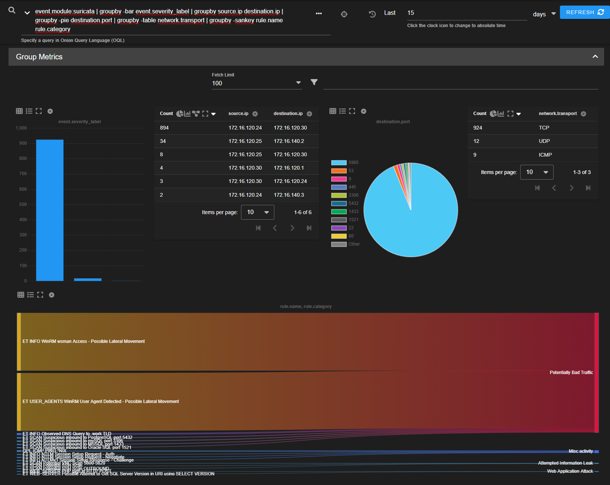
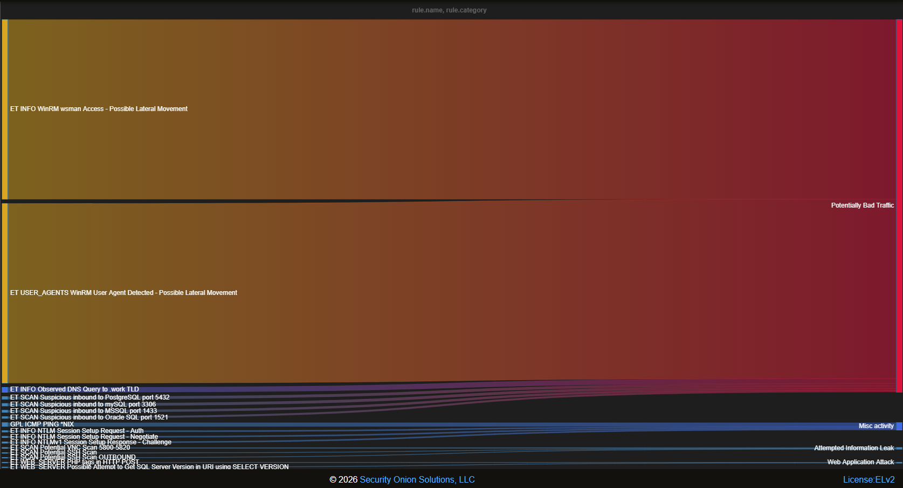

# Dashboard 002: Security Onion Network Threat Monitoring Dashboard

## Objective

Develop a custom Security Onion dashboard that provides centralized visibility into network security events generated by Suricata, enabling analysts to quickly identify alert trends, communication patterns, targeted services, protocol usage, and network-based threats.

---

## Dashboard Information

| Field | Value |
|---------|---------|
| Platform | Security Onion |
| Data Source | Suricata |
| Dashboard Type | Network Threat Monitoring |
| Purpose | Network Security Monitoring & Threat Hunting |
| Status | Operational |

---

## Background

During adversary emulation exercises conducted within the AESOC Lab environment, Security Onion generated a significant volume of network-based alerts from Suricata.

Although individual alerts could be reviewed through the Security Onion interface, analysts lacked a centralized operational view capable of displaying:

- Alert severity distribution
- Communication patterns
- Targeted services
- Protocol usage
- Alert classifications
- Threat hunting metrics

To improve visibility and analyst efficiency, a custom Security Onion dashboard was developed using Onion Query Language (OQL).

The dashboard consolidates key network security metrics into a single view, enabling rapid identification of suspicious activity and supporting network investigations.

---

## Dashboard Query

```text
event.module:suricata
| groupby -bar event.severity_label
| groupby source.ip destination.ip
| groupby -pie destination.port
| groupby -table network.transport
| groupby -sankey rule.name rule.category
```

---

## Dashboard Components

### Alert Severity Distribution

Displays alert volume categorized by severity.

Severity categories include:

```text
High
Medium
Low
```

This visualization provides analysts with immediate visibility into the overall security posture of the environment.

---

### Source-to-Destination Communication Matrix

Displays communication flows between hosts.

Observed examples:

```text
172.16.120.24 → 172.16.120.30
172.16.120.25 → 172.16.140.2
172.16.120.25 → 172.16.120.30
```

This visualization supports investigations involving:

- Lateral Movement
- Authentication Activity
- Threat Hunting
- Network Discovery
- Suspicious Communications

---

### Targeted Service Distribution

Displays destination ports observed in network alerts.

Observed services include:

```text
5985 (WinRM)
80 (HTTP)
53 (DNS)
445 (SMB)
1433 (MSSQL)
3306 (MySQL)
5432 (PostgreSQL)
1521 (Oracle SQL)
```

This visualization highlights services most frequently associated with security events.

---

### Protocol Distribution

Displays protocol usage across observed alerts.

Protocols observed:

```text
TCP
UDP
ICMP
```

This provides a high-level view of network activity patterns.

---

### Alert Classification Flow

Uses a Sankey visualization to map:

```text
Rule Name
      ↓
Rule Category
```

This helps analysts understand how individual detections contribute to broader categories of network activity.

---

## Threat Hunting Value

The dashboard enables analysts to quickly identify:

- High-volume detections
- Frequently targeted services
- Communication hotspots
- Network reconnaissance activity
- Lateral movement activity
- Protocol anomalies
- Alert category trends

---

## Findings

Analysis of dashboard telemetry identified several notable observations.

### WinRM Activity

The highest volume detections were associated with WinRM activity generated during lateral movement validation testing.

Examples included:

```text
ET INFO WinRM wsman Access - Possible Lateral Movement

ET USER_AGENTS WinRM User Agent Detected - Possible Lateral Movement
```

---

### Network Discovery Activity

The dashboard successfully identified reconnaissance and scanning activity including:

```text
ET SCAN Potential SSH Scan

ET SCAN Suspicious inbound to MSSQL port 1433

ET SCAN Suspicious inbound to PostgreSQL port 5432

ET SCAN Suspicious inbound to MySQL port 3306
```

---

### Alert Classification Trends

The Sankey visualization grouped detections into broader categories including:

```text
Potentially Bad Traffic

Attempted Information Leak

Misc Activity

Web Application Attack
```

This significantly improved triage efficiency.

---

### Communication Analysis

Communication analysis showed the Domain Controller and Security Onion Honeypot were among the most frequently targeted systems during adversary emulation exercises.

---

### Protocol Analysis

TCP traffic accounted for the overwhelming majority of observed network alerts.

---

## MITRE ATT&CK Relevance

| Technique | Description |
|------------|------------|
| T1021 | Remote Services |
| T1046 | Network Service Discovery |
| T1018 | Remote System Discovery |
| T1078 | Valid Accounts |
| T1190 | Exploit Public-Facing Application |
| T1059 | Command and Scripting Interpreter |

---

## Screenshots

### Screenshot 1 – Dashboard Overview

Custom Security Onion dashboard displaying alert severity, communication patterns, targeted services, protocol usage, and alert classifications.



---

### Screenshot 2 – Alert Classification Sankey Visualization

Expanded Sankey visualization showing relationships between Suricata detections and broader alert categories.



---

## Skills Demonstrated

- Security Onion
- Network Security Monitoring (NSM)
- Suricata Analysis
- Onion Query Language (OQL)
- Threat Hunting
- Security Dashboard Development
- Detection Analysis
- Network Traffic Analysis
- Alert Triage
- SOC Monitoring
- Security Visualization

---

## Lessons Learned

- Dashboards significantly improve analyst efficiency by centralizing telemetry.
- Communication mapping helps identify lateral movement and reconnaissance activity.
- Service distribution visualizations quickly highlight targeted services.
- Alert categorization improves triage and prioritization.
- Sankey visualizations provide valuable context for understanding detection relationships.
- Network monitoring complements endpoint monitoring and improves overall visibility.

---

## Conclusion

A custom Security Onion Network Threat Monitoring Dashboard was developed to centralize Suricata alert telemetry and improve analyst visibility into network security events.

The dashboard successfully provides visibility into alert severity, communication patterns, targeted services, protocol usage, and alert classifications while supporting threat hunting and incident investigations.

This dashboard complements the Wazuh Security Monitoring Dashboard by providing network-centric visibility while Wazuh provides endpoint-centric visibility, creating a complete monitoring capability within the AESOC environment.

The project demonstrates practical experience with:

**Security Onion → Suricata Analysis → OQL Development → Dashboard Design → Threat Hunting → Network Monitoring**
