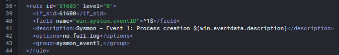
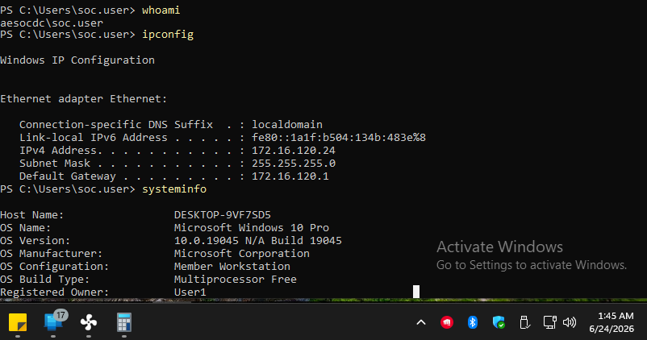
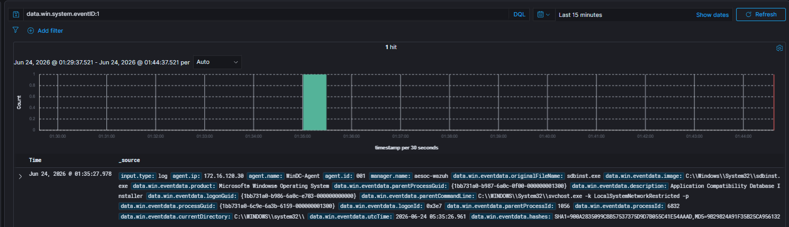
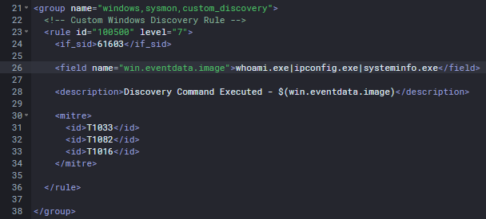
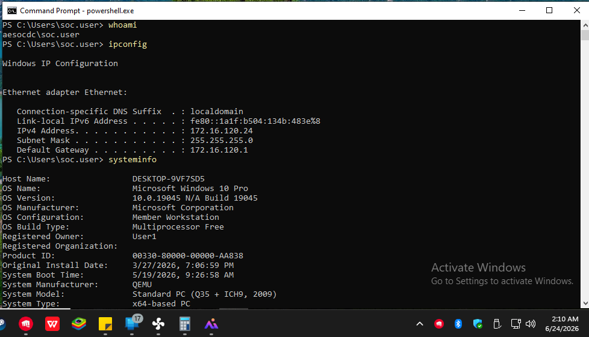
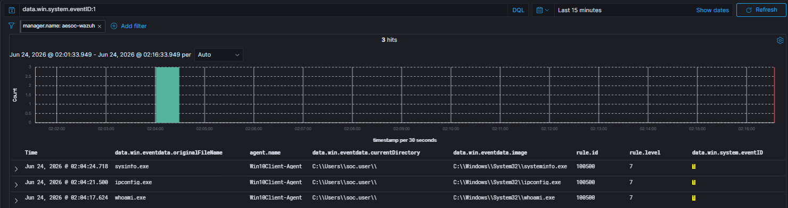

# Detection Engineering 001: Windows Discovery Activity Detection

## Objective

Develop a custom Wazuh detection capable of identifying Windows Discovery commands using Sysmon Event ID 1 Process Creation telemetry.

---

## Detection Information

| Field | Value |
|---------|---------|
| Platform | Wazuh |
| Detection Type | Custom Rule Development |
| Data Source | Sysmon Event ID 1 |
| Rule ID | 100500 |
| Severity | Medium |
| Status | Implemented |

---

## Background

During adversary emulation exercises within the AESOC Lab, several Windows Discovery commands were executed to simulate post-compromise reconnaissance activity.

Examples included:

```powershell
whoami
ipconfig
systeminfo
```

While reviewing telemetry in Wazuh, it was observed that these commands did not generate dedicated security alerts.

Although Sysmon Process Creation telemetry existed, I was required to manually search process creation logs to identify Discovery activity.

This represented a detection gap within the environment.

---

## Detection Gap Identification

### Existing Coverage

The environment already collected Sysmon Event ID 1 Process Creation telemetry through the default Wazuh Sysmon rule.

| Field | Value |
|---------|---------|
| Rule ID | 61603 |
| Severity | 0 |
| Description | Sysmon - Event 1 Process Creation |

The existing rule successfully collected telemetry but did not generate actionable alerts for Discovery techniques.

### Detection Gap

The following Discovery commands executed successfully without generating dedicated alerts:

- whoami.exe
- ipconfig.exe
- systeminfo.exe

As a result, analysts lacked visibility into common Discovery behavior associated with post-compromise reconnaissance.

---

## ATT&CK Mapping

### Tactic

```text
TA0007 – Discovery
```

### Techniques

| Technique | Description |
|------------|------------|
| T1033 | System Owner/User Discovery |
| T1016 | System Network Configuration Discovery |
| T1082 | System Information Discovery |

---

## Detection Engineering

### Detection Objective

Create a custom Wazuh rule capable of generating alerts whenever common Windows Discovery commands are executed.

### Parent Rule

```xml
<if_sid>61603</if_sid>
```

### Targeted Executables

```text
whoami.exe
ipconfig.exe
systeminfo.exe
```

### Custom Rule Logic

```xml
<group name="windows,sysmon,custom_discovery">

  <rule id="100500" level="7">
    <if_sid>61603</if_sid>

    <field name="win.eventdata.image">
      whoami.exe|ipconfig.exe|systeminfo.exe
    </field>

    <description>
      Discovery Command Executed - $(win.eventdata.image)
    </description>

    <mitre>
      <id>T1033</id>
      <id>T1082</id>
      <id>T1016</id>
    </mitre>

  </rule>

</group>
```

The rule was configured to generate a Level 7 alert whenever one of the targeted Discovery commands was executed.

---

## Detection Validation

Following deployment of the custom rule, the Discovery commands were executed again.

### Test Commands

```powershell
whoami
ipconfig
systeminfo
```

### Validation Results

The custom rule successfully generated dedicated alerts for all three Discovery commands.

Generated alerts included:

| Rule ID | Level |
|----------|----------|
| 100500 | 7 |

Detected executables:

- whoami.exe
- ipconfig.exe
- systeminfo.exe

---

## Results

### Before Implementation

| Capability | Status |
|------------|------------|
| Process Creation Visibility | Yes |
| Discovery Alerting | No |
| ATT&CK Mapping | No |
| Analyst Visibility | Limited |

### After Implementation

| Capability | Status |
|------------|------------|
| Process Creation Visibility | Yes |
| Discovery Alerting | Yes |
| ATT&CK Mapping | Yes |
| Analyst Visibility | Improved |

The custom detection transformed generic Sysmon telemetry into actionable Discovery alerts.

---

## Findings

| Category | Result |
|------------|------------|
| Detection Status | Successful |
| Classification | Detection Gap Resolved |
| Rule ID | 100500 |
| Severity | Medium |
| Status | Implemented |

The custom rule successfully identified Discovery command execution and generated dedicated alerts aligned to MITRE ATT&CK Discovery techniques.

---

## Screenshots

### Screenshot 1 – Existing Sysmon Process Creation Rule

Default Wazuh Sysmon Event ID 1 rule used as the parent detection source.



---

### Screenshot 2 – Discovery Command Execution

Windows Discovery commands executed to validate existing visibility and test detection coverage.



---

### Screenshot 3 – Detection Gap Validation

Investigation showing Discovery activity only visible through generic Sysmon telemetry and not generating dedicated alerts.



---

### Screenshot 4 – Custom Detection Rule

Custom Wazuh rule created to detect Windows Discovery command execution.



---

### Screenshot 5 – Detection Validation Testing

Discovery commands executed again following deployment of the custom detection rule.



---

### Screenshot 6 – Successful Detection Validation

Custom rule successfully generated alerts for whoami.exe, ipconfig.exe, and systeminfo.exe.



---

## Lessons Learned

- Sysmon Event ID 1 provides valuable process creation telemetry.
- Telemetry alone does not provide effective detection coverage.
- Detection engineering transforms raw telemetry into actionable alerts.
- MITRE ATT&CK mapping improves analyst context during investigations.
- Custom Wazuh rules can significantly improve visibility into adversary behavior.
- Discovery activity is commonly observed during post-compromise reconnaissance.
- Detection gaps should be identified and addressed before they are exploited by attackers.

---

## Conclusion

A detection gap was identified during adversary emulation exercises when Windows Discovery commands executed without generating dedicated alerts.

Although Sysmon Process Creation telemetry existed, I was required to manually review process creation events to identify Discovery activity.

A custom Wazuh rule was developed to detect execution of whoami.exe, ipconfig.exe, and systeminfo.exe and map the activity to MITRE ATT&CK Discovery techniques T1033, T1016, and T1082.

Following deployment, the custom detection successfully generated dedicated alerts for Discovery activity, improving visibility and strengthening detection coverage within the AESOC environment.

The project successfully demonstrated the complete Detection Engineering lifecycle:

**Detection Gap Identification → Rule Development → Testing → Validation → Deployment**
