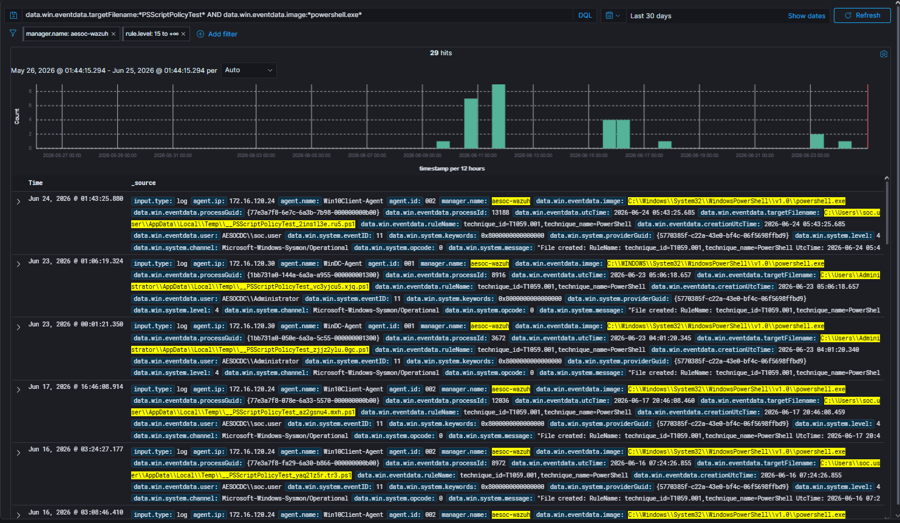
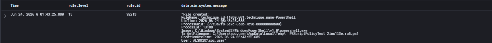
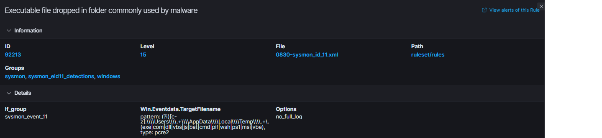
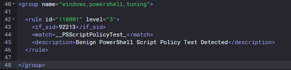
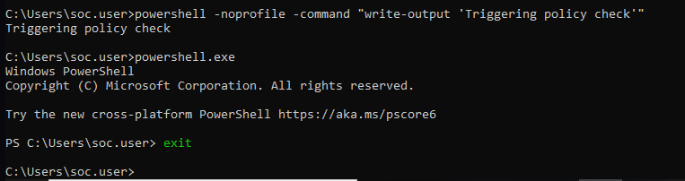
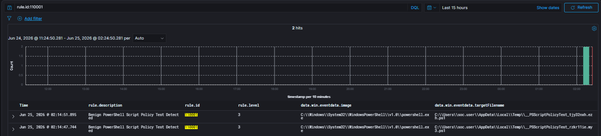

# Detection Tuning 001: Windows PowerShell Script Policy Test Reclassification

## Objective

Reduce false-positive severity generated by legitimate PowerShell Script Policy Test files while preserving analyst visibility into the activity.

---

## Tuning Information

| Field | Value |
|---------|---------|
| Platform | Wazuh |
| Tuning Type | False Positive Reduction |
| Parent Rule | 92213 |
| Custom Rule | 110001 |
| Original Severity | 15 |
| Tuned Severity | 3 |
| Status | Implemented |

---

## Background

During adversary emulation exercises, Atomic Red Team testing, and routine PowerShell validation activities within the AESOC Lab environment, multiple high-severity alerts were observed related to PowerShell file creation activity.

Historical review identified numerous alerts associated with PowerShell Script Policy Test files.

Although these alerts were generated correctly by Wazuh, investigation revealed that the activity was legitimate PowerShell behavior rather than malicious execution.

This resulted in unnecessary high-severity alerts and reduced overall detection fidelity.

---

## Detection Review

### Existing Detection

The alerts originated from the following Wazuh rule:

| Field | Value |
|---------|---------|
| Rule ID | 92213 |
| Severity | 15 |
| Description | Executable file dropped in folder commonly used by malware |

Rule 92213 detects executable content written to directories frequently abused by malware, including:

```text
C:\Users\<User>\AppData\Local\Temp\
```

The rule was functioning as designed.

---

## Detection Gap Analysis

Investigation revealed that the detected files were not malicious payloads.

Instead, they were PowerShell-generated Script Policy Test files:

```text
__PSScriptPolicyTest_<random>.ps1
```

Example:

```text
C:\Users\soc.user\AppData\Local\Temp\__PSScriptPolicyTest_2ins1l3e.ru5.ps1
```

These files are automatically created by PowerShell when validating execution policies and are considered normal operating system behavior.

### Root Cause

The original rule correctly detected file creation activity within a sensitive directory but lacked context regarding legitimate PowerShell Script Policy Test files.

As a result, benign activity was being classified with the same severity as potentially malicious payload drops.

---

## ATT&CK Mapping

| Technique | Description |
|------------|------------|
| T1059.001 | PowerShell |

---

## Detection Tuning Strategy

### Tuning Objective

Reduce the severity of known PowerShell Script Policy Test artifacts while maintaining visibility for analysts.

Instead of suppressing the activity entirely, a child rule was created to identify PowerShell-generated Script Policy Test files and reclassify them as low-severity events.

### Parent Rule

```xml
<if_sid>92213</if_sid>
```

### Custom Tuning Rule

```xml
<group name="windows,powershell,tuning">

  <rule id="110001" level="3">
    <if_sid>92213</if_sid>
    <match>__PSScriptPolicyTest_</match>
    <description>Benign PowerShell Script Policy Test Detected</description>
  </rule>

</group>
```

The rule inherits from Rule 92213 and matches PowerShell Script Policy Test filenames.

---

## Tuning Validation

Following deployment of the custom tuning rule, a new PowerShell Script Policy Test file was generated.

### Validation Command

```powershell
powershell -noprofile -command "write-output 'Triggering policy check'"
```

### Validation Results

The custom rule successfully triggered:

| Field | Value |
|---------|---------|
| Rule ID | 110001 |
| Severity | 3 |
| Description | Benign PowerShell Script Policy Test Detected |

The original high-severity alert was successfully reclassified as a low-severity event.

---

## Results

### Before Tuning

| Rule ID | Severity | Description |
|----------|----------|-------------|
| 92213 | 15 | Executable file dropped in folder commonly used by malware |

### After Tuning

| Rule ID | Severity | Description |
|----------|----------|-------------|
| 110001 | 3 | Benign PowerShell Script Policy Test Detected |

### Improvement Achieved

| Capability | Before | After |
|------------|------------|------------|
| Analyst Visibility | Yes | Yes |
| False Positive Severity | High | Low |
| Alert Fatigue | High | Reduced |
| Detection Fidelity | Moderate | Improved |

---

## Security Considerations

The activity was intentionally reclassified rather than suppressed.

Benefits of this approach include:

- Maintains analyst visibility
- Reduces alert fatigue
- Preserves audit history
- Prevents complete blind spots
- Allows future review if activity becomes suspicious

If an attacker attempted to abuse the PowerShell Script Policy Test naming convention, the activity would still be visible to analysts.

---

## Findings

| Category | Result |
|------------|------------|
| Tuning Status | Successful |
| Classification | False Positive Reduction |
| Parent Rule | 92213 |
| Custom Rule | 110001 |
| Severity Reduction | 15 → 3 |
| Status | Implemented |

The tuning project successfully reduced false-positive severity while maintaining visibility into PowerShell activity.

---

## Screenshots

### Screenshot 1 – Historical Alert Activity

Historical review showing repeated high-severity PowerShell Script Policy Test alerts.



---

### Screenshot 2 – Original Alert Investigation

Investigation showing Rule 92213 triggering on PowerShell-generated Script Policy Test files.



---

### Screenshot 3 – Original Rule Analysis

Review of Rule 92213 demonstrating why the activity was triggering as a high-severity alert.



---

### Screenshot 4 – Custom Tuning Rule

Custom child rule created to identify and reclassify PowerShell Script Policy Test artifacts.



---

### Screenshot 5 – Validation Testing

PowerShell execution used to generate a new Script Policy Test file and validate the tuning rule.



---

### Screenshot 6 – Successful Tuning Validation

Custom Rule 110001 successfully generated a low-severity alert for benign PowerShell activity.



---

## Skills Demonstrated

- Detection Analysis
- Detection Tuning
- False Positive Investigation
- Wazuh Rule Development
- Alert Prioritization
- Threat Detection Validation
- SOC Operations
- PowerShell Monitoring
- Detection Lifecycle Management

---

## Lessons Learned

- Not all high-severity alerts represent malicious activity.
- Detection fidelity is improved through continuous tuning.
- Alert fatigue can reduce analyst effectiveness.
- False positives should be reclassified rather than blindly suppressed.
- Parent-child rule relationships provide flexible tuning capabilities.
- Maintaining visibility is often preferable to suppressing activity entirely.
- Detection tuning is a critical component of SOC maturity.

---

## Conclusion

A review of historical PowerShell alerts identified repeated high-severity detections associated with legitimate PowerShell Script Policy Test files.

Although the original Wazuh rule correctly detected executable content being written to a sensitive directory, it lacked context regarding benign PowerShell-generated artifacts.

A custom child rule was developed to identify PowerShell Script Policy Test files and reduce their severity from Level 15 to Level 3.

The tuning successfully reduced alert fatigue while preserving analyst visibility, improving overall detection fidelity within the AESOC environment.

This project demonstrated the complete Detection Tuning lifecycle:

**False Positive Identification → Root Cause Analysis → Rule Development → Validation → Tuning Implementation**
