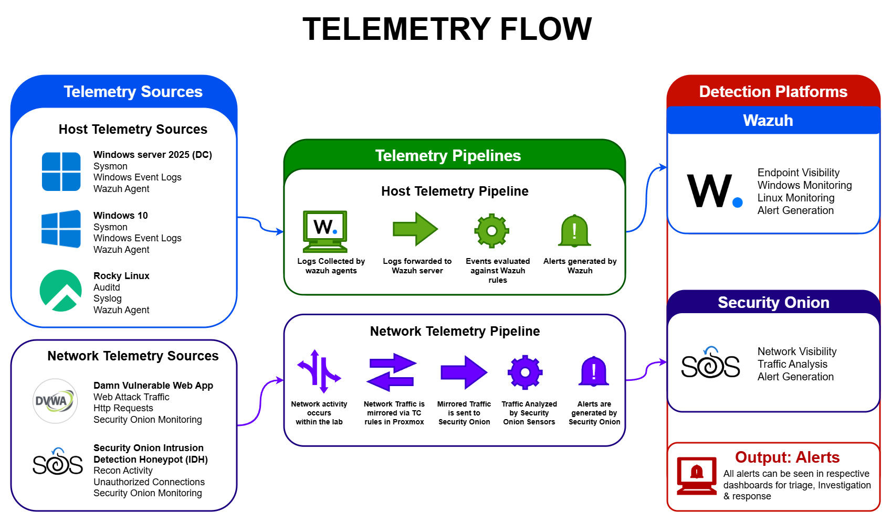
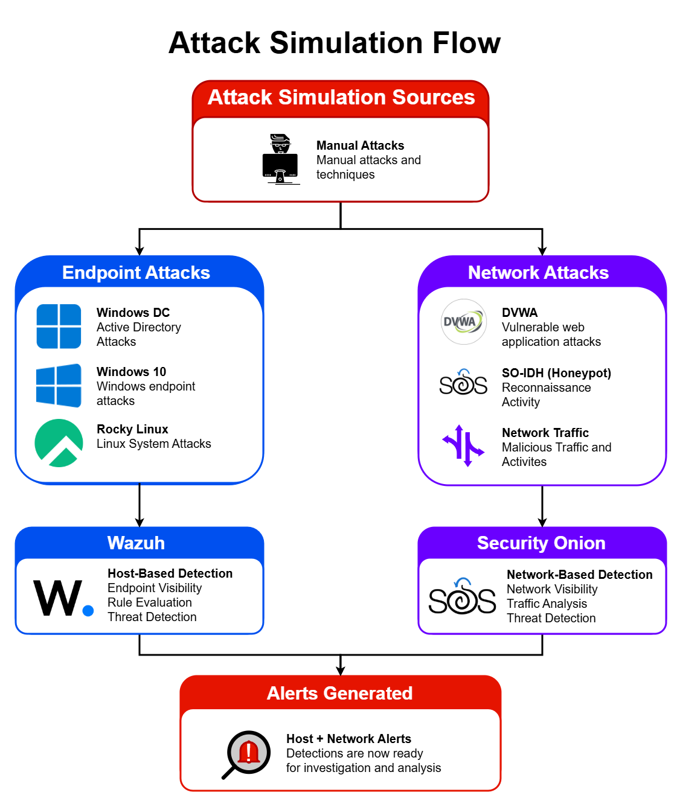
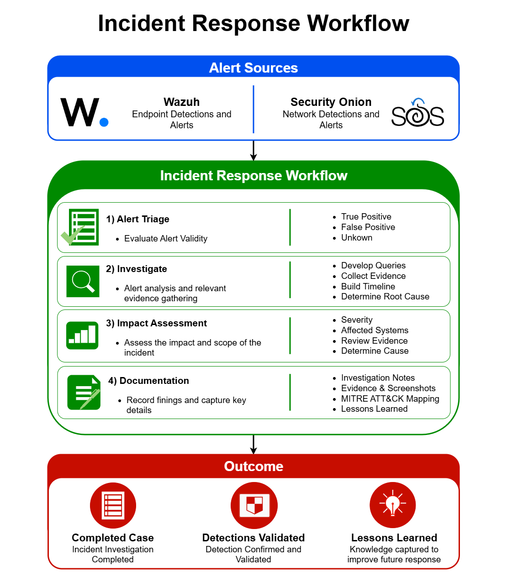

# Documentation

This directory contains architecture diagrams, workflows, and supporting documentation used throughout the AESOC project.

---

## 01. Lab Architecture

Provides a high-level overview of the AESOC environment, including network segmentation, virtual infrastructure, security tooling, and monitoring systems.

---

## 02. Telemetry Flow

Illustrates how endpoint and network telemetry is collected, processed, and analyzed by Wazuh and Security Onion.

---

## 03. Attack Simulation Flow

Shows how attack activity is generated within the environment and how telemetry is captured for investigation and analysis.

---

## 04. Incident Response Workflow

Documents the investigation methodology used throughout the project, from alert triage through investigation, findings, and final documentation.

---

## Documentation Purpose

The diagrams contained within this directory provide visual references for the architecture, telemetry collection process, adversary emulation workflow, and investigation methodology used throughout the AESOC project. These documents support the investigations, detection engineering activities, dashboards, and lab build documentation contained within this repository.
