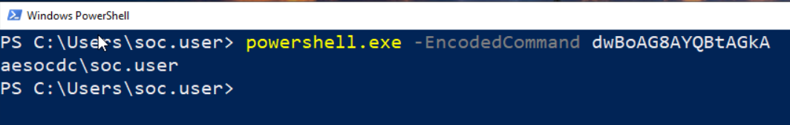
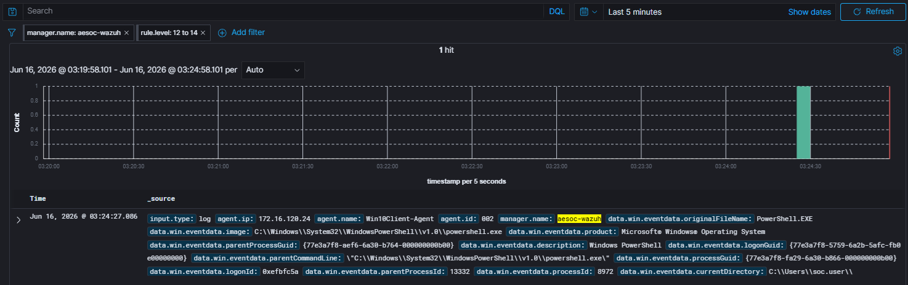

# Case-001: PowerShell Encoded Command Execution

## Objective

Investigate a PowerShell execution alert generated by Wazuh following the execution of an encoded PowerShell command and determine whether the activity was malicious, benign, or part of an authorized adversary emulation exercise.

---

## Alert Information

| Field | Value |
|---------|---------|
| Platform | Wazuh |
| Severity | High |
| Rule ID | 92057 |
| Host | Win10Client |
| User | AESOCDC\soc.user |
| Technique | T1059.001 |
| MITRE ATT&CK | PowerShell |
| Status | Closed |

---

## Investigation Steps

### Alert Triage

Wazuh generated a high-severity alert after detecting the execution of an encoded PowerShell command on the Windows 10 client.

Encoded PowerShell commands are commonly associated with attacker tradecraft because they can obscure command execution and reduce visibility into executed actions.

The alert was reviewed to determine whether the activity represented malicious behavior or an authorized security test.

---

### Detection Validation

An encoded PowerShell command was executed using the `-EncodedCommand` parameter to emulate adversary behavior commonly observed in real-world attacks.

Wazuh successfully detected the activity and generated a high-severity alert mapped to ATT&CK technique T1059.001 (PowerShell).

Detection validation confirmed:

- Alert generation
- ATT&CK mapping
- PowerShell visibility
- Command-line monitoring
- Process creation logging

---

### Investigation

Analysis of the alert revealed the following artifacts:

| Artifact | Value |
|-----------|-----------|
| User | AESOCDC\soc.user |
| Host | Win10Client |
| Process | powershell.exe |
| Rule ID | 92057 |
| ATT&CK Technique | T1059.001 – PowerShell |

The captured command line contained the `-EncodedCommand` parameter, confirming that an encoded PowerShell command was executed.

Review of the alert telemetry confirmed:

- Process creation telemetry was captured
- User attribution was available
- Host attribution was available
- Command-line arguments were logged
- ATT&CK mapping was applied automatically

No evidence of malicious follow-on activity was identified during the investigation.

---

### Impact Assessment

If executed by an attacker, encoded PowerShell commands could be used to:

- Execute malicious scripts
- Download additional payloads
- Perform system reconnaissance
- Establish persistence
- Obfuscate malicious activity

In this case, the activity was performed as part of a controlled adversary emulation exercise designed to validate detection and investigation capabilities.

No production systems were impacted.

---

## Findings

| Category | Result |
|------------|------------|
| Detection Status | Successful |
| Classification | True Positive – Benign |
| Severity | High |
| Impact | Medium |
| Status | Closed |

The alert accurately detected the emulated activity and provided sufficient telemetry to support investigation and attribution.

---

## MITRE ATT&CK Mapping

| Technique | Description |
|------------|------------|
| T1059.001 | PowerShell |

---

## Screenshots

### Screenshot 1 – Attack Simulation

An encoded PowerShell command was executed using the `-EncodedCommand` parameter to emulate attacker tradecraft.

---

### Screenshot 2 – Detection Validation

Wazuh successfully generated a high-severity alert following execution of the encoded PowerShell command.

---

### Screenshot 3 – Investigation

Alert analysis confirmed execution of an encoded PowerShell command and provided detailed telemetry including process information, command-line arguments, user context, and ATT&CK mapping.

---

## Lessons Learned

- Encoded PowerShell commands are commonly used by attackers to obscure command execution.
- Wazuh successfully detected and mapped the activity to ATT&CK technique T1059.001.
- Process creation telemetry provides valuable visibility into PowerShell execution activity.
- User attribution, command-line monitoring, and ATT&CK mapping significantly improve investigation efficiency.
- Adversary emulation exercises are effective for validating detection coverage and investigation workflows.

---

## Conclusion

An encoded PowerShell command was executed as part of a controlled adversary emulation exercise to validate detection and investigation capabilities. Wazuh successfully detected the activity, generated a high-severity alert, and captured sufficient telemetry to support a complete investigation. The activity was determined to be a **True Positive – Benign** event resulting from authorized security testing.
