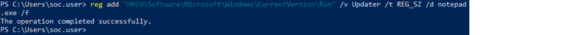
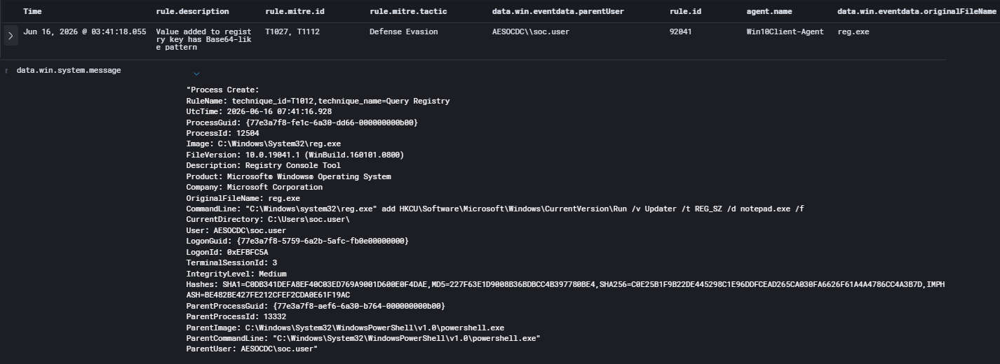
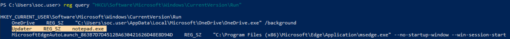

# Case-002: Registry Run Key Persistence

## Objective

Investigate a registry modification alert generated by Wazuh following the creation of a Windows Run Key persistence mechanism and determine whether the activity was malicious or authorized.

---

## Alert Information

| Field | Value |
|---------|---------|
| Platform | Wazuh |
| Severity | Medium |
| Rule ID | 92041 |
| Host | Win10Client |
| User | AESOCDC\soc.user |
| Techniques | T1027, T1112 |
| Status | Closed |

---

## Alert Triage

Wazuh generated a medium-severity alert after detecting a registry modification performed through `reg.exe` on the Windows 10 endpoint.

Registry modifications involving Windows Run Keys are commonly associated with persistence mechanisms because programs configured within these locations are automatically executed when a user logs on.

The activity was reviewed to determine whether it represented unauthorized persistence or an approved adversary emulation exercise.

---

## Detection Validation

A registry value was added to the Windows Run Key location to emulate a persistence technique commonly used by attackers.

The following command was executed:

```text
reg add "HKCU\Software\Microsoft\Windows\CurrentVersion\Run" /v Updater /t REG_SZ /d notepad.exe /f
```

Wazuh successfully detected the registry modification and generated an alert associated with registry-related ATT&CK techniques.

**Validation Confirmed:**

- Registry activity monitoring
- Alert generation
- Process execution visibility
- ATT&CK mapping
- Command-line telemetry collection

---

## Investigation

### Key Artifacts

| Artifact | Value |
|----------|----------|
| User | AESOCDC\soc.user |
| Host | Win10Client |
| Process | reg.exe |
| Rule ID | 92041 |
| ATT&CK Techniques | T1027, T1112 |

### Investigation Summary

Analysis of the alert identified execution of `reg.exe` modifying the following registry location:

```text
HKCU\Software\Microsoft\Windows\CurrentVersion\Run
```

The captured command line showed:

```text
reg.exe add HKCU\Software\Microsoft\Windows\CurrentVersion\Run /v Updater /t REG_SZ /d notepad.exe /f
```

Review of the telemetry confirmed:

- Registry modification activity was detected
- User attribution was available
- Host attribution was available
- Command-line arguments were captured
- Parent-child process relationships were recorded

The process execution chain was identified as:

```text
powershell.exe
    ↓
reg.exe
    ↓
Registry Modification
```

Additional endpoint validation confirmed the presence of the **Updater** registry value configured to launch **notepad.exe** at user logon.

No evidence of unauthorized or malicious follow-on activity was identified.

---

## Findings

| Category | Result |
|------------|------------|
| Classification | True Positive – Authorized Activity |
| Detection Status | Successful |
| Status | Closed |

The alert accurately detected the registry modification and provided sufficient telemetry to support investigation and attribution.

Analyst review determined that the observed behavior aligned with ATT&CK technique **T1547.001 – Registry Run Keys / Startup Folder**, despite the detection rule only mapping the activity to T1027 and T1112.

---

## MITRE ATT&CK Mapping

| Technique | Description |
|------------|------------|
| T1112 | Modify Registry |
| T1027 | Obfuscated/Compressed Files and Information |
| T1547.001 | Registry Run Keys / Startup Folder |

---

## Screenshots

### Attack Simulation

A registry value named **Updater** was created within the Windows Run Key location to emulate a persistence mechanism commonly used by attackers.



---

### Detection Validation

Wazuh successfully generated an alert following execution of the registry modification command, confirming visibility into registry-related activity.


---

### Investigation

Alert analysis confirmed execution of `reg.exe`, captured command-line telemetry, user context, process information, and ATT&CK mappings.



---

### Additional Validation

Endpoint validation confirmed the presence of the **Updater** Run Key value configured to execute **notepad.exe** during user logon.



---

## Lessons Learned

- Registry Run Keys are a common persistence mechanism used by attackers.
- Wazuh successfully detected registry modification activity and captured detailed process telemetry.
- Parent-child process relationships improve investigation context and attribution.
- Registry validation on the endpoint can confirm whether persistence artifacts were successfully created.
- Adversary emulation exercises are effective for validating persistence detection coverage.

---

## Conclusion

A registry modification was performed as part of a controlled adversary emulation exercise to simulate persistence through the Windows Run Key location. Wazuh successfully detected the activity, generated an alert, and captured sufficient telemetry to support a complete investigation.

Additional endpoint validation confirmed creation of the **Updater** Run Key value, demonstrating a persistence mechanism that would execute during user logon. The activity was determined to be a **True Positive – Authorized Activity** and validated visibility into registry-based persistence techniques.
