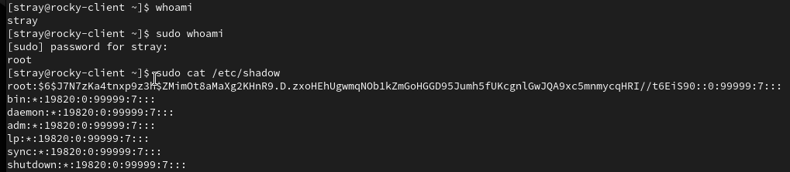
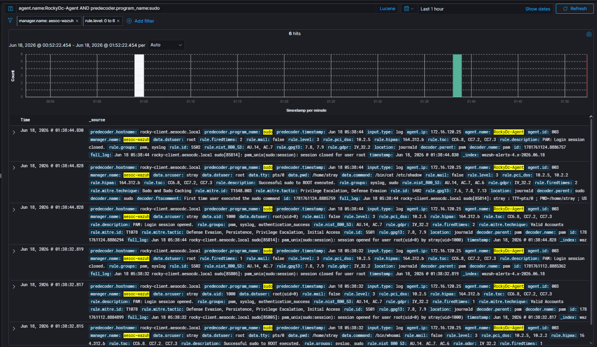
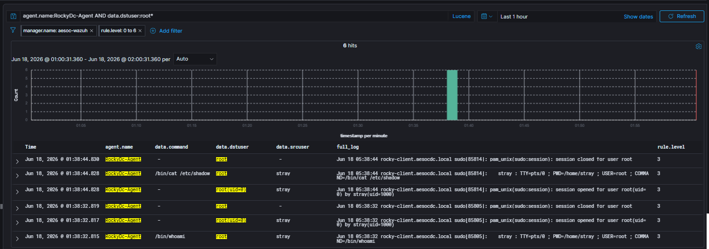

# Case-005: Sudo Privilege Escalation Investigation

## Objective

Investigate Linux privilege escalation activity generated through sudo usage and determine whether the activity was malicious, benign, or part of an authorized adversary emulation exercise.

---

## Alert Information

| Field            | Value                         |
| ---------------- | ----------------------------- |
| Platform         | Wazuh                         |
| Severity         | Medium                        |
| Host             | Rocky Linux                   |
| User             | stray                         |
| ATT&CK Technique | T1548.003                     |
| ATT&CK Tactic    | TA0004 – Privilege Escalation |
| Status           | Closed                        |

---

## Alert Triage

Wazuh generated alerts indicating sudo activity on the Rocky Linux endpoint.

Privilege escalation through sudo is a common administrative function but is also frequently abused by attackers after obtaining access to a Linux system.

The alert was reviewed to determine whether the activity represented malicious privilege escalation or authorized security testing.

---

## Detection Validation

Privilege escalation activity was generated using the sudo utility.

### Commands Executed

```bash
whoami

sudo whoami

sudo cat /etc/shadow
```

The commands first verified the current user context, elevated privileges to root, and then accessed the sensitive file:

```text
/etc/shadow
```

Wazuh successfully captured the resulting telemetry.

### Detection Validation Confirmed

* Sudo command execution logging
* User attribution
* Root session creation
* Root session termination
* Sensitive file access visibility
* Linux privilege escalation monitoring

---

## Investigation

### Privilege Escalation Activity

Analysis identified sudo command execution associated with the account:

```text
stray
```

The following command was executed:

```text
COMMAND=/bin/whoami
```

under the security context:

```text
USER=root
```

This confirmed successful privilege escalation from a standard user account to the root account.

### Evidence

```text
stray : TTY=pts/0 ; PWD=/home/stray ; USER=root ; COMMAND=/bin/whoami
```

---

### Root Session Creation

Analysis identified PAM authentication events generated during privilege escalation.

Evidence showed:

```text
pam_unix(sudo:session): session opened for user root(uid=0) by stray(uid=1000)
```

This confirmed creation of a privileged root session.

### Key Findings

| Field         | Value |
| ------------- | ----- |
| Original User | stray |
| Original UID  | 1000  |
| Elevated User | root  |
| Elevated UID  | 0     |

---

### Sensitive File Access

Following privilege escalation, the account accessed:

```text
/etc/shadow
```

using the command:

```text
COMMAND=/bin/cat /etc/shadow
```

The `/etc/shadow` file contains password hashes and is restricted to privileged users.

### Evidence

```text
stray : TTY=pts/0 ; PWD=/home/stray ; USER=root ; COMMAND=/bin/cat /etc/shadow
```

This confirmed that elevated permissions were successfully used to access a sensitive system resource.

---

### Root Session Closure

Following command execution, PAM recorded termination of the root session.

### Evidence

```text
pam_unix(sudo:session): session closed for user root
```

This confirmed completion of the privileged activity.

---

## Analysis

### Activity Observed

Linux privilege escalation through sudo resulting in execution of commands as root.

### Escalation Method

```text
sudo
```

### Original User Context

```text
User: stray
UID: 1000
```

### Elevated User Context

```text
User: root
UID: 0
```

### Commands Executed

```text
/bin/whoami

/bin/cat /etc/shadow
```

### Systems Involved

| Role             | System      |
| ---------------- | ----------- |
| Source           | Rocky Linux |
| Target           | Rocky Linux |
| User             | stray       |
| Elevated Account | root        |

### Supporting Evidence

#### Wazuh Telemetry

* Sudo command execution recorded
* Root session creation recorded
* Root session termination recorded
* User attribution identified
* Command attribution identified
* Sensitive file access identified

### Key Artifacts

```text
USER=root

COMMAND=/bin/whoami

COMMAND=/bin/cat /etc/shadow

session opened for user root(uid=0) by stray(uid=1000)

session closed for user root
```

---

## Findings

| Category         | Result                 |
| ---------------- | ---------------------- |
| Detection Status | Successful             |
| Classification   | True Positive – Benign |
| Severity         | Medium                 |
| Status           | Closed                 |

The investigation confirmed that the account `stray` successfully elevated privileges using sudo and executed commands under the root security context.

Wazuh telemetry provided complete visibility into the privilege escalation workflow, including user attribution, session creation, command execution, sensitive file access, and session termination.

---

## MITRE ATT&CK Mapping

| Technique | Description           |
| --------- | --------------------- |
| T1548.003 | Sudo and Sudo Caching |

---

## Screenshots

### Screenshot 1 – Attack Simulation

A standard Linux user elevated privileges using sudo and accessed a privileged system resource.



---

### Screenshot 2 – Detection Validation

Wazuh successfully detected sudo activity and generated telemetry associated with privilege escalation.



---

### Screenshot 3 – Investigation

Investigation identified successful privilege escalation, root session creation, command execution, and access to `/etc/shadow`.



---

## Lessons Learned

* Sudo activity provides valuable visibility into Linux privilege escalation events.
* PAM session logs can be used to identify creation and termination of elevated sessions.
* User attribution is critical when investigating privileged activity.
* Access to sensitive files such as `/etc/shadow` should be closely monitored.
* Wazuh provides effective visibility into Linux privilege escalation activity.
* Adversary emulation exercises are effective for validating Linux detection coverage.

---

## Conclusion

A privilege escalation simulation was successfully performed on Rocky Linux using sudo.

Investigation determined that the account `stray` elevated privileges to root and executed commands requiring elevated permissions, including access to the sensitive file `/etc/shadow`.

Wazuh successfully recorded sudo command execution, root session creation, root session termination, user attribution, and sensitive file access, allowing the activity to be fully reconstructed.

Analysis confirmed successful privilege escalation from `stray (uid=1000)` to `root (uid=0)` and validated detection coverage for ATT&CK technique **T1548.003 – Sudo and Sudo Caching** within the AESOC environment.

The activity was determined to be a **True Positive – Benign** event resulting from an authorized adversary emulation exercise.

