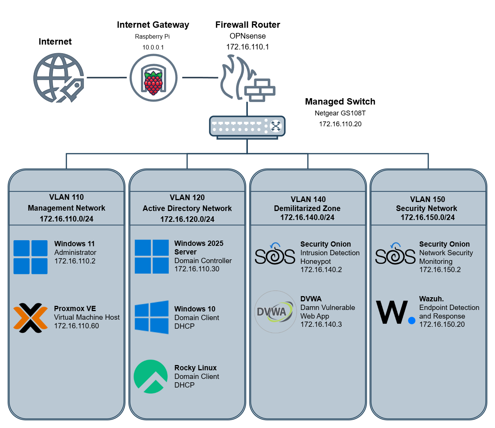

# Adversary Emulation & Security Operations Center (AESOC)

## Portfolio Highlights

- 9 Pre-SOAR Security Investigations
- 5 Full-Lifecycle Reenactments*
- Full Alert-to-Resolution Operational Workflow*
- 3 SOAR Automation Playbooks*
- Wazuh, Shuffle, TheHive, Zammad, and Slack Integration*
- Direct SOC Containment and IT Remediation Handoffs*
- Detection Engineering and Detection Tuning
- Wazuh and Security Onion Monitoring Dashboards

## Best SOC Work

| Type                     | Case Study                                                                                                            | What It Demonstrates                                                                                                                                 |
| ------------------------ | --------------------------------------------------------------------------------------------------------------------- | ---------------------------------------------------------------------------------------------------------------------------------------------------- |
| Detection Engineering    | [Windows Discovery Activity Detection](./05-Detection-Engineering/Custom-Detections/Custom-Detection-001-Windows-Discovery-Activity/) | Identifying a detection gap, validating telemetry, developing a custom Wazuh detection rule, and validating alert generation through testing         |
| Incident Investigation   | [WinRM Lateral Movement Investigation](./04-Investigations/01-Pre-SOAR-Investigations/Case-003-WinRM-Lateral-Movement/)                             | Correlating Wazuh endpoint telemetry with Security Onion network evidence during a Windows Remote Management (WinRM) lateral movement investigation  |
| Web Attack Investigation | [SQL Injection Investigation](./04-Investigations/01-Pre-SOAR-Investigations/Case-007-SQL-Injection-Investigation/)                                 | Investigating a web application attack using Security Onion, HTTP request analysis, source attribution, and documented SOC investigation methodology |

These case studies demonstrate alert triage, detection validation, incident investigation, MITRE ATT&CK mapping, endpoint and network telemetry correlation, detection engineering, and professional SOC documentation practices.

## Technologies Used

* Wazuh
* Security Onion
* Shuffle
* TheHive
* Sysmon
* Auditd
* Suricata
* Zeek
* Windows Server 2025
* Windows 10
* Rocky Linux
* OPNsense
* Proxmox VE

## Skills Demonstrated

* Security Monitoring
* Incident Investigation
* Threat Hunting
* Detection Engineering
* Detection Tuning
* Network Security Monitoring
* SIEM Analysis
* Log Analysis
* MITRE ATT&CK Mapping
* Dashboard Development

## Cybersecurity Frameworks

AESOC includes framework mapping to connect hands-on SOC lab work to security operations, control validation, incident response, detection engineering, and risk management concepts.

| Framework / Concept    | How It Is Used                                                                                                                                                           |
| ---------------------- | ------------------------------------------------------------------------------------------------------------------------------------------------------------------------ |
| NIST CSF 2.0           | Mapped current lab activities to Govern, Identify, Protect, Detect, Respond, and Recover functions                                                                       |
| MITRE ATT&CK           | Mapped observed adversary behaviors to tactics and techniques across investigations                                                                                      |
| OWASP                  | Applied web application security concepts to SQL injection and malicious file upload investigations                                                                      |
| ISO/IEC 27001 Concepts | Mapped current lab activities to foundational concepts such as logging, monitoring, access control, incident management, evidence collection, and continuous improvement |
| Control Gap Analysis   | Identified detection and monitoring gaps based on available telemetry and investigation evidence                                                                         |

Detailed mappings are available in the [Framework Mapping](07-Supporting-Reference/Framework-and-Control-Mapping/) directory.

## Repository Navigation

| Section | Description |
|---|---|
| [Lab Architecture](01-Lab-Architecture/) | AESOC network architecture, telemetry flow, assets, VLANs, and security stack |
| [SOC Operations](02-SOC-Operations/) | Alert-to-resolution lifecycle, analyst runbooks, ownership, handoffs, and closure procedures |
| [SOAR Automation](03-SOAR-Automation/) | Shuffle playbooks integrating Wazuh, TheHive, Zammad, and Slack |
| [Investigations](04-Investigations/) | Pre-SOAR cases, full-lifecycle reenactments, and new operational investigations |
| [Detection Engineering](05-Detection-Engineering/) | Detection tuning, custom detections, testing, and validation evidence |
| [SOC Dashboards](06-SOC-Dashboards/) | Wazuh and Security Onion monitoring dashboards |
| [Supporting Reference](07-Supporting-Reference/) | Integration guides, framework mapping, ATT&CK mapping, and supporting technical reference |
---

AESOC is a cybersecurity homelab project designed to emulate real-world Security Operations Center (SOC) workflows through centralized monitoring, incident investigation, threat hunting, detection engineering, and adversary simulation.

The project focuses on incident investigation, threat hunting, detection engineering, alert tuning, dashboard development, framework mapping, and MITRE ATT&CK-mapped adversary emulation activities.

---

## Project Origin

While completing The Ohio State University's Cybersecurity Bootcamp, I became increasingly interested in the technologies and infrastructure used to support the program's hands-on security exercises. Beyond completing the labs, I wanted to understand how the underlying systems generated telemetry, collected logs, detected attacks, and enabled analysts to investigate security events.

After completing the program, I set out to build my own Security Operations Center environment from the ground up. The goal was not only to recreate many of the concepts explored during the bootcamp, but also to gain practical experience deploying enterprise security tools, engineering detections, investigating alerts, and documenting the full analyst workflow.

The result is AESOC (Adversary Emulation & Security Operations Center), a personal SOC environment designed to emulate real-world security operations through centralized monitoring, incident investigation, detection engineering, adversary simulation, and network security analysis. The environment integrates Windows, Linux, web application, and network telemetry to provide hands-on experience with the technologies and workflows commonly used by Security Operations Center (SOC) analysts.

---

## Core Objectives

* Build and operate a centralized SOC environment
* Simulate adversary behavior in a controlled lab
* Perform end-to-end security investigations
* Validate and improve detection coverage through custom detection engineering and tuning
* Conduct threat hunting and log analysis activities
* Create custom dashboards for security monitoring and visibility
* Map investigations to the MITRE ATT&CK framework
* Map current lab activities to cybersecurity frameworks and control concepts
* Document findings using structured SOC reporting practices

---

## Environment Overview

### Physical Infrastructure

| Device           | Purpose                                        |
| ---------------- | ---------------------------------------------- |
| Beelink SER5 Pro | Proxmox virtualization host                    |
| Beelink EQi12    | OPNsense firewall and network security gateway |
| Netgear GS108TV3 | VLAN-capable managed switch                    |

### Virtual Infrastructure

| System              | Purpose                                                    |
| ------------------- | ---------------------------------------------------------- |
| Proxmox VE          | Virtualization platform                                    |
| Windows Server 2022 | Active Directory Domain Controller                         |
| Windows 10          | User endpoint                                              |
| Rocky Linux         | Linux endpoint                                             |
| Wazuh               | SIEM and endpoint monitoring                               |
| Security Onion      | Network Security Monitoring (NSM)                          |
| DVWA                | Vulnerable web application for attack simulation           |
| SO-IDH              | Honeypot used for intrusion detection and alert generation |

### Security Tooling

* Wazuh
* Security Onion
* OPNsense
* Sysmon
* Auditd
* Suricata
* Zeek

### Security Operations Capabilities

* Endpoint Monitoring
* Network Security Monitoring
* Log Analysis
* Incident Investigation
* Threat Hunting
* Detection Engineering
* Detection Tuning
* Security Dashboard Development
* MITRE ATT&CK Mapping
* NIST CSF 2.0 Mapping
* Control Gap Analysis
