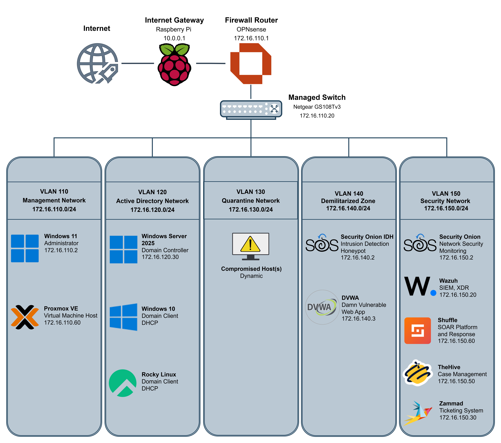

# Adversary Emulation & Security Operations Center (AESOC)

AESOC is a portable, segmented cybersecurity home lab built to demonstrate practical entry-level SOC analyst skills.

The environment combines endpoint and network monitoring, alert triage, investigation, detection engineering, SOAR automation, case management, ticketing, and controlled adversary simulation.

[](01-Lab-Architecture/AESOC-Architecture.png)

[Open the architecture diagram at full size](01-Lab-Architecture/AESOC-Architecture.png)

---

## Portfolio Overview

| Area | Current implementation |
|---|---|
| Security investigations | 9 documented pre-SOAR investigations |
| SOAR automation | 3 validated Shuffle playbooks |
| SOC operations | Alert-to-resolution workflow, Tier 1 and Tier 2 runbooks, handoffs, and closure checklist |
| Detection engineering | 1 custom Wazuh detection and 1 detection-tuning project |
| Security monitoring | 1 Wazuh dashboard and 1 Security Onion dashboard |
| Case management | TheHive alert and case lifecycle |
| Ticketing | Zammad Detection Engineering and Infrastructure Remediation workflows |
| Notifications | Slack alert, case, and ticket channels |
| Framework mapping | MITRE ATT&CK, NIST CSF 2.0, OWASP, ISO/IEC 27001 concepts, and control-gap analysis |

> **Project scope:** AESOC is a controlled home-lab environment. Cases, tickets, comments, assignments, and notification messages used to validate the automation are test payloads and do not represent production incidents.

---

## Alert-to-Resolution Workflow

```text
Endpoint Activity
        ↓
Wazuh Detection
        ↓
Shuffle Alert Intake
        ↓
TheHive Alert + Slack Notification
        ↓
Tier 1 Alert Triage
   ┌────┴───────────────┐
   ↓                    ↓
Close Alert       Escalate to Case
                         ↓
                Tier 2 Investigation
             ┌───────────┼────────────┐
             ↓           ↓            ↓
       Direct SOC    Detection    Infrastructure
         Action       Review       Remediation
             ↓           ↓            ↓
         Validate     Zammad        Zammad
          Result       Ticket         Ticket
                          └────┬───────┘
                               ↓
                    Ticket Closure Handback
                               ↓
                       TheHive Case Update
                               ↓
                        Tier 2 Validation
                               ↓
                         Final Case Closure
```

TheHive is the primary alert and investigation record. Zammad tracks work assigned to Detection Engineering or Infrastructure Remediation. Slack provides lifecycle visibility but is not treated as the official investigation record.

Security Onion provides a separate network-monitoring path. Its alerts are currently reviewed within Security Onion and are not yet forwarded into the documented Shuffle automation.

---

## Featured Work

| Project | What it demonstrates |
|---|---|
| [SOC Operations](02-SOC-Operations/) | Tier 1 triage, Tier 2 investigation, response paths, ownership, handoffs, validation, and case closure |
| [Wazuh Alert Intake](03-SOAR-Automation/01-Wazuh-Alert-Intake/) | Wazuh webhook ingestion, severity routing, TheHive alert creation, and Slack notification |
| [Case Updates and Ticket Routing](03-SOAR-Automation/02-Case-Updates-and-Ticket-Routing/) | TheHive lifecycle events, tag-based routing, Zammad ticket creation, and duplicate prevention |
| [Ticket Closure Handback](03-SOAR-Automation/03-Ticket-Closure-Handback/) | Zammad closure processing, TheHive synchronization, and Tier 2 handback |
| [WinRM Lateral Movement](04-Investigations/01-Pre-SOAR-Investigations/Case-003-WinRM-Lateral-Movement/) | Correlation of Wazuh endpoint telemetry with Security Onion network evidence |
| [Windows Discovery Custom Detection](05-Detection-Engineering/Custom-Detections/Custom-Detection-001-Windows-Discovery-Activity/) | Detection-gap analysis, Wazuh rule development, testing, and validation |
| [PowerShell Detection Tuning](05-Detection-Engineering/Detection-Tuning/Detection-Tuning-001-Windows-PowerShell-Activity/) | False-positive analysis, severity tuning, and post-change validation |
| [Wazuh Security Monitoring Dashboard](06-SOC-Dashboards/Wazuh/Dashboard-001-Security-Monitoring/) | Endpoint alert and security-event visualization |
| [Security Onion Network Threat Dashboard](06-SOC-Dashboards/Security-Onion/Dashboard-001-Network-Threat-Monitoring/) | Network alert, protocol, and connection visibility |

---

## Repository Navigation

| Section | Contents |
|---|---|
| [01 – Lab Architecture](01-Lab-Architecture/) | Physical and logical architecture, VLANs, telemetry flow, assets, and security stack |
| [02 – SOC Operations](02-SOC-Operations/) | Alert lifecycle, ownership, Tier 1 and Tier 2 runbooks, and closure procedures |
| [03 – SOAR Automation](03-SOAR-Automation/) | Three validated Shuffle workflows with implementation evidence |
| [04 – Investigations](04-Investigations/01-Pre-SOAR-Investigations/) | Nine documented endpoint, authentication, Linux, web, and network investigations |
| [05 – Detection Engineering](05-Detection-Engineering/) | Custom detections, detection tuning, testing, and validation |
| [06 – SOC Dashboards](06-SOC-Dashboards/) | Wazuh and Security Onion monitoring dashboards |
| [Integration References](07-Supporting-Reference/Integrations/) | Wazuh, Shuffle, TheHive, Zammad, and Slack integration summaries |
| [Framework and Control Mapping](07-Supporting-Reference/Framework-and-Control-Mapping/) | MITRE ATT&CK, NIST CSF, OWASP, ISO concepts, and control gaps |

---

## Investigation Coverage

### Windows and Active Directory

- PowerShell encoded-command execution
- Registry Run Key persistence
- WinRM lateral movement
- NTLM authentication activity

### Linux

- Sudo privilege activity
- SSH authentication activity

### Network and Web Applications

- SQL injection
- Malicious file upload
- Network service discovery

The original nine cases are retained as **Pre-SOAR Investigations** because they were completed before implementation of the full Shuffle, TheHive, Zammad, and Slack lifecycle.

Selected cases will later be repeated or extended through the complete operational workflow under Full-Lifecycle Investigations.

---

## Detection Engineering

AESOC currently includes two completed detection projects:

### Custom Detection

[Windows Discovery Activity Detection](05-Detection-Engineering/Custom-Detections/Custom-Detection-001-Windows-Discovery-Activity/)

- Identified a Wazuh detection gap
- Confirmed that the required telemetry was available
- Developed a custom Wazuh rule
- Generated controlled test activity
- Validated successful alert generation

### Detection Tuning

[PowerShell Script Policy Test Reclassification](05-Detection-Engineering/Detection-Tuning/Detection-Tuning-001-Windows-PowerShell-Activity/)

- Investigated repeated high-severity alerts
- Confirmed legitimate PowerShell behavior
- Created a child rule to reduce severity
- Preserved event visibility
- Retested and validated the tuning result

---

## Security Stack

### Infrastructure and Segmentation

- Raspberry Pi portable Internet gateway
- OPNsense firewall and inter-VLAN routing
- Netgear GS108Tv3 managed switch
- Proxmox VE virtualization
- Dedicated Management, Active Directory, Quarantine, DMZ, and Security VLANs

### Detection and Monitoring

- Wazuh
- Security Onion
- Sysmon
- Windows Event Logs
- Auditd
- Syslog
- Suricata
- Zeek

### Security Operations

- Shuffle SOAR
- TheHive
- Zammad
- Slack
- Wazuh dashboards
- Security Onion dashboards

### Monitored and Test Systems

- Windows Server 2025 domain controller
- Windows 10 endpoint
- Rocky Linux endpoint
- DVWA
- Security Onion Intrusion Detection Honeypot
- Quarantine network

---

## Skills Demonstrated

- Alert triage
- Endpoint and network investigation
- SIEM and NSM analysis
- Log and event correlation
- MITRE ATT&CK mapping
- Detection engineering
- Detection tuning
- SOAR workflow development
- Case and ticket lifecycle management
- Analyst ownership and handoffs
- Dashboard development
- Technical documentation
- Network segmentation
- Controlled adversary simulation

---

## Framework and Control Mapping

AESOC documentation connects completed lab work to:

- MITRE ATT&CK
- NIST Cybersecurity Framework 2.0
- OWASP concepts
- ISO/IEC 27001 concepts
- Detection and monitoring control-gap analysis

These mappings describe how the implemented technical work relates to broader security operations and risk-management concepts. They do not claim formal organizational compliance or certification.

[Review the framework mappings](07-Supporting-Reference/Framework-and-Control-Mapping/)

---

## Project Background

AESOC began after completing The Ohio State University Cybersecurity Bootcamp. I wanted to understand not only how to perform individual security exercises, but also how the surrounding infrastructure collects telemetry, generates detections, supports investigations, and moves security work through an operational lifecycle.

The result is a personally designed and operated SOC lab that combines Windows, Linux, web-application, and network telemetry with detection, investigation, automation, and documentation.
