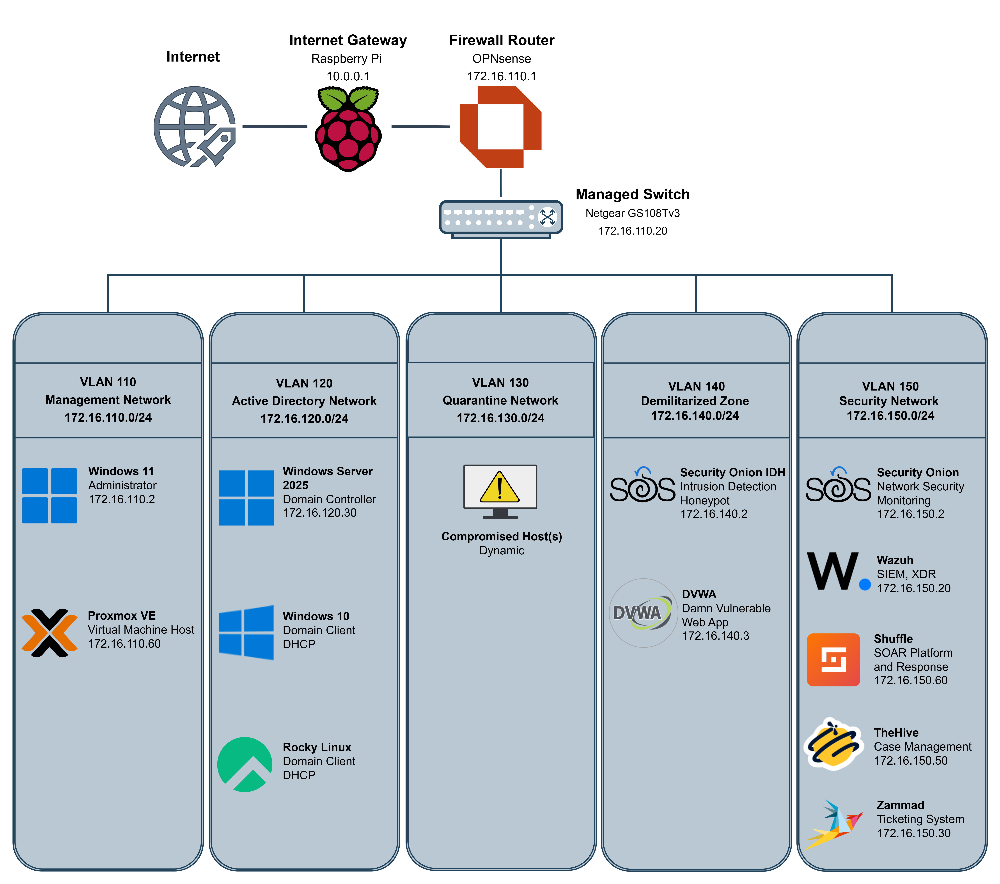

# Adversary Emulation & Security Operations Center (AESOC)

AESOC is a portable, segmented cybersecurity home lab built to demonstrate practical entry-level SOC analyst skills.

The portfolio combines endpoint and network monitoring, alert triage, investigation, detection engineering, SOAR automation, case management, ticketing, and controlled adversary simulation. It also includes a separate Microsoft Azure cloud-security workstream covering IAM investigations and Microsoft Sentinel detection and incident response.

[](01-Lab-Architecture/AESOC-Architecture.png)

[Open the architecture diagram at full size](01-Lab-Architecture/AESOC-Architecture.png)

---

## Portfolio Overview

| Area | Current implementation |
| --- | --- |
| Security investigations | 12 documented investigations: 9 pre-SOAR, 1 full-lifecycle, and 2 Azure IAM investigations |
| SOAR automation | 3 validated Shuffle playbooks |
| Detection engineering | 1 custom Wazuh detection, 1 validated tuning project, 1 deferred tuning review, and 1 Microsoft Sentinel analytics rule |
| Security monitoring | Wazuh, Security Onion, Microsoft Sentinel, Azure Activity Logs, and Microsoft Entra logs |
| SOC workflow | Tier 1 triage, Tier 2 investigation, escalation, containment, validation, and closure |
| Case and ticket management | TheHive case lifecycle and Zammad remediation workflows |
| Cloud security | Azure RBAC, Microsoft Entra ID, KQL analytics, Sentinel alerts, and incident response |
| Framework mapping | MITRE ATT&CK, NIST CSF 2.0, OWASP, ISO/IEC 27001 concepts, and control-gap analysis |

> **Project scope:** All investigations, alerts, incidents, role assignments, sign-ins, tickets, and response actions were generated in controlled personal lab environments for authorized testing.

---

## Alert-to-Resolution Workflow

```text
Endpoint Activity
        ↓
Wazuh Detection
        ↓
Shuffle Alert Intake
        ↓
TheHive Alert + Slack Notification
        ↓
Tier 1 Triage
   ┌────┴─────────────┐
   ↓                  ↓
Close Alert     Escalate to Case
                       ↓
              Tier 2 Investigation
          ┌────────────┼────────────┐
          ↓            ↓            ↓
      SOC Action   Detection    Infrastructure
                    Review       Remediation
          ↓            ↓            ↓
      Validation    Zammad       Zammad
                     Ticket        Ticket
                        └────┬───────┘
                             ↓
                    TheHive Handback
                             ↓
                    Final Case Closure
```

TheHive serves as the primary investigation record. Zammad tracks work assigned to Detection Engineering or Infrastructure Remediation, while Slack provides lifecycle notifications.

Security Onion provides separate network-monitoring visibility through Suricata, Zeek, and Arkime.

---

## Featured Work

| Project | What it demonstrates |
| --- | --- |
| [SOC Operations](02-SOC-Operations/) | Tier 1 and Tier 2 procedures, ownership, escalation, handoffs, validation, and closure |
| [OneDrive-to-Explorer Full-Lifecycle Investigation](04-Investigations/02-Full-Lifecycle-Investigations/01-OneDrive-Explorer-Process-Access/) | End-to-end alert triage, investigation, Detection Engineering handoff, ticket closure, and case resolution |
| [SOAR Automation](03-SOAR-Automation/) | Wazuh alert intake, TheHive case events, Zammad ticket routing, Slack notifications, and closure handback |
| [Pre-SOAR Investigations](04-Investigations/01-Pre-SOAR-Investigations/) | Windows, Linux, authentication, web-application, and network investigations |
| [Detection Engineering](05-Detection-Engineering/) | Custom Wazuh detection development, rule testing, tuning, and validation |
| [SOC Dashboards](06-SOC-Dashboards/) | Wazuh endpoint monitoring and Security Onion network visibility |
| [Unauthorized Azure Contributor Assignment](09-Cloud-Security/01-Azure-IAM/01-Unauthorized-Contributor-Assignment/) | Azure RBAC investigation, excessive-access containment, and least-privilege restoration |
| [Suspicious Entra Sign-In and Account Containment](09-Cloud-Security/01-Azure-IAM/02-Suspicious-Sign-In-Account-Containment/) | Authentication analysis, account containment, session revocation, password reset, and MFA recovery |
| [Azure RBAC Role Assignment Detection](09-Cloud-Security/02-Microsoft-Sentinel/01-Azure-RBAC-Role-Assignment-Detection/) | Azure Activity ingestion, KQL analytics, Sentinel alert generation, incident investigation, containment, and closure |
| [Rekall Penetration Test](08-Penetration-Testing/) | Vulnerability assessment, exploitation evidence, risk analysis, and remediation recommendations |

---

## Repository Navigation

| Section | Contents |
| --- | --- |
| [01 – Lab Architecture](01-Lab-Architecture/) | Hardware, VLANs, telemetry flow, assets, and security architecture |
| [02 – SOC Operations](02-SOC-Operations/) | Alert lifecycle, analyst ownership, runbooks, escalation, and closure |
| [03 – SOAR Automation](03-SOAR-Automation/) | Three validated Shuffle workflows |
| [04 – Investigations](04-Investigations/) | Pre-SOAR cases and full-lifecycle investigations |
| [05 – Detection Engineering](05-Detection-Engineering/) | Custom detections, tuning, testing, and validation |
| [06 – SOC Dashboards](06-SOC-Dashboards/) | Wazuh and Security Onion dashboards |
| [07 – Supporting Reference](07-Supporting-Reference/) | Integration summaries, framework mapping, and supporting documentation |
| [08 – Penetration Testing](08-Penetration-Testing/) | Rekall penetration testing portfolio report |
| [09 – Cloud Security](09-Cloud-Security/) | Azure IAM investigations and Microsoft Sentinel projects |
| [Azure IAM](09-Cloud-Security/01-Azure-IAM/) | Azure RBAC and Microsoft Entra identity investigations |
| [Microsoft Sentinel](09-Cloud-Security/02-Microsoft-Sentinel/) | KQL detections, analytics rules, alerts, incidents, and cloud response |

---

## Investigation Coverage

### Endpoint and Identity

- PowerShell execution
- Registry Run Key persistence
- WinRM lateral movement
- NTLM authentication
- Linux sudo and SSH activity
- Azure RBAC privilege changes
- Microsoft Entra sign-in activity

### Network and Web

- Network service discovery
- SQL injection
- Malicious file upload
- Endpoint and network telemetry correlation

The original nine investigations are retained as **Pre-SOAR Investigations** because they were completed before the full Shuffle, TheHive, Zammad, and Slack workflow was implemented.

---

## Security Stack

| Category | Technologies |
| --- | --- |
| Infrastructure | Proxmox VE, OPNsense, Netgear managed switching, Raspberry Pi, VLAN segmentation |
| Endpoint monitoring | Wazuh, Sysmon, Windows Event Logs, Auditd |
| Network monitoring | Security Onion, Suricata, Zeek, Arkime |
| Security operations | Shuffle SOAR, TheHive, Zammad, Slack |
| Cloud security | Microsoft Azure, Microsoft Entra ID, Azure RBAC, Azure Activity Logs |
| Cloud SIEM | Microsoft Sentinel, Log Analytics, Kusto Query Language, Microsoft Defender portal |
| Test systems | Windows Server 2025, Windows 10/11, Rocky Linux, Azure and Entra test identities |

---

## Skills Demonstrated

- Alert triage and prioritization
- Tier 1 and Tier 2 investigation
- Endpoint and network telemetry analysis
- Log and event correlation
- Detection development, testing, and tuning
- SOAR workflow development
- Case and ticket lifecycle management
- Analyst ownership, escalation, and handoffs
- Azure RBAC and least-privilege analysis
- Microsoft Entra authentication investigation
- KQL query and Sentinel analytics-rule development
- Cloud alert and incident investigation
- Account containment and access recovery
- MITRE ATT&CK and security-control mapping
- Technical documentation and evidence handling

---

## Framework and Control Mapping

AESOC documentation connects completed work to:

- MITRE ATT&CK
- NIST Cybersecurity Framework 2.0
- OWASP concepts
- ISO/IEC 27001 concepts
- Detection and monitoring control-gap analysis

These mappings connect the technical work to broader security concepts and do not claim formal organizational compliance.

[Review the framework mappings](07-Supporting-Reference/Framework-and-Control-Mapping/)

---

## Project Background

AESOC began after completing The Ohio State University Cybersecurity Bootcamp. I built the environment to understand how endpoint, network, identity, and cloud telemetry becomes a detection, how analysts investigate that activity, and how security work moves from alert generation through containment and closure.

Detailed procedures, evidence, queries, investigation findings, and outcomes are documented within each linked project directory.
